# jsm_assets4 Query Sample Run vs PingCAP Report

Run time: 2026-05-08T14:37:12.191771+00:00

Source report: `/Users/jin/Downloads/full_report_for_pingcap.md`.

Notes:
- The source report contains normalized SQL with placeholders, so this run materialized representative parameter sets from `jsm_assets4`.
- Each runnable query uses up to 10 sampled parameter sets. Rows are fetched to the client; latency is client-observed SQL execution plus fetch time.
- Wide object queries are represented as `SELECT o.*` / `SELECT obj.*`; predicate, ordering, and limit shape are preserved.
- Queries whose referenced tables are absent from `jsm_assets4` are marked skipped.
- Grafana: [http://a2e41aa49d08647d1b55ecd7b146bbf6-38f9eda417a300aa.elb.us-east-2.amazonaws.com:3000](http://a2e41aa49d08647d1b55ecd7b146bbf6-38f9eda417a300aa.elb.us-east-2.amazonaws.com:3000)

## Summary

| Query | Source avg | Source max | Source rows avg | Samples | Run rows avg | jsm_assets4 avg | jsm_assets4 p50 | jsm_assets4 max | Comparison | Status |
|---:|---:|---:|---:|---:|---:|---:|---:|---:|---|---|
| 1 | 2.7ms | 518.3ms | 0 | 0 | None | None | None | None | n/a | skipped |
| 2 | 320.8ms | 14332.3ms | 234 | 10 | 600 | 103.3 | 80.6 | 203.8 | 3.11x faster | ok |
| 3 | 36.3ms | 8652.6ms | 1 | 0 | None | None | None | None | n/a | skipped |
| 4 | 11882.9ms | 34102.7ms | 1000 | 10 | 1000 | 8618.1 | 10658.4 | 11471.1 | 1.38x faster | ok |
| 5 | 29101.7ms | 60034.6ms | 65 | 10 | 1000 | 1497.3 | 219.9 | 8309.5 | 19.44x faster | ok |
| 6 | 44.8ms | 927.9ms | 168 | 10 | 50 | 50.1 | 38.7 | 140.8 | 1.12x source | ok |
| 7 | 8.7ms | 487.0ms | 35 | 10 | 35 | 9.1 | 6.5 | 31.3 | 1.05x source | ok |
| 8 | 16983.6ms | 32291.9ms | 6 | 10 | 108.6 | 16143.0 | 8304.9 | 42368.0 | 1.05x faster | ok |
| 9 | 28.1ms | 10778.1ms | 8 | 10 | 24 | 16.4 | 16.2 | 27.5 | 1.71x faster | ok |
| 10 | 41204.1ms | 51112.0ms | 136 | 10 | 956.8 | 606.1 | 556.2 | 1474.4 | 67.98x faster | ok |
| 11 | 17.0ms | 228.7ms | 1 | 10 | 1 | 13.2 | 11.2 | 31.6 | 1.29x faster | ok |
| 12 | 10.2ms | 473.9ms | 1 | 0 | None | None | None | None | n/a | skipped |
| 13 | 29.8ms | 6157.8ms | 175 | 10 | 175 | 9.7 | 9.4 | 12.1 | 3.07x faster | ok |
| 14 | 28809.4ms | 45421.2ms | 1000 | 10 | 1000 | 90.0 | 85.3 | 148.7 | 320.10x faster | ok |
| 15 | 24650.8ms | 42060.9ms | 1000 | 10 | 1000 | 77.7 | 85.0 | 93.3 | 317.26x faster | ok |
| 16 | 47800.9ms | 60019.8ms | 500 | 10 | 1000 | 843.1 | 826.1 | 913.7 | 56.70x faster | ok |
| 17 | 29564.9ms | 37139.7ms | 0 | 10 | 1000 | 159.3 | 135.6 | 311.1 | 185.59x faster | ok |
| 18 | 3.7ms | 325.7ms | 4 | 10 | 5 | 2.4 | 2.5 | 3.1 | 1.54x faster | ok |
| 19 | 39798.6ms | 60018.5ms | 500 | 10 | 1000 | 86.7 | 88.0 | 96.2 | 459.04x faster | ok |
| 20 | 17.8ms | 5900.3ms | 1 | 10 | 1 | 4.4 | 3.5 | 12.9 | 4.05x faster | ok |
| 21 | 23577.6ms | 30859.8ms | 1000 | 10 | 1000 | 1556.0 | 245.6 | 13389.4 | 15.15x faster | ok |
| 22 | 25.9ms | 233.2ms | 20 | 10 | 20 | 28.3 | 30.4 | 50.7 | 1.09x source | ok |
| 23 | 33550.1ms | 35378.6ms | 0 | 10 | 956.8 | 113.7 | 89.6 | 235.2 | 295.08x faster | ok |
| 24 | 60085.2ms | 60085.2ms | 0 | 10 | 1000 | 1765.0 | 1183.8 | 7046.3 | 34.04x faster | ok |
| 25 | 59691.1ms | 59691.1ms | 1000 | 10 | 1000 | 780.5 | 815.5 | 898.7 | 76.48x faster | ok |

## Skipped Queries

- Query #1: cdm_type_obj_type_attr is not present in jsm_assets4.
- Query #3: cdm_type_obj_type, cdm_type_obj_schema, and obj_schema_owner are not present in jsm_assets4.
- Query #12: cdm_type_ref_type, cdm_type_obj_schema, and obj_schema_owner are not present in jsm_assets4.

## Concurrent Runs

Worker assignment is per query class. When concurrency equals the runnable query class count, each query class gets one worker. When concurrency is higher, workers are assigned round-robin across the runnable query classes.

| Concurrency | Query classes | Duration s | Successful ops | QPS | Avg ms | P95 ms | Max ms |
|---:|---:|---:|---:|---:|---:|---:|---:|
| 66 | 22 | 600 | 25061 | 41.58 | 1579.1 | 4233.6 | 12112.0 |
| 132 | 22 | 600 | 179223 | 296.85 | 442.8 | 1547.7 | 21732.4 |

### Grafana / Prometheus Resource Metrics

CPU and memory values below are pulled from the Grafana Prometheus datasource for each run window. CPU capacity percentage uses the replica count recorded for that run.

#### Concurrency 66

- Window: `2026-05-08T09:27:24.920898+00:00` to `2026-05-08T09:37:27.651864+00:00`
- Grafana time range: [http://a2e41aa49d08647d1b55ecd7b146bbf6-38f9eda417a300aa.elb.us-east-2.amazonaws.com:3000?from=1778232444920&to=1778233047651](http://a2e41aa49d08647d1b55ecd7b146bbf6-38f9eda417a300aa.elb.us-east-2.amazonaws.com:3000?from=1778232444920&to=1778233047651)

| Component | Replicas | CPU avg cores | CPU max cores | CPU max % capacity | Mem avg GiB | Mem max GiB | Note |
|---|---:|---:|---:|---:|---:|---:|---|
| tidb | 3 | 6.18 | 7.11 | 14.8% | 12.49 | 16.31 |  |
| tikv | 4 | 30.14 | 34.29 | 53.6% | 73.72 | 74.61 |  |
| tiflash | 6 | 64.51 | 82.04 | 85.5% | 52.75 | 58.44 | TiFlash proxy process CPU metric |

Grafana panel screenshots:

<table>
<tr>
<td width="50%"><strong>TiDB CPU</strong><br>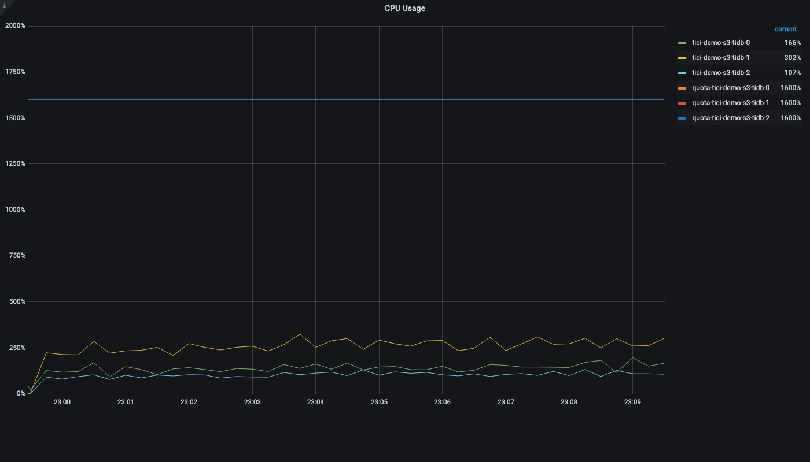</td>
<td width="50%"><strong>TiDB Memory</strong><br>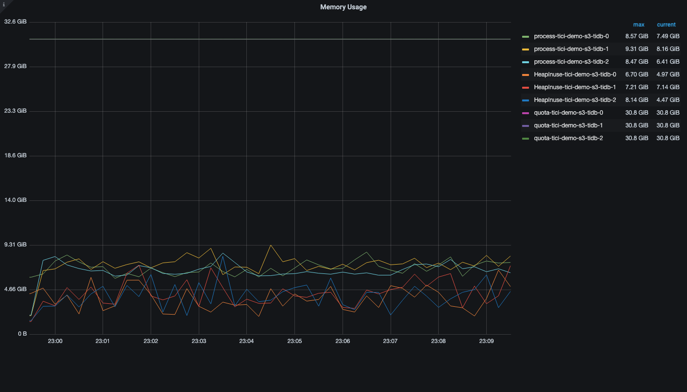</td>
</tr>
<tr>
<td width="50%"><strong>TiKV CPU</strong><br>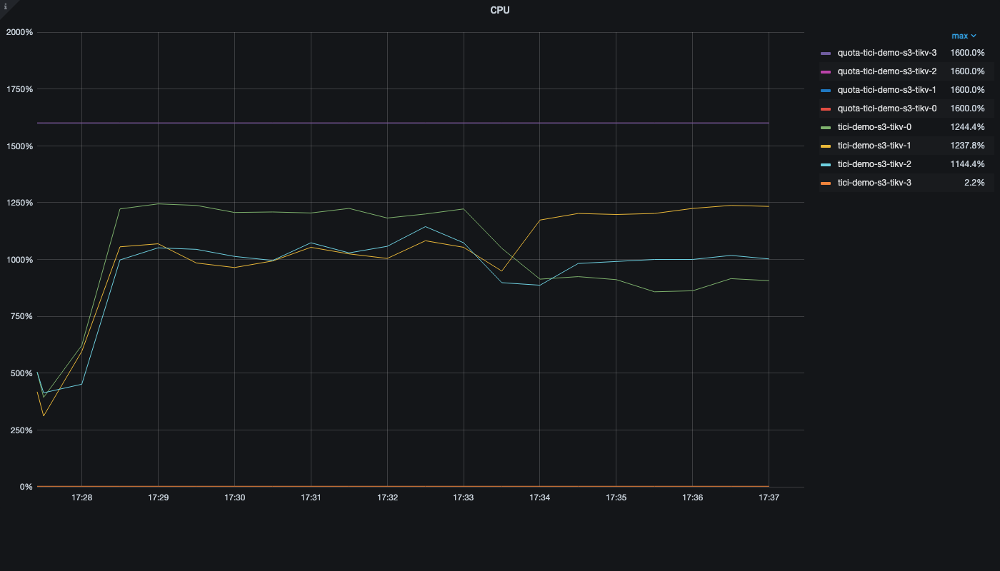</td>
<td width="50%"><strong>TiKV Memory</strong><br>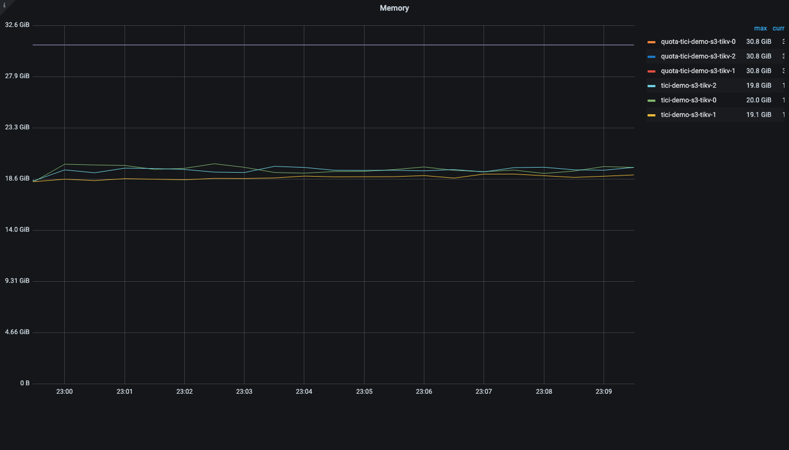</td>
</tr>
<tr>
<td width="50%"><strong>TiFlash CPU</strong><br>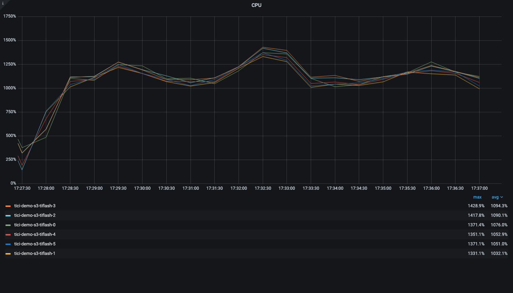</td>
<td width="50%"><strong>TiFlash Memory</strong><br>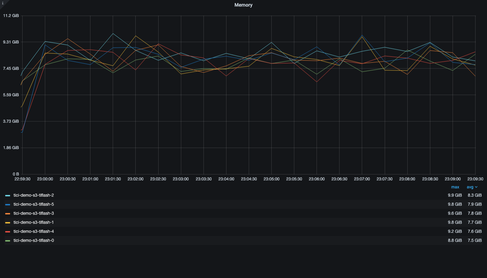</td>
</tr>
</table>

| Query | Successful ops | Source avg | Source max | Source rows avg | Run avg ms | vs source avg | P95 ms | Max ms | Run rows avg |
|---:|---:|---:|---:|---:|---:|---|---:|---:|---:|
| 2 | 1726 | 320.8ms | 14332.3ms | 234 | 1042.0 | 3.25x source | 1802.2 | 5323.1 | 600 |
| 4 | 654 | 11882.9ms | 34102.7ms | 1000 | 2757.1 | 4.31x faster | 4605.0 | 7439.7 | 1000 |
| 5 | 588 | 29101.7ms | 60034.6ms | 65 | 3066.1 | 9.49x faster | 5057.3 | 8565.0 | 1000 |
| 6 | 1765 | 44.8ms | 927.9ms | 168 | 1017.9 | 22.72x source | 1802.2 | 5672.3 | 50 |
| 7 | 2098 | 8.7ms | 487.0ms | 35 | 857.0 | 98.51x source | 1561.8 | 5669.5 | 35 |
| 8 | 351 | 16983.6ms | 32291.9ms | 6 | 5140.4 | 3.30x faster | 9737.8 | 12112.0 | 111.3 |
| 9 | 2103 | 28.1ms | 10778.1ms | 8 | 854.3 | 30.40x source | 1557.0 | 5674.0 | 24 |
| 10 | 608 | 41204.1ms | 51112.0ms | 136 | 2958.2 | 13.93x faster | 5073.0 | 8229.5 | 957.4 |
| 11 | 1858 | 17.0ms | 228.7ms | 1 | 966.6 | 56.86x source | 1702.8 | 5630.7 | 1 |
| 13 | 2038 | 29.8ms | 6157.8ms | 175 | 881.0 | 29.56x source | 1647.4 | 5701.7 | 175 |
| 14 | 708 | 28809.4ms | 45421.2ms | 1000 | 2540.9 | 11.34x faster | 4244.9 | 6919.8 | 1000 |
| 15 | 708 | 24650.8ms | 42060.9ms | 1000 | 2543.0 | 9.69x faster | 4114.5 | 7088.3 | 1000 |
| 16 | 519 | 47800.9ms | 60019.8ms | 500 | 3469.3 | 13.78x faster | 4661.2 | 8217.1 | 1000 |
| 17 | 618 | 29564.9ms | 37139.7ms | 0 | 2905.7 | 10.17x faster | 5124.1 | 7227.7 | 1000 |
| 18 | 2164 | 3.7ms | 325.7ms | 4 | 829.7 | 224.24x source | 1541.9 | 5692.9 | 5 |
| 19 | 662 | 39798.6ms | 60018.5ms | 500 | 2720.8 | 14.63x faster | 4388.8 | 6849.2 | 1000 |
| 20 | 2126 | 17.8ms | 5900.3ms | 1 | 844.5 | 47.44x source | 1554.8 | 5663.3 | 1 |
| 21 | 407 | 23577.6ms | 30859.8ms | 1000 | 4430.4 | 5.32x faster | 7125.6 | 11135.8 | 1000 |
| 22 | 1809 | 25.9ms | 233.2ms | 20 | 992.4 | 38.32x source | 1741.4 | 5307.0 | 20 |
| 23 | 618 | 33550.1ms | 35378.6ms | 0 | 2910.3 | 11.53x faster | 5189.5 | 7218.5 | 956.0 |
| 24 | 417 | 60085.2ms | 60085.2ms | 0 | 4313.4 | 13.93x faster | 5148.4 | 9951.9 | 1000 |
| 25 | 516 | 59691.1ms | 59691.1ms | 1000 | 3488.2 | 17.11x faster | 4704.1 | 8207.4 | 1000 |

#### Concurrency 132

- Window: `2026-05-08T14:27:07.866017+00:00` to `2026-05-08T14:37:11.607752+00:00`
- Grafana time range: [http://a2e41aa49d08647d1b55ecd7b146bbf6-38f9eda417a300aa.elb.us-east-2.amazonaws.com:3000?from=1778250427866&to=1778251031607](http://a2e41aa49d08647d1b55ecd7b146bbf6-38f9eda417a300aa.elb.us-east-2.amazonaws.com:3000?from=1778250427866&to=1778251031607)

| Component | Replicas | CPU avg cores | CPU max cores | CPU max % capacity | Mem avg GiB | Mem max GiB | Note |
|---|---:|---:|---:|---:|---:|---:|---|
| tidb | 3 | 5.31 | 6.90 | 14.4% | 22.15 | 25.97 |  |
| tikv | 3 | 28.96 | 33.96 | 70.8% | 58.04 | 59.21 |  |
| tiflash | 6 | 72.81 | 85.89 | 89.5% | 56.81 | 67.19 | TiFlash proxy process CPU metric |

Grafana panel screenshots:

<table>
<tr>
<td width="50%"><strong>TiDB CPU</strong><br>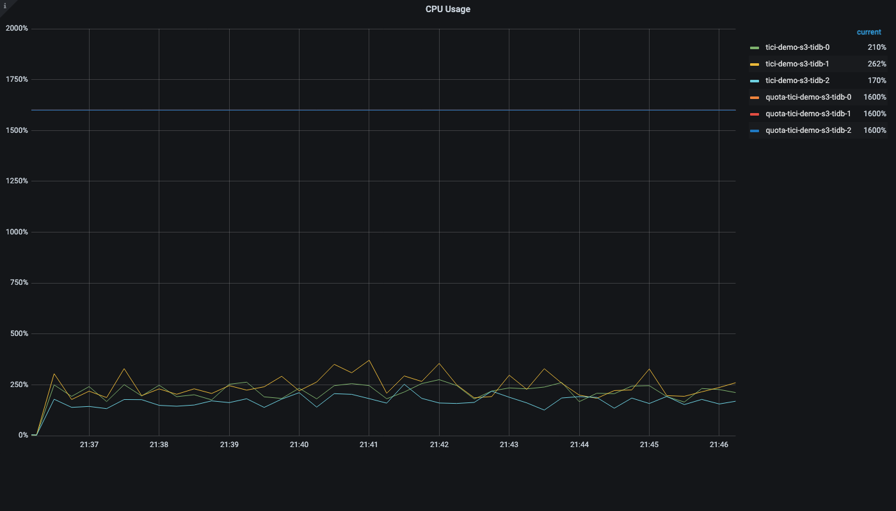</td>
<td width="50%"><strong>TiDB Memory</strong><br>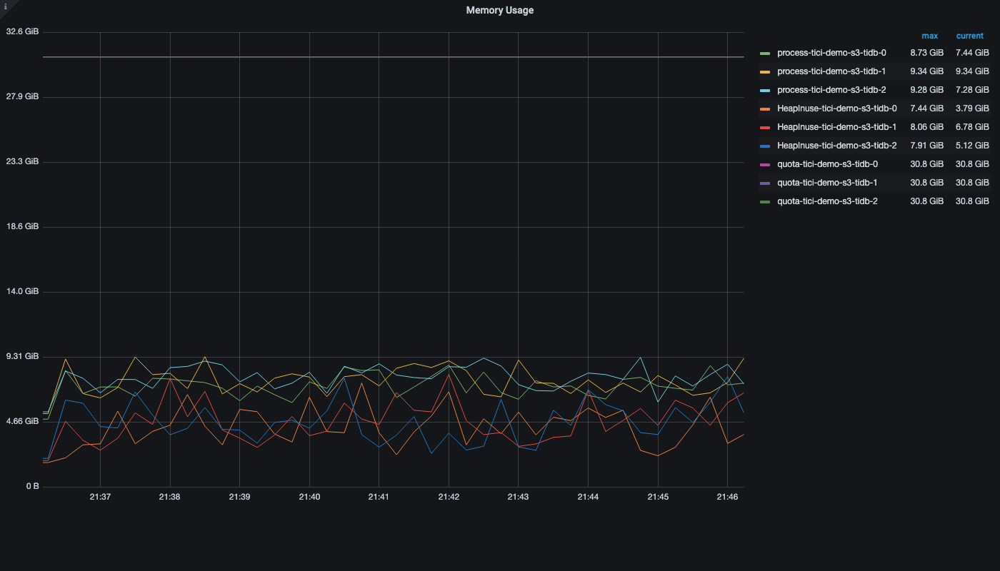</td>
</tr>
<tr>
<td width="50%"><strong>TiKV CPU</strong><br>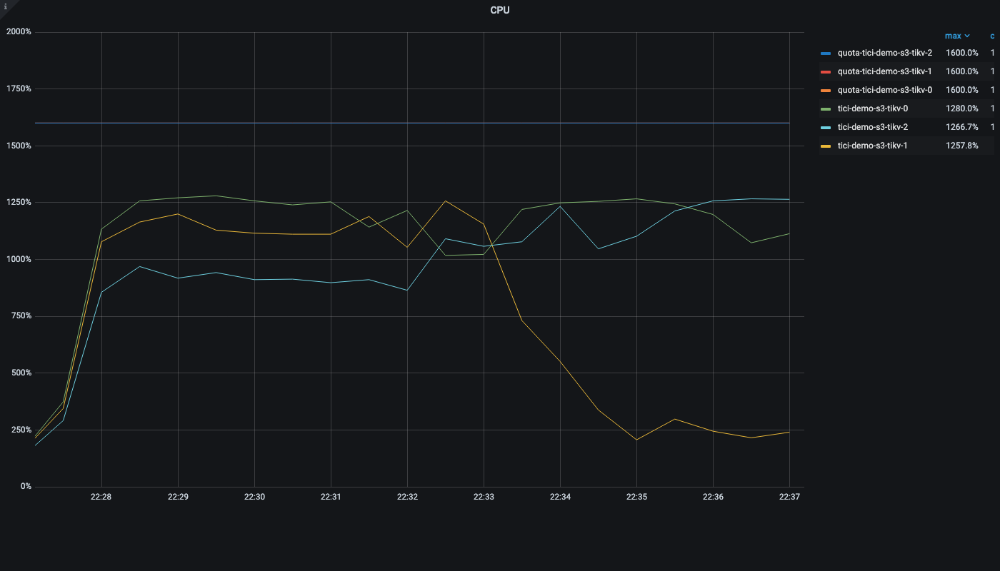</td>
<td width="50%"><strong>TiKV Memory</strong><br>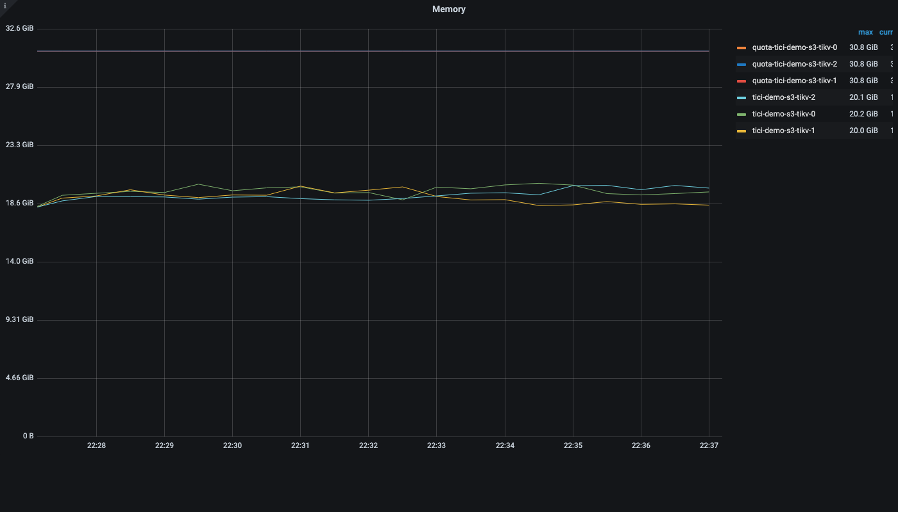</td>
</tr>
<tr>
<td width="50%"><strong>TiFlash CPU</strong><br>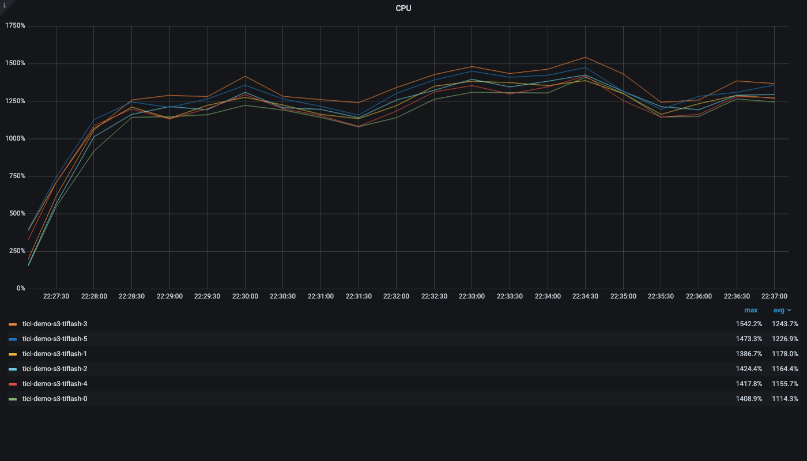</td>
<td width="50%"><strong>TiFlash Memory</strong><br>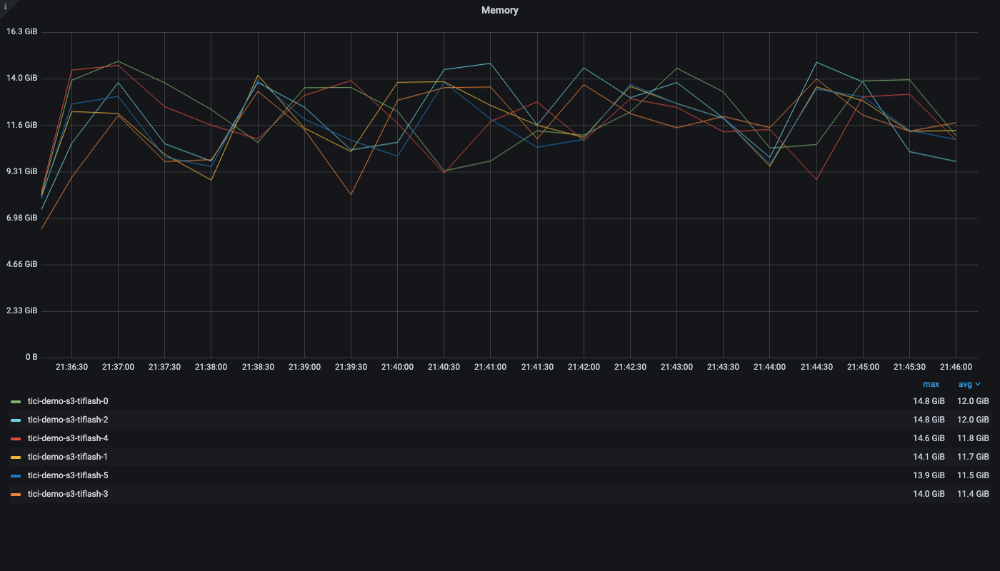</td>
</tr>
</table>

| Query | Successful ops | Source avg | Source max | Source rows avg | Run avg ms | vs source avg | P95 ms | Max ms | Run rows avg |
|---:|---:|---:|---:|---:|---:|---|---:|---:|---:|
| 2 | 2306 | 320.8ms | 14332.3ms | 234 | 1562.2 | 4.87x source | 2194.5 | 4558.9 | 600 |
| 4 | 565 | 11882.9ms | 34102.7ms | 1000 | 6384.7 | 1.86x faster | 10664.6 | 13565.4 | 1000 |
| 5 | 497 | 29101.7ms | 60034.6ms | 65 | 7279.4 | 4.00x faster | 11625.7 | 13629.2 | 1000 |
| 6 | 2603 | 44.8ms | 927.9ms | 168 | 1384.6 | 30.91x source | 1905.3 | 2415.9 | 50 |
| 7 | 28089 | 8.7ms | 487.0ms | 35 | 128.1 | 14.72x source | 224.5 | 472.7 | 35 |
| 8 | 541 | 16983.6ms | 32291.9ms | 6 | 6673.5 | 2.54x faster | 14794.1 | 18967.4 | 108.4 |
| 9 | 34113 | 28.1ms | 10778.1ms | 8 | 105.5 | 3.75x source | 188.8 | 1159.6 | 24 |
| 10 | 444 | 41204.1ms | 51112.0ms | 136 | 8152.7 | 5.05x faster | 11805.6 | 21732.4 | 957.2 |
| 11 | 2953 | 17.0ms | 228.7ms | 1 | 1220.1 | 71.77x source | 1692.8 | 2297.3 | 1 |
| 13 | 16523 | 29.8ms | 6157.8ms | 175 | 217.9 | 7.31x source | 355.7 | 2605.4 | 175 |
| 14 | 528 | 28809.4ms | 45421.2ms | 1000 | 6838.6 | 4.21x faster | 11159.3 | 17053.9 | 1000 |
| 15 | 526 | 24650.8ms | 42060.9ms | 1000 | 6864.5 | 3.59x faster | 11966.8 | 15021.1 | 1000 |
| 16 | 406 | 47800.9ms | 60019.8ms | 500 | 8889.8 | 5.38x faster | 11651.2 | 15855.4 | 1000 |
| 17 | 530 | 29564.9ms | 37139.7ms | 0 | 6801.1 | 4.35x faster | 11493.2 | 15806.6 | 1000 |
| 18 | 49479 | 3.7ms | 325.7ms | 4 | 72.7 | 19.65x source | 142.9 | 388.0 | 5 |
| 19 | 510 | 39798.6ms | 60018.5ms | 500 | 7080.3 | 5.62x faster | 11981.1 | 17543.9 | 1000 |
| 20 | 34029 | 17.8ms | 5900.3ms | 1 | 105.8 | 5.94x source | 191.6 | 407.7 | 1 |
| 21 | 335 | 23577.6ms | 30859.8ms | 1000 | 10776.4 | 2.19x faster | 15745.4 | 18339.6 | 1000 |
| 22 | 2832 | 25.9ms | 233.2ms | 20 | 1272.0 | 49.11x source | 1761.5 | 2428.9 | 20 |
| 23 | 539 | 33550.1ms | 35378.6ms | 0 | 6697.4 | 5.01x faster | 11222.3 | 15223.6 | 956.7 |
| 24 | 463 | 60085.2ms | 60085.2ms | 0 | 7805.9 | 7.70x faster | 10128.3 | 12156.8 | 1000 |
| 25 | 412 | 59691.1ms | 59691.1ms | 1000 | 8782.7 | 6.80x faster | 11429.0 | 13220.6 | 1000 |


## Per-Query Details

### Query #1

- Source tables: `cdm_type_obj_type_attr`
- Source avg/max latency: `2.7ms` / `518.3ms`
- Source avg rows/cop tasks: `0` / `1`
- Status: `skipped`
- Reason: cdm_type_obj_type_attr is not present in jsm_assets4

### Query #2

- Source tables: `obj_relationship_new`
- Source avg/max latency: `320.8ms` / `14332.3ms`
- Source avg rows/cop tasks: `234` / `33`
- Status: `ok`

| Sample | Params | Rows | Latency ms |
|---|---|---:|---:|
| s1 | workspace=8a6526e6-cd57-4216-bac6-358a6177d221, object_ids=25 | 600 | 81.9 |
| s2 | workspace=9963b35f-9397-48ec-9403-adab57aef265, object_ids=25 | 600 | 51.0 |
| s3 | workspace=3b4c201d-8244-416e-925d-f9608e001a2b, object_ids=25 | 600 | 73.7 |
| s4 | workspace=cafd5188-8a63-44e7-b4a9-e885c9664b9c, object_ids=25 | 600 | 57.4 |
| s5 | workspace=134fa09e-62e8-4b23-be76-d1b2d01845cc, object_ids=25 | 600 | 79.3 |
| s6 | workspace=183afe88-bcf4-48a6-a9ef-65420b7b819c, object_ids=25 | 600 | 75.1 |
| s7 | workspace=23f639f1-fae8-48b0-8518-da3b7c80be57, object_ids=25 | 600 | 102.0 |
| s8 | workspace=718915aa-f8e9-4bbc-b1dc-ba720f1296e2, object_ids=25 | 600 | 109.3 |
| s9 | workspace=00eaf117-fdd6-4176-9926-45310e6b9f54, object_ids=25 | 600 | 203.8 |
| s10 | workspace=82e47cda-f6dc-4999-b9fa-dc813435ec51, object_ids=25 | 600 | 199.2 |

<details>
<summary>Representative SQL</summary>

```sql
SELECT obj_relationship.workspace_id, obj_relationship.partition_id, obj_relationship.id, obj_relationship.object_id, obj_relationship.referenced_object_id, obj_relationship.object_type_attribute_id, obj_relationship.object_type_id, obj_relationship.referenced_object_type_id FROM obj_relationship_new obj_relationship WHERE obj_relationship.object_id IN (0x3d54b7c18cde48c296776991d41c0dfa, 0xc887970dbde547ff98bf25d0cc21cf40, 0xcf7d1166d3b8425ca2d283f728d71871, 0x6ca95034821e4b89a302146d4664b1ae, 0xb290d40f1c004c579d80553213a504a5, 0x6afb38ce677b4f9ba874e6abbdbac0a8, 0x20c10228fe1d490e95e4ff4eb73326e5, 0x0de869b45262444ab3f08957d1338a8c, 0x181a210858f54606a72a6ef39d2c1b40, 0x7f5051a6eb094068933dc8c2d3f68f8d, 0x5e7d3931b1094607865b7cf3ccd6e436, 0xe41e795cb96546a280b82b71e0833c92, 0x7a67a9ded63b4ece96fc98bf41cacd08, 0x97079757e703439ea060479068182bec, 0xff3f64347c804ff6b9cebec83d89b943, 0x394324db445048e583106987b778b59a, 0xd37f44c32afc4b97880fc717492dfe4c, 0x85f411f4f1234651bdad2c1147d0b6a7, 0xd6fc65178c7e497eb6629cec44ea83e2, 0xbdb0d63ab8054bf9b5abfad861a34a8c, 0x0a8b3892cf4643b38e48046a34dbba5b, 0xfa800fc4290a44a2a96d7abc3ebbd837, 0x9565907878b24889887292929ece99c1, 0xcb0b61ea348543538fb4ee4c8e0b1a32, 0xaba978c7705046059db0a8e0ef5bfd6a);
```

</details>

### Query #3

- Source tables: `obj_type,cdm_type_obj_type,icon,obj_schema,cdm_type_obj_schema,obj_schema_property,obj_schema_owner`
- Source avg/max latency: `36.3ms` / `8652.6ms`
- Source avg rows/cop tasks: `1` / `6`
- Status: `skipped`
- Reason: cdm_type_obj_type, cdm_type_obj_schema, and obj_schema_owner are not present in jsm_assets4

### Query #4

- Source tables: `obj_new`
- Source avg/max latency: `11882.9ms` / `34102.7ms`
- Source avg rows/cop tasks: `1000` / `518`
- Status: `ok`

| Sample | Params | Rows | Latency ms |
|---|---|---:|---:|
| s1 | workspace=8a6526e6-cd57-4216-bac6-358a6177d221, obj_types=5 | 1000 | 9048.8 |
| s2 | workspace=9963b35f-9397-48ec-9403-adab57aef265, obj_types=5 | 1000 | 10422.6 |
| s3 | workspace=3b4c201d-8244-416e-925d-f9608e001a2b, obj_types=5 | 1000 | 10746.6 |
| s4 | workspace=cafd5188-8a63-44e7-b4a9-e885c9664b9c, obj_types=5 | 1000 | 11471.1 |
| s5 | workspace=134fa09e-62e8-4b23-be76-d1b2d01845cc, obj_types=5 | 1000 | 11157.0 |
| s6 | workspace=183afe88-bcf4-48a6-a9ef-65420b7b819c, obj_types=5 | 1000 | 10570.1 |
| s7 | workspace=23f639f1-fae8-48b0-8518-da3b7c80be57, obj_types=5 | 1000 | 11244.9 |
| s8 | workspace=718915aa-f8e9-4bbc-b1dc-ba720f1296e2, obj_types=5 | 1000 | 11424.6 |
| s9 | workspace=00eaf117-fdd6-4176-9926-45310e6b9f54, obj_types=5 | 1000 | 49.0 |
| s10 | workspace=82e47cda-f6dc-4999-b9fa-dc813435ec51, obj_types=5 | 1000 | 46.4 |

<details>
<summary>Representative SQL</summary>

```sql
SELECT o.sequential_id, o.label FROM obj_new o WHERE o.workspace_id='8a6526e6-cd57-4216-bac6-358a6177d221' AND (o.obj_type_id IN (0xad3f4feadb96456da7bffc4cd63f05f4, 0x1bfa019ca2164e97b43331fe25d01325, 0x1d9d47a406e14befa85e456dcec5b67b, 0x29ba27b2e1174ca3a0541b8e84c15d4e, 0x81790b7da4ec44de85e1c94e50c497a7) AND ((o.numeric_value_5 IS NOT NULL AND o.obj_type_id = 0xad3f4feadb96456da7bffc4cd63f05f4) OR (o.numeric_value_5 IS NOT NULL AND o.obj_type_id = 0x1bfa019ca2164e97b43331fe25d01325) OR (o.numeric_value_5 IS NOT NULL AND o.obj_type_id = 0x1d9d47a406e14befa85e456dcec5b67b) OR (o.numeric_value_5 IS NOT NULL AND o.obj_type_id = 0x29ba27b2e1174ca3a0541b8e84c15d4e) OR (o.numeric_value_5 IS NOT NULL AND o.obj_type_id = 0x81790b7da4ec44de85e1c94e50c497a7))) ORDER BY o.label ASC LIMIT 1000 OFFSET 0;
```

</details>

### Query #5

- Source tables: `obj_new`
- Source avg/max latency: `29101.7ms` / `60034.6ms`
- Source avg rows/cop tasks: `65` / `1821`
- Status: `ok`

| Sample | Params | Rows | Latency ms |
|---|---|---:|---:|
| s1 | workspace=8a6526e6-cd57-4216-bac6-358a6177d221, obj_type_branches=5 | 1000 | 275.6 |
| s2 | workspace=3b4c201d-8244-416e-925d-f9608e001a2b, obj_type_branches=5 | 1000 | 221.4 |
| s3 | workspace=cafd5188-8a63-44e7-b4a9-e885c9664b9c, obj_type_branches=5 | 1000 | 218.3 |
| s4 | workspace=134fa09e-62e8-4b23-be76-d1b2d01845cc, obj_type_branches=5 | 1000 | 165.0 |
| s5 | workspace=183afe88-bcf4-48a6-a9ef-65420b7b819c, obj_type_branches=5 | 1000 | 140.4 |
| s6 | workspace=23f639f1-fae8-48b0-8518-da3b7c80be57, obj_type_branches=5 | 1000 | 165.4 |
| s7 | workspace=718915aa-f8e9-4bbc-b1dc-ba720f1296e2, obj_type_branches=5 | 1000 | 183.6 |
| s8 | workspace=00eaf117-fdd6-4176-9926-45310e6b9f54, obj_type_branches=5 | 1000 | 3899.1 |
| s9 | workspace=82e47cda-f6dc-4999-b9fa-dc813435ec51, obj_type_branches=5 | 1000 | 8309.5 |
| s10 | workspace=8a6526e6-cd57-4216-bac6-358a6177d221, obj_type_branches=5 | 1000 | 1394.6 |

<details>
<summary>Representative SQL</summary>

```sql
SELECT o.sequential_id, o.label FROM obj_new o WHERE o.workspace_id='8a6526e6-cd57-4216-bac6-358a6177d221' AND (o.obj_type_id IN (0x1bfa019ca2164e97b43331fe25d01325, 0x1d9d47a406e14befa85e456dcec5b67b, 0x81790b7da4ec44de85e1c94e50c497a7, 0x29ba27b2e1174ca3a0541b8e84c15d4e, 0xad3f4feadb96456da7bffc4cd63f05f4) AND (((JSON_CONTAINS(o.other_values_indexed, JSON_SET(CAST('{}' AS JSON), '$."57bcd304-17ea-4e4b-9316-5d5193a72ba5"', JSON_ARRAY('61b1c1e2977c5b00728b5a69'))) OR JSON_CONTAINS(o.other_values_indexed, JSON_SET(CAST('{}' AS JSON), '$."bfa02459-ed27-4699-80be-74abd546f842"', JSON_ARRAY('jira-group16'))) OR JSON_CONTAINS(o.other_values_indexed, JSON_SET(CAST('{}' AS JSON), '$."bfa02459-ed27-4699-80be-74abd546f842"', JSON_ARRAY('jira-group4'))) OR JSON_CONTAINS(o.other_values_indexed, JSON_SET(CAST('{}' AS JSON), '$."bfa02459-ed27-4699-80be-74abd546f842"', JSON_ARRAY('jira-group6')))) AND o.obj_type_id=0x1bfa019ca2164e97b43331fe25d01325) OR ((JSON_CONTAINS(o.other_values_indexed, JSON_SET(CAST('{}' AS JSON), '$."2a594586-2aed-43f5-9545-f20a1ac1fca9"', JSON_ARRAY('61b1c873d5986c006aa9cad0'))) OR JSON_CONTAINS(o.other_values_indexed, JSON_SET(CAST('{}' AS JSON), '$."afce7106-823a-4e74-bca5-e89e98f3c06a"', JSON_ARRAY('jira-group12'))) OR JSON_CONTAINS(o.other_values_indexed, JSON_SET(CAST('{}' AS JSON), '$."afce7106-823a-4e74-bca5-e89e98f3c06a"', JSON_ARRAY('jira-group5'))) OR JSON_CONTAINS(o.other_values_indexed, JSON_SET(CAST('{}' AS JSON), '$."2a594586-2aed-43f5-9545-f20a1ac1fca9"', JSON_ARRAY('61b1be48977c5b00728b2790')))) AND o.obj_type_id=0x1d9d47a406e14befa85e456dcec5b67b) OR ((JSON_CONTAINS(o.other_values_indexed, JSON_SET(CAST('{}' AS JSON), '$."1eee37c0-0f68-41e4-abfa-9b166b9a0a18"', JSON_ARRAY('jira-group4'))) OR JSON_CONTAINS(o.other_values_indexed, JSON_SET(CAST('{}' AS JSON), '$."42cf7e7a-80c9-472a-b5da-429c41632661"', JSON_ARRAY('61b1b833b43d5b006ad6df46'))) OR JSON_CONTAINS(o.other_values_indexed, JSON_SET(CAST('{}' AS JSON), '$."1eee37c0-0f68-41e4-abfa-9b166b9a0a18"', JSON_ARRAY('jira-group7'))) OR JSON_CONTAINS(o.other_values_indexed, JSON_SET(CAST('{}' AS JSON), '$."1eee37c0-0f68-41e4-abfa-9b166b9a0a18"', JSON_ARRAY('jira-group1')))) AND o.obj_type_id=0x81790b7da4ec44de85e1c94e50c497a7) OR ((JSON_CONTAINS(o.other_values_indexed, JSON_SET(CAST('{}' AS JSON), '$."1ab70ec5-6043-4626-974e-2f1c9b2c1841"', JSON_ARRAY('61b191e3977c5b0072892742'))) OR JSON_CONTAINS(o.other_values_indexed, JSON_SET(CAST('{}' AS JSON), '$."1ab70ec5-6043-4626-974e-2f1c9b2c1841"', JSON_ARRAY('61b1bcd7744c4d0069897157'))) OR JSON_CONTAINS(o.other_values_indexed, JSON_SET(CAST('{}' AS JSON), '$."ca0f6d36-5cc2-4f2f-a9de-24e6601f9eb2"', JSON_ARRAY('jira-group5'))) OR JSON_CONTAINS(o.other_values_indexed, JSON_SET(CAST('{}' AS JSON), '$."1ab70ec5-6043-4626-974e-2f1c9b2c1841"', JSON_ARRAY('61b1bbfb6d002b006b4f2925')))) AND o.obj_type_id=0x29ba27b2e1174ca3a0541b8e84c15d4e) OR ((JSON_CONTAINS(o.other_values_indexed, JSON_SET(CAST('{}' AS JSON), '$."cb46cc57-4418-4849-b604-c321ad0e3a35"', JSON_ARRAY('61b1b76bd5986c006aa8e95d'))) OR JSON_CONTAINS(o.other_values_indexed, JSON_SET(CAST('{}' AS JSON), '$."e2876f3e-fbd0-42cb-bd16-8c3b5f5ecdb9"', JSON_ARRAY('jira-group1'))) OR JSON_CONTAINS(o.other_values_indexed, JSON_SET(CAST('{}' AS JSON), '$."e2876f3e-fbd0-42cb-bd16-8c3b5f5ecdb9"', JSON_ARRAY('jira-group3'))) OR JSON_CONTAINS(o.other_values_indexed, JSON_SET(CAST('{}' AS JSON), '$."cb46cc57-4418-4849-b604-c321ad0e3a35"', JSON_ARRAY('61b1c23f6d002b006b4f7d37')))) AND o.obj_type_id=0xad3f4feadb96456da7bffc4cd63f05f4))) ORDER BY o.label ASC LIMIT 1000 OFFSET 0;
```

</details>

### Query #6

- Source tables: `obj_new`
- Source avg/max latency: `44.8ms` / `927.9ms`
- Source avg rows/cop tasks: `168` / `0`
- Status: `ok`

| Sample | Params | Rows | Latency ms |
|---|---|---:|---:|
| s1 | workspace=8a6526e6-cd57-4216-bac6-358a6177d221, ids=50 | 50 | 140.8 |
| s2 | workspace=9963b35f-9397-48ec-9403-adab57aef265, ids=50 | 50 | 68.5 |
| s3 | workspace=3b4c201d-8244-416e-925d-f9608e001a2b, ids=50 | 50 | 55.3 |
| s4 | workspace=cafd5188-8a63-44e7-b4a9-e885c9664b9c, ids=50 | 50 | 31.2 |
| s5 | workspace=134fa09e-62e8-4b23-be76-d1b2d01845cc, ids=50 | 50 | 44.4 |
| s6 | workspace=183afe88-bcf4-48a6-a9ef-65420b7b819c, ids=50 | 50 | 38.8 |
| s7 | workspace=23f639f1-fae8-48b0-8518-da3b7c80be57, ids=50 | 50 | 38.6 |
| s8 | workspace=718915aa-f8e9-4bbc-b1dc-ba720f1296e2, ids=50 | 50 | 27.7 |
| s9 | workspace=00eaf117-fdd6-4176-9926-45310e6b9f54, ids=50 | 50 | 27.8 |
| s10 | workspace=82e47cda-f6dc-4999-b9fa-dc813435ec51, ids=50 | 50 | 27.6 |

<details>
<summary>Representative SQL</summary>

```sql
SELECT obj.* FROM obj_new obj WHERE obj.id IN (0xbf9242d795564affacb528e70164d521, 0xdc6365eb21094270ac4536b871313f37, 0xf21eb653b5d0435894383d549553e98e, 0x5e522f7eca9d43c5b412a84b625e3da5, 0x34f637a0ccfd421c88f7774b8e0ccafc, 0x1d658953532d43c995df751c9165d7e5, 0xae791e1441a74d058e618483c920a682, 0x045a20795346403790358c97bb041e01, 0x50c2f36231a548baa609488f70ef3fea, 0x7c2cbaea76614842b88cf7d41024ee85, 0x946ff8b44d0a40dd863b3f7bd0a9762a, 0xe86ca5bb14e94ab2ae79e660c662ce30, 0xb6a5664f296b4e6bae61e77c12bbca64, 0x7ff6d462ec2e4fda9bcca635eecdd9bc, 0x4f9904747979418ebebe8c6a62b873a0, 0xcf81e64cdc7e42d6b4d48dd852170492, 0x54f47b26d0e34b0aa4bc2186d4f39787, 0x145b3336d16e43e48d8d25658e777fb0, 0xe0765b5d5b344767af715c118558fa3e, 0x47ad2529ece1499388797966fbee9166, 0xef45b769eb784515a59a74ddaba4fab8, 0xc044402b245b406ca6e0c2abf6a2e3cb, 0x74577eadf9734cb097f68ec3546e53b1, 0x8224731012a64be59a8e17e920236e81, 0xb3294a50fb494ecd95970e209eb9852a, 0xc764f613b070433caa63ba322f34e855, 0xeb42ca4ee1bf42d994607f58767610b1, 0x1ec3deee9a044428ae8e2a93a98f0fcc, 0x74854f8bd85f458b9c95f8483f84b632, 0x0614df6aa236435182adc70a779d9d71, 0x5234dc67d1d04abe98ca205e3f6c2537, 0xfc1ca3e07d1a49cdaa16c4a17d9820b8, 0x43239a33fa374a858d178e8a349f24da, 0xceda146c3b494111815347fa250a2225, 0x6f4b2c6323144d20b51e72fbd9e16a44, 0x9590ce6ecd124c3489baf8e747d0adbd, 0x0135352075364340a9cacf38181e9a49, 0x5be09303296e45dc9b7809ef7d0a46dd, 0x812ac67f91b24862a994f36ec79c19a9, 0x7cb42ea50cd0458da1f91b08b3b791ae, 0xaeb4227d55e14004bbf4b3d0f03770a3, 0x849484e9cd8f462fae0741cdb429af97, 0xc98c1884b1544337b9e7d33cf46faf15, 0x97805b08a5b84a0eb79a161d77b72d10, 0xb537eedbbbea41fe93e1f314498e537a, 0x5ff5a20afe7046e28c96fddf5751d150, 0xa0bf1ccba83b4f6a99f4ed113d2e4eb5, 0x382a85f7490b4a73847cbbdff63b5dbe, 0x5bb61f64f46149ffbacf59ccab80fd40, 0xa9f9292ddf764d14a2636c3be3445956);
```

</details>

### Query #7

- Source tables: `obj_type_attr,obj_type`
- Source avg/max latency: `8.7ms` / `487.0ms`
- Source avg rows/cop tasks: `35` / `2`
- Status: `ok`

| Sample | Params | Rows | Latency ms |
|---|---|---:|---:|
| s1 | workspace=cafd5188-8a63-44e7-b4a9-e885c9664b9c, obj_type=ca0a6a3f-120d-4e81-a73a-35dc434b9590 | 35 | 31.3 |
| s2 | workspace=cafd5188-8a63-44e7-b4a9-e885c9664b9c, obj_type=89a756f6-0201-4cda-bec2-e6496b1d0018 | 35 | 6.9 |
| s3 | workspace=8a6526e6-cd57-4216-bac6-358a6177d221, obj_type=29ba27b2-e117-4ca3-a054-1b8e84c15d4e | 35 | 8.3 |
| s4 | workspace=718915aa-f8e9-4bbc-b1dc-ba720f1296e2, obj_type=e7afe364-c8d5-413e-b80c-eb69477bba57 | 35 | 6.7 |
| s5 | workspace=00eaf117-fdd6-4176-9926-45310e6b9f54, obj_type=fa849938-5ed1-4c60-89b9-adb37223c21c | 35 | 6.6 |
| s6 | workspace=9963b35f-9397-48ec-9403-adab57aef265, obj_type=e9b4640e-fde6-4a4b-aba2-d402fb8d3f93 | 35 | 6.4 |
| s7 | workspace=3b4c201d-8244-416e-925d-f9608e001a2b, obj_type=451aed8b-a883-4ee3-8d40-5f6881afa983 | 35 | 5.9 |
| s8 | workspace=8a6526e6-cd57-4216-bac6-358a6177d221, obj_type=1bfa019c-a216-4e97-b433-31fe25d01325 | 35 | 6.3 |
| s9 | workspace=134fa09e-62e8-4b23-be76-d1b2d01845cc, obj_type=0a79f4d5-1527-4f18-b770-be668a5fb0ad | 35 | 6.5 |
| s10 | workspace=9963b35f-9397-48ec-9403-adab57aef265, obj_type=caa0b57b-5bca-42d7-80f6-7b3831e81978 | 35 | 6.2 |

<details>
<summary>Representative SQL</summary>

```sql
SELECT otae1_0.id, otae1_0.additional_value, otae1_0.aql, otae1_0.created, otae1_0.default_type_id, otae1_0.deleted_at, otae1_0.description, otae1_0.external_id, otae1_0.group_id_type_value, otae1_0.hidden, otae1_0.include_child_object_types, otae1_0.is_deleted, otae1_0.label, otae1_0.maximum_cardinality, otae1_0.minimum_cardinality, otae1_0.name, otae1_0.object_type_id, otae1_0.ota_position, otae1_0.options, otae1_0.pending, otae1_0.reference_object_type_id, otae1_0.reference_type_id, otae1_0.regex_validation, otae1_0.removable, otae1_0.sequential_id, otae1_0.suffix, otae1_0.summable, otae1_0.type, otae1_0.type_value, otae1_0.unique_attribute, otae1_0.updated, otae1_0.workspace_id FROM obj_type_attr otae1_0 LEFT JOIN obj_type ot1_0 ON ot1_0.id = otae1_0.object_type_id AND ot1_0.workspace_id = 'cafd5188-8a63-44e7-b4a9-e885c9664b9c' AND ot1_0.is_deleted = 0 AND ot1_0.is_deleted = 0 WHERE otae1_0.workspace_id = 'cafd5188-8a63-44e7-b4a9-e885c9664b9c' AND otae1_0.is_deleted = 0 AND ot1_0.id IN (0xca0a6a3f120d4e81a73a35dc434b9590);
```

</details>

### Query #8

- Source tables: `obj_new`
- Source avg/max latency: `16983.6ms` / `32291.9ms`
- Source avg rows/cop tasks: `6` / `127`
- Status: `ok`

| Sample | Params | Rows | Latency ms |
|---|---|---:|---:|
| s1 | workspace=8a6526e6-cd57-4216-bac6-358a6177d221, obj_type=ad3f4fea-db96-456d-a7bf-fc4cd63f05f4, text_value_22=⁣Analysed⁣ | 4 | 42368.0 |
| s2 | workspace=9963b35f-9397-48ec-9403-adab57aef265, obj_type=c803e991-dc8d-4c96-a818-0a05c3a7ee7b, text_value_22=⁣Operational⁣ | 37 | 39990.9 |
| s3 | workspace=3b4c201d-8244-416e-925d-f9608e001a2b, obj_type=451aed8b-a883-4ee3-8d40-5f6881afa983, text_value_22=⁣Retired⁣ | 19 | 26999.8 |
| s4 | workspace=cafd5188-8a63-44e7-b4a9-e885c9664b9c, obj_type=eefa73e0-11da-4486-8024-fddfc52baef8, text_value_22=⁣Defined⁣ | 1000 | 25577.8 |
| s5 | workspace=134fa09e-62e8-4b23-be76-d1b2d01845cc, obj_type=c30b5368-dba0-4929-bc3d-dff93d45b5c2, text_value_22=⁣Retired⁣ | 13 | 8028.0 |
| s6 | workspace=183afe88-bcf4-48a6-a9ef-65420b7b819c, obj_type=09ae6b6f-4a9d-4021-8377-e14a3e0ccdd1, text_value_22=⁣Defined⁣ | 1 | 8581.7 |
| s7 | workspace=23f639f1-fae8-48b0-8518-da3b7c80be57, obj_type=a8439325-6f3b-4715-bdcb-9c132779da43, text_value_22=⁣Retired⁣ | 2 | 4490.7 |
| s8 | workspace=718915aa-f8e9-4bbc-b1dc-ba720f1296e2, obj_type=440eb858-a088-46c0-bb9a-0f1ca94eae58, text_value_22=⁣Approved⁣ | 5 | 4165.5 |
| s9 | workspace=00eaf117-fdd6-4176-9926-45310e6b9f54, obj_type=dc814b70-4b9e-458d-94fe-350ddfc49d98, text_value_22=⁣Defined⁣ | 4 | 639.1 |
| s10 | workspace=82e47cda-f6dc-4999-b9fa-dc813435ec51, obj_type=fd57a932-342b-43ee-b20c-0ea71d89c5b3, text_value_22=⁣Defined⁣ | 1 | 588.3 |

<details>
<summary>Representative SQL</summary>

```sql
SELECT o.sequential_id, o.label FROM obj_new o WHERE o.workspace_id='8a6526e6-cd57-4216-bac6-358a6177d221' AND (o.obj_type_id IN (0xad3f4feadb96456da7bffc4cd63f05f4, 0x81790b7da4ec44de85e1c94e50c497a7, 0x1d9d47a406e14befa85e456dcec5b67b, 0x1bfa019ca2164e97b43331fe25d01325, 0x29ba27b2e1174ca3a0541b8e84c15d4e) AND (o.obj_type_id = 0xad3f4feadb96456da7bffc4cd63f05f4) AND (o.text_value_23 = 'Amana' AND MATCH(o.text_value_22) AGAINST ('"⁣Analysed⁣"' IN BOOLEAN MODE) AND o.text_value_22 LIKE '%⁣Analysed⁣%' AND o.text_value_22 != '' AND o.text_value_9 = 'Fagor' AND (o.numeric_value_3 = 20.000000000000000000000000000000 OR o.numeric_value_1 = 938.000000000000000000000000000000))) ORDER BY o.label ASC LIMIT 1000 OFFSET 0;
```

</details>

### Query #9

- Source tables: `obj_relationship_new`
- Source avg/max latency: `28.1ms` / `10778.1ms`
- Source avg rows/cop tasks: `8` / `6`
- Status: `ok`

| Sample | Params | Rows | Latency ms |
|---|---|---:|---:|
| s1 | workspace=9963b35f-9397-48ec-9403-adab57aef265, object_id=d8312458-5347-4044-93fb-a6699a237a0d | 24 | 15.1 |
| s2 | workspace=cafd5188-8a63-44e7-b4a9-e885c9664b9c, object_id=1aad6e65-5158-4aa6-acbf-07086511d34f | 24 | 18.5 |
| s3 | workspace=3b4c201d-8244-416e-925d-f9608e001a2b, object_id=d1b33aad-b216-46e7-ba41-8fd241b78193 | 24 | 12.8 |
| s4 | workspace=8a6526e6-cd57-4216-bac6-358a6177d221, object_id=f3764ae7-41b2-4061-a67c-b2646a491e03 | 24 | 27.5 |
| s5 | workspace=183afe88-bcf4-48a6-a9ef-65420b7b819c, object_id=344e6047-1681-47d9-a916-a1b56678ee12 | 24 | 19.2 |
| s6 | workspace=8a6526e6-cd57-4216-bac6-358a6177d221, object_id=2084b310-7756-47ab-95a9-5d2b14e951b3 | 24 | 10.8 |
| s7 | workspace=cafd5188-8a63-44e7-b4a9-e885c9664b9c, object_id=a2407626-7bb1-478c-a8e4-9867c7a7d8f7 | 24 | 17.3 |
| s8 | workspace=8a6526e6-cd57-4216-bac6-358a6177d221, object_id=03b64a23-9dd4-4767-b2ae-458587776144 | 24 | 10.2 |
| s9 | workspace=8a6526e6-cd57-4216-bac6-358a6177d221, object_id=de9533f2-5132-49c8-97ea-a53248460d94 | 24 | 12.7 |
| s10 | workspace=183afe88-bcf4-48a6-a9ef-65420b7b819c, object_id=7ad29c7b-e5a1-4cdd-b99e-c4559739494f | 24 | 19.7 |

<details>
<summary>Representative SQL</summary>

```sql
SELECT obj_relationship.workspace_id, obj_relationship.partition_id, obj_relationship.id, obj_relationship.object_id, obj_relationship.referenced_object_id, obj_relationship.object_type_attribute_id, obj_relationship.object_type_id, obj_relationship.referenced_object_type_id FROM obj_relationship_new obj_relationship WHERE obj_relationship.object_id = 0xd83124585347404493fba6699a237a0d;
```

</details>

### Query #10

- Source tables: `obj_new`
- Source avg/max latency: `41204.1ms` / `51112.0ms`
- Source avg rows/cop tasks: `136` / `4324`
- Status: `ok`

| Sample | Params | Rows | Latency ms |
|---|---|---:|---:|
| s1 | workspace=00eaf117-fdd6-4176-9926-45310e6b9f54, obj_type=266009e9-5e41-4baf-ab14-eef7ffe5f2e0, json_terms=4 | 1000 | 401.5 |
| s2 | workspace=00eaf117-fdd6-4176-9926-45310e6b9f54, obj_type=77744fc5-c48e-44e8-a7f1-1213703b7707, json_terms=4 | 1000 | 525.2 |
| s3 | workspace=00eaf117-fdd6-4176-9926-45310e6b9f54, obj_type=7d9ffc8b-03a9-4ef6-9bbf-b2e5f939ba14, json_terms=4 | 1000 | 553.4 |
| s4 | workspace=00eaf117-fdd6-4176-9926-45310e6b9f54, obj_type=dc814b70-4b9e-458d-94fe-350ddfc49d98, json_terms=4 | 1000 | 398.8 |
| s5 | workspace=00eaf117-fdd6-4176-9926-45310e6b9f54, obj_type=fa849938-5ed1-4c60-89b9-adb37223c21c, json_terms=4 | 1000 | 396.2 |
| s6 | workspace=134fa09e-62e8-4b23-be76-d1b2d01845cc, obj_type=05f273ff-2221-45a4-9742-dd58bb38be3e, json_terms=4 | 568 | 1474.4 |
| s7 | workspace=134fa09e-62e8-4b23-be76-d1b2d01845cc, obj_type=0a79f4d5-1527-4f18-b770-be668a5fb0ad, json_terms=4 | 1000 | 590.0 |
| s8 | workspace=134fa09e-62e8-4b23-be76-d1b2d01845cc, obj_type=33516f75-3dd9-43d6-b121-a8bf408c69be, json_terms=4 | 1000 | 580.0 |
| s9 | workspace=134fa09e-62e8-4b23-be76-d1b2d01845cc, obj_type=c30b5368-dba0-4929-bc3d-dff93d45b5c2, json_terms=4 | 1000 | 559.1 |
| s10 | workspace=134fa09e-62e8-4b23-be76-d1b2d01845cc, obj_type=d05f4480-7ba4-4f69-9764-9ee42ce5f6ef, json_terms=4 | 1000 | 582.1 |

<details>
<summary>Representative SQL</summary>

```sql
SELECT o.* FROM obj_new o WHERE o.workspace_id='00eaf117-fdd6-4176-9926-45310e6b9f54' AND (o.obj_type_id=0x266009e95e414bafab14eef7ffe5f2e0 AND (JSON_CONTAINS(o.other_values_indexed, JSON_SET(CAST('{}' AS JSON), '$."305e045b-affd-4a0d-9c42-6198a29d9be1"', JSON_ARRAY('jira-group5'))) OR JSON_CONTAINS(o.other_values_indexed, JSON_SET(CAST('{}' AS JSON), '$."305e045b-affd-4a0d-9c42-6198a29d9be1"', JSON_ARRAY('jira-group8'))) OR JSON_CONTAINS(o.other_values_indexed, JSON_SET(CAST('{}' AS JSON), '$."305e045b-affd-4a0d-9c42-6198a29d9be1"', JSON_ARRAY('jira-group2'))) OR JSON_CONTAINS(o.other_values_indexed, JSON_SET(CAST('{}' AS JSON), '$."93a28091-1d1d-4a99-956f-56655d771eb1"', JSON_ARRAY('61b1bf2ac75da800726b198f')))) AND o.obj_type_id=0x266009e95e414bafab14eef7ffe5f2e0) ORDER BY o.label ASC LIMIT 1000 OFFSET 0;
```

</details>

### Query #11

- Source tables: `obj_new`
- Source avg/max latency: `17.0ms` / `228.7ms`
- Source avg rows/cop tasks: `1` / `0`
- Status: `ok`

| Sample | Params | Rows | Latency ms |
|---|---|---:|---:|
| s1 | workspace=00eaf117-fdd6-4176-9926-45310e6b9f54, sequential_id=1 | 1 | 31.6 |
| s2 | workspace=00eaf117-fdd6-4176-9926-45310e6b9f54, sequential_id=2 | 1 | 11.4 |
| s3 | workspace=00eaf117-fdd6-4176-9926-45310e6b9f54, sequential_id=3 | 1 | 11.2 |
| s4 | workspace=00eaf117-fdd6-4176-9926-45310e6b9f54, sequential_id=4 | 1 | 10.8 |
| s5 | workspace=00eaf117-fdd6-4176-9926-45310e6b9f54, sequential_id=5 | 1 | 12.0 |
| s6 | workspace=00eaf117-fdd6-4176-9926-45310e6b9f54, sequential_id=6 | 1 | 11.6 |
| s7 | workspace=00eaf117-fdd6-4176-9926-45310e6b9f54, sequential_id=7 | 1 | 11.0 |
| s8 | workspace=00eaf117-fdd6-4176-9926-45310e6b9f54, sequential_id=8 | 1 | 11.3 |
| s9 | workspace=00eaf117-fdd6-4176-9926-45310e6b9f54, sequential_id=9 | 1 | 10.8 |
| s10 | workspace=00eaf117-fdd6-4176-9926-45310e6b9f54, sequential_id=10 | 1 | 10.8 |

<details>
<summary>Representative SQL</summary>

```sql
SELECT obj.* FROM obj_new obj WHERE obj.workspace_id='00eaf117-fdd6-4176-9926-45310e6b9f54' AND obj.sequential_id = 1;
```

</details>

### Query #12

- Source tables: `ref_type,cdm_type_ref_type,obj_schema,cdm_type_obj_schema,obj_schema_property,obj_schema_owner`
- Source avg/max latency: `10.2ms` / `473.9ms`
- Source avg rows/cop tasks: `1` / `2`
- Status: `skipped`
- Reason: cdm_type_ref_type, cdm_type_obj_schema, and obj_schema_owner are not present in jsm_assets4

### Query #13

- Source tables: `obj_type_attr,obj_type`
- Source avg/max latency: `29.8ms` / `6157.8ms`
- Source avg rows/cop tasks: `175` / `2`
- Status: `ok`

| Sample | Params | Rows | Latency ms |
|---|---|---:|---:|
| s1 | workspace=8a6526e6-cd57-4216-bac6-358a6177d221, obj_types=5 | 175 | 12.1 |
| s2 | workspace=9963b35f-9397-48ec-9403-adab57aef265, obj_types=5 | 175 | 9.4 |
| s3 | workspace=3b4c201d-8244-416e-925d-f9608e001a2b, obj_types=5 | 175 | 10.8 |
| s4 | workspace=cafd5188-8a63-44e7-b4a9-e885c9664b9c, obj_types=5 | 175 | 10.1 |
| s5 | workspace=134fa09e-62e8-4b23-be76-d1b2d01845cc, obj_types=5 | 175 | 9.5 |
| s6 | workspace=183afe88-bcf4-48a6-a9ef-65420b7b819c, obj_types=5 | 175 | 8.7 |
| s7 | workspace=23f639f1-fae8-48b0-8518-da3b7c80be57, obj_types=5 | 175 | 9.1 |
| s8 | workspace=718915aa-f8e9-4bbc-b1dc-ba720f1296e2, obj_types=5 | 175 | 8.9 |
| s9 | workspace=00eaf117-fdd6-4176-9926-45310e6b9f54, obj_types=5 | 175 | 9.5 |
| s10 | workspace=82e47cda-f6dc-4999-b9fa-dc813435ec51, obj_types=5 | 175 | 9.1 |

<details>
<summary>Representative SQL</summary>

```sql
SELECT otae1_0.id, otae1_0.additional_value, otae1_0.aql, otae1_0.created, otae1_0.default_type_id, otae1_0.deleted_at, otae1_0.description, otae1_0.external_id, otae1_0.group_id_type_value, otae1_0.hidden, otae1_0.include_child_object_types, otae1_0.is_deleted, otae1_0.label, otae1_0.maximum_cardinality, otae1_0.minimum_cardinality, otae1_0.name, otae1_0.object_type_id, otae1_0.ota_position, otae1_0.options, otae1_0.pending, otae1_0.reference_object_type_id, otae1_0.reference_type_id, otae1_0.regex_validation, otae1_0.removable, otae1_0.sequential_id, otae1_0.suffix, otae1_0.summable, otae1_0.type, otae1_0.type_value, otae1_0.unique_attribute, otae1_0.updated, otae1_0.workspace_id FROM obj_type_attr otae1_0 LEFT JOIN obj_type ot1_0 ON ot1_0.id = otae1_0.object_type_id AND ot1_0.workspace_id = '8a6526e6-cd57-4216-bac6-358a6177d221' AND ot1_0.is_deleted = 0 AND ot1_0.is_deleted = 0 WHERE otae1_0.workspace_id = '8a6526e6-cd57-4216-bac6-358a6177d221' AND otae1_0.is_deleted = 0 AND ot1_0.id IN (0x1bfa019ca2164e97b43331fe25d01325, 0x1d9d47a406e14befa85e456dcec5b67b, 0x29ba27b2e1174ca3a0541b8e84c15d4e, 0x81790b7da4ec44de85e1c94e50c497a7, 0xad3f4feadb96456da7bffc4cd63f05f4);
```

</details>

### Query #14

- Source tables: `obj_new`
- Source avg/max latency: `28809.4ms` / `45421.2ms`
- Source avg rows/cop tasks: `1000` / `1697`
- Status: `ok`

| Sample | Params | Rows | Latency ms |
|---|---|---:|---:|
| s1 | workspace=00eaf117-fdd6-4176-9926-45310e6b9f54, obj_type=266009e9-5e41-4baf-ab14-eef7ffe5f2e0, text_value_8=􏿿 | 1000 | 94.7 |
| s2 | workspace=00eaf117-fdd6-4176-9926-45310e6b9f54, obj_type=266009e9-5e41-4baf-ab14-eef7ffe5f2e0, text_value_8=LG | 1000 | 89.0 |
| s3 | workspace=00eaf117-fdd6-4176-9926-45310e6b9f54, obj_type=77744fc5-c48e-44e8-a7f1-1213703b7707, text_value_8=KitchenAid | 1000 | 148.7 |
| s4 | workspace=00eaf117-fdd6-4176-9926-45310e6b9f54, obj_type=7d9ffc8b-03a9-4ef6-9bbf-b2e5f939ba14, text_value_8=Siemens | 1000 | 136.1 |
| s5 | workspace=00eaf117-fdd6-4176-9926-45310e6b9f54, obj_type=266009e9-5e41-4baf-ab14-eef7ffe5f2e0, text_value_8=Fagor | 1000 | 85.0 |
| s6 | workspace=00eaf117-fdd6-4176-9926-45310e6b9f54, obj_type=dc814b70-4b9e-458d-94fe-350ddfc49d98, text_value_8=Samsung | 1000 | 84.2 |
| s7 | workspace=00eaf117-fdd6-4176-9926-45310e6b9f54, obj_type=dc814b70-4b9e-458d-94fe-350ddfc49d98, text_value_8=Franke | 1000 | 80.2 |
| s8 | workspace=00eaf117-fdd6-4176-9926-45310e6b9f54, obj_type=fa849938-5ed1-4c60-89b9-adb37223c21c, text_value_8=􏿿 | 1000 | 85.7 |
| s9 | workspace=00eaf117-fdd6-4176-9926-45310e6b9f54, obj_type=dc814b70-4b9e-458d-94fe-350ddfc49d98, text_value_8=Samsung | 1000 | 16.9 |
| s10 | workspace=00eaf117-fdd6-4176-9926-45310e6b9f54, obj_type=dc814b70-4b9e-458d-94fe-350ddfc49d98, text_value_8=Siemens | 1000 | 79.9 |

<details>
<summary>Representative SQL</summary>

```sql
SELECT o.sequential_id, o.text_value_8 FROM obj_new o WHERE o.workspace_id='00eaf117-fdd6-4176-9926-45310e6b9f54' AND (o.obj_type_id=0x266009e95e414bafab14eef7ffe5f2e0 AND ((NOT o.text_value_7_lower = '__not_amana__' OR LOWER(o.text_value_7) = '􏿿') AND o.text_value_7 IS NOT NULL AND o.obj_type_id=0x266009e95e414bafab14eef7ffe5f2e0)  AND (o.text_value_8='􏿿' AND o.obj_type_id=0x266009e95e414bafab14eef7ffe5f2e0)) ORDER BY o.text_value_8 ASC LIMIT 1000 OFFSET 0;
```

</details>

### Query #15

- Source tables: `obj_new`
- Source avg/max latency: `24650.8ms` / `42060.9ms`
- Source avg rows/cop tasks: `1000` / `1225`
- Status: `ok`

| Sample | Params | Rows | Latency ms |
|---|---|---:|---:|
| s1 | workspace=00eaf117-fdd6-4176-9926-45310e6b9f54, obj_type=266009e9-5e41-4baf-ab14-eef7ffe5f2e0, text_value_8=􏿿 | 1000 | 93.3 |
| s2 | workspace=00eaf117-fdd6-4176-9926-45310e6b9f54, obj_type=266009e9-5e41-4baf-ab14-eef7ffe5f2e0, text_value_8=LG | 1000 | 76.7 |
| s3 | workspace=00eaf117-fdd6-4176-9926-45310e6b9f54, obj_type=77744fc5-c48e-44e8-a7f1-1213703b7707, text_value_8=KitchenAid | 1000 | 89.9 |
| s4 | workspace=00eaf117-fdd6-4176-9926-45310e6b9f54, obj_type=7d9ffc8b-03a9-4ef6-9bbf-b2e5f939ba14, text_value_8=Siemens | 1000 | 86.7 |
| s5 | workspace=00eaf117-fdd6-4176-9926-45310e6b9f54, obj_type=266009e9-5e41-4baf-ab14-eef7ffe5f2e0, text_value_8=Fagor | 1000 | 78.5 |
| s6 | workspace=00eaf117-fdd6-4176-9926-45310e6b9f54, obj_type=dc814b70-4b9e-458d-94fe-350ddfc49d98, text_value_8=Samsung | 1000 | 85.4 |
| s7 | workspace=00eaf117-fdd6-4176-9926-45310e6b9f54, obj_type=dc814b70-4b9e-458d-94fe-350ddfc49d98, text_value_8=Franke | 1000 | 77.4 |
| s8 | workspace=00eaf117-fdd6-4176-9926-45310e6b9f54, obj_type=fa849938-5ed1-4c60-89b9-adb37223c21c, text_value_8=􏿿 | 1000 | 87.7 |
| s9 | workspace=00eaf117-fdd6-4176-9926-45310e6b9f54, obj_type=dc814b70-4b9e-458d-94fe-350ddfc49d98, text_value_8=Samsung | 1000 | 16.9 |
| s10 | workspace=00eaf117-fdd6-4176-9926-45310e6b9f54, obj_type=dc814b70-4b9e-458d-94fe-350ddfc49d98, text_value_8=Siemens | 1000 | 84.5 |

<details>
<summary>Representative SQL</summary>

```sql
SELECT o.sequential_id, o.text_value_1 FROM obj_new o WHERE o.workspace_id='00eaf117-fdd6-4176-9926-45310e6b9f54' AND (o.obj_type_id=0x266009e95e414bafab14eef7ffe5f2e0 AND ((NOT o.text_value_7_lower = '__not_amana__' OR LOWER(o.text_value_7) = '􏿿') AND o.text_value_7 IS NOT NULL AND o.obj_type_id=0x266009e95e414bafab14eef7ffe5f2e0)  AND (o.text_value_8='􏿿' AND o.obj_type_id=0x266009e95e414bafab14eef7ffe5f2e0)) ORDER BY o.text_value_1 ASC LIMIT 1000 OFFSET 0;
```

</details>

### Query #16

- Source tables: `obj_new`
- Source avg/max latency: `47800.9ms` / `60019.8ms`
- Source avg rows/cop tasks: `500` / `1738`
- Status: `ok`

| Sample | Params | Rows | Latency ms |
|---|---|---:|---:|
| s1 | workspace=00eaf117-fdd6-4176-9926-45310e6b9f54, obj_type=266009e9-5e41-4baf-ab14-eef7ffe5f2e0, text_value_16=Whirlpool | 1000 | 829.1 |
| s2 | workspace=00eaf117-fdd6-4176-9926-45310e6b9f54, obj_type=266009e9-5e41-4baf-ab14-eef7ffe5f2e0, text_value_16=􏿿 | 1000 | 913.7 |
| s3 | workspace=00eaf117-fdd6-4176-9926-45310e6b9f54, obj_type=77744fc5-c48e-44e8-a7f1-1213703b7707, text_value_16=Whirlpool | 1000 | 828.8 |
| s4 | workspace=00eaf117-fdd6-4176-9926-45310e6b9f54, obj_type=7d9ffc8b-03a9-4ef6-9bbf-b2e5f939ba14, text_value_16=Admiral | 1000 | 815.7 |
| s5 | workspace=00eaf117-fdd6-4176-9926-45310e6b9f54, obj_type=266009e9-5e41-4baf-ab14-eef7ffe5f2e0, text_value_16=􏿿 | 1000 | 823.5 |
| s6 | workspace=00eaf117-fdd6-4176-9926-45310e6b9f54, obj_type=dc814b70-4b9e-458d-94fe-350ddfc49d98, text_value_16=Whirlpool | 1000 | 805.3 |
| s7 | workspace=00eaf117-fdd6-4176-9926-45310e6b9f54, obj_type=dc814b70-4b9e-458d-94fe-350ddfc49d98, text_value_16=LG | 1000 | 818.0 |
| s8 | workspace=00eaf117-fdd6-4176-9926-45310e6b9f54, obj_type=fa849938-5ed1-4c60-89b9-adb37223c21c, text_value_16=􏿿 | 1000 | 893.9 |
| s9 | workspace=00eaf117-fdd6-4176-9926-45310e6b9f54, obj_type=dc814b70-4b9e-458d-94fe-350ddfc49d98, text_value_16=Franke | 1000 | 813.8 |
| s10 | workspace=00eaf117-fdd6-4176-9926-45310e6b9f54, obj_type=dc814b70-4b9e-458d-94fe-350ddfc49d98, text_value_16=􏿿 | 1000 | 889.3 |

<details>
<summary>Representative SQL</summary>

```sql
SELECT o.* FROM obj_new o WHERE o.workspace_id='00eaf117-fdd6-4176-9926-45310e6b9f54' AND (o.obj_type_id=0x266009e95e414bafab14eef7ffe5f2e0 AND ((NOT o.text_value_7_lower = '__not_amana__' OR LOWER(o.text_value_7) = '􏿿') AND o.text_value_7 IS NOT NULL AND o.obj_type_id=0x266009e95e414bafab14eef7ffe5f2e0)  AND (o.text_value_16='Whirlpool' AND o.obj_type_id=0x266009e95e414bafab14eef7ffe5f2e0)) ORDER BY o.numeric_value_4 ASC LIMIT 1000 OFFSET 0;
```

</details>

### Query #17

- Source tables: `obj_new`
- Source avg/max latency: `29564.9ms` / `37139.7ms`
- Source avg rows/cop tasks: `0` / `2578`
- Status: `ok`

| Sample | Params | Rows | Latency ms |
|---|---|---:|---:|
| s1 | workspace=00eaf117-fdd6-4176-9926-45310e6b9f54, obj_type=266009e9-5e41-4baf-ab14-eef7ffe5f2e0, json_terms=8 | 1000 | 66.4 |
| s2 | workspace=00eaf117-fdd6-4176-9926-45310e6b9f54, obj_type=77744fc5-c48e-44e8-a7f1-1213703b7707, json_terms=8 | 1000 | 103.4 |
| s3 | workspace=00eaf117-fdd6-4176-9926-45310e6b9f54, obj_type=7d9ffc8b-03a9-4ef6-9bbf-b2e5f939ba14, json_terms=8 | 1000 | 160.1 |
| s4 | workspace=00eaf117-fdd6-4176-9926-45310e6b9f54, obj_type=dc814b70-4b9e-458d-94fe-350ddfc49d98, json_terms=8 | 1000 | 56.6 |
| s5 | workspace=00eaf117-fdd6-4176-9926-45310e6b9f54, obj_type=fa849938-5ed1-4c60-89b9-adb37223c21c, json_terms=8 | 1000 | 90.0 |
| s6 | workspace=134fa09e-62e8-4b23-be76-d1b2d01845cc, obj_type=05f273ff-2221-45a4-9742-dd58bb38be3e, json_terms=8 | 1000 | 311.1 |
| s7 | workspace=134fa09e-62e8-4b23-be76-d1b2d01845cc, obj_type=0a79f4d5-1527-4f18-b770-be668a5fb0ad, json_terms=8 | 1000 | 111.0 |
| s8 | workspace=134fa09e-62e8-4b23-be76-d1b2d01845cc, obj_type=33516f75-3dd9-43d6-b121-a8bf408c69be, json_terms=8 | 1000 | 206.2 |
| s9 | workspace=134fa09e-62e8-4b23-be76-d1b2d01845cc, obj_type=c30b5368-dba0-4929-bc3d-dff93d45b5c2, json_terms=8 | 1000 | 275.7 |
| s10 | workspace=134fa09e-62e8-4b23-be76-d1b2d01845cc, obj_type=d05f4480-7ba4-4f69-9764-9ee42ce5f6ef, json_terms=8 | 1000 | 212.1 |

<details>
<summary>Representative SQL</summary>

```sql
SELECT o.sequential_id, o.label FROM obj_new o WHERE o.workspace_id='00eaf117-fdd6-4176-9926-45310e6b9f54' AND (o.obj_type_id=0x266009e95e414bafab14eef7ffe5f2e0 AND (JSON_CONTAINS(o.other_values_indexed, JSON_SET(CAST('{}' AS JSON), '$."305e045b-affd-4a0d-9c42-6198a29d9be1"', JSON_ARRAY('jira-group5'))) OR JSON_CONTAINS(o.other_values_indexed, JSON_SET(CAST('{}' AS JSON), '$."305e045b-affd-4a0d-9c42-6198a29d9be1"', JSON_ARRAY('jira-group8'))) OR JSON_CONTAINS(o.other_values_indexed, JSON_SET(CAST('{}' AS JSON), '$."305e045b-affd-4a0d-9c42-6198a29d9be1"', JSON_ARRAY('jira-group2'))) OR JSON_CONTAINS(o.other_values_indexed, JSON_SET(CAST('{}' AS JSON), '$."93a28091-1d1d-4a99-956f-56655d771eb1"', JSON_ARRAY('61b1bf2ac75da800726b198f'))) OR JSON_CONTAINS(o.other_values_indexed, JSON_SET(CAST('{}' AS JSON), '$."305e045b-affd-4a0d-9c42-6198a29d9be1"', JSON_ARRAY('jira-group19'))) OR JSON_CONTAINS(o.other_values_indexed, JSON_SET(CAST('{}' AS JSON), '$."93a28091-1d1d-4a99-956f-56655d771eb1"', JSON_ARRAY('61b1beabd2e64c0071db24b4'))) OR JSON_CONTAINS(o.other_values_indexed, JSON_SET(CAST('{}' AS JSON), '$."305e045b-affd-4a0d-9c42-6198a29d9be1"', JSON_ARRAY('jira-group11'))) OR JSON_CONTAINS(o.other_values_indexed, JSON_SET(CAST('{}' AS JSON), '$."93a28091-1d1d-4a99-956f-56655d771eb1"', JSON_ARRAY('61b1ba77c510bc006b66f112')))) AND o.obj_type_id=0x266009e95e414bafab14eef7ffe5f2e0) ORDER BY o.label ASC LIMIT 1000 OFFSET 0;
```

</details>

### Query #18

- Source tables: `obj_type`
- Source avg/max latency: `3.7ms` / `325.7ms`
- Source avg rows/cop tasks: `4` / `0`
- Status: `ok`

| Sample | Params | Rows | Latency ms |
|---|---|---:|---:|
| s1 | workspace=8a6526e6-cd57-4216-bac6-358a6177d221, obj_types=5 | 5 | 2.5 |
| s2 | workspace=9963b35f-9397-48ec-9403-adab57aef265, obj_types=5 | 5 | 3.1 |
| s3 | workspace=3b4c201d-8244-416e-925d-f9608e001a2b, obj_types=5 | 5 | 2.0 |
| s4 | workspace=cafd5188-8a63-44e7-b4a9-e885c9664b9c, obj_types=5 | 5 | 2.9 |
| s5 | workspace=134fa09e-62e8-4b23-be76-d1b2d01845cc, obj_types=5 | 5 | 1.9 |
| s6 | workspace=183afe88-bcf4-48a6-a9ef-65420b7b819c, obj_types=5 | 5 | 2.8 |
| s7 | workspace=23f639f1-fae8-48b0-8518-da3b7c80be57, obj_types=5 | 5 | 2.6 |
| s8 | workspace=718915aa-f8e9-4bbc-b1dc-ba720f1296e2, obj_types=5 | 5 | 1.9 |
| s9 | workspace=00eaf117-fdd6-4176-9926-45310e6b9f54, obj_types=5 | 5 | 2.0 |
| s10 | workspace=82e47cda-f6dc-4999-b9fa-dc813435ec51, obj_types=5 | 5 | 2.5 |

<details>
<summary>Representative SQL</summary>

```sql
SELECT ote1_0.* FROM obj_type ote1_0 WHERE ote1_0.workspace_id='8a6526e6-cd57-4216-bac6-358a6177d221' AND ote1_0.is_deleted = 0 AND ote1_0.id IN (0x1bfa019ca2164e97b43331fe25d01325, 0x1d9d47a406e14befa85e456dcec5b67b, 0x29ba27b2e1174ca3a0541b8e84c15d4e, 0x81790b7da4ec44de85e1c94e50c497a7, 0xad3f4feadb96456da7bffc4cd63f05f4);
```

</details>

### Query #19

- Source tables: `obj_new`
- Source avg/max latency: `39798.6ms` / `60018.5ms`
- Source avg rows/cop tasks: `500` / `1758`
- Status: `ok`

| Sample | Params | Rows | Latency ms |
|---|---|---:|---:|
| s1 | workspace=00eaf117-fdd6-4176-9926-45310e6b9f54, obj_type=266009e9-5e41-4baf-ab14-eef7ffe5f2e0, text_value_16=Whirlpool | 1000 | 85.1 |
| s2 | workspace=00eaf117-fdd6-4176-9926-45310e6b9f54, obj_type=266009e9-5e41-4baf-ab14-eef7ffe5f2e0, text_value_16=􏿿 | 1000 | 96.2 |
| s3 | workspace=00eaf117-fdd6-4176-9926-45310e6b9f54, obj_type=77744fc5-c48e-44e8-a7f1-1213703b7707, text_value_16=Whirlpool | 1000 | 92.1 |
| s4 | workspace=00eaf117-fdd6-4176-9926-45310e6b9f54, obj_type=7d9ffc8b-03a9-4ef6-9bbf-b2e5f939ba14, text_value_16=Admiral | 1000 | 87.4 |
| s5 | workspace=00eaf117-fdd6-4176-9926-45310e6b9f54, obj_type=266009e9-5e41-4baf-ab14-eef7ffe5f2e0, text_value_16=􏿿 | 1000 | 77.0 |
| s6 | workspace=00eaf117-fdd6-4176-9926-45310e6b9f54, obj_type=dc814b70-4b9e-458d-94fe-350ddfc49d98, text_value_16=Whirlpool | 1000 | 78.3 |
| s7 | workspace=00eaf117-fdd6-4176-9926-45310e6b9f54, obj_type=dc814b70-4b9e-458d-94fe-350ddfc49d98, text_value_16=LG | 1000 | 83.3 |
| s8 | workspace=00eaf117-fdd6-4176-9926-45310e6b9f54, obj_type=fa849938-5ed1-4c60-89b9-adb37223c21c, text_value_16=􏿿 | 1000 | 88.5 |
| s9 | workspace=00eaf117-fdd6-4176-9926-45310e6b9f54, obj_type=dc814b70-4b9e-458d-94fe-350ddfc49d98, text_value_16=Franke | 1000 | 88.5 |
| s10 | workspace=00eaf117-fdd6-4176-9926-45310e6b9f54, obj_type=dc814b70-4b9e-458d-94fe-350ddfc49d98, text_value_16=􏿿 | 1000 | 90.6 |

<details>
<summary>Representative SQL</summary>

```sql
SELECT o.sequential_id, o.numeric_value_4 FROM obj_new o WHERE o.workspace_id='00eaf117-fdd6-4176-9926-45310e6b9f54' AND (o.obj_type_id=0x266009e95e414bafab14eef7ffe5f2e0 AND ((NOT o.text_value_7_lower = '__not_amana__' OR LOWER(o.text_value_7) = '􏿿') AND o.text_value_7 IS NOT NULL AND o.obj_type_id=0x266009e95e414bafab14eef7ffe5f2e0)  AND (o.text_value_16='Whirlpool' AND o.obj_type_id=0x266009e95e414bafab14eef7ffe5f2e0)) ORDER BY o.numeric_value_4 ASC LIMIT 1000 OFFSET 0;
```

</details>

### Query #20

- Source tables: `obj_type_attr`
- Source avg/max latency: `17.8ms` / `5900.3ms`
- Source avg rows/cop tasks: `1` / `2`
- Status: `ok`

| Sample | Params | Rows | Latency ms |
|---|---|---:|---:|
| s1 | workspace=00eaf117-fdd6-4176-9926-45310e6b9f54, sequential_id=1 | 1 | 12.9 |
| s2 | workspace=00eaf117-fdd6-4176-9926-45310e6b9f54, sequential_id=2 | 1 | 3.5 |
| s3 | workspace=00eaf117-fdd6-4176-9926-45310e6b9f54, sequential_id=3 | 1 | 3.5 |
| s4 | workspace=00eaf117-fdd6-4176-9926-45310e6b9f54, sequential_id=4 | 1 | 3.7 |
| s5 | workspace=00eaf117-fdd6-4176-9926-45310e6b9f54, sequential_id=5 | 1 | 3.5 |
| s6 | workspace=00eaf117-fdd6-4176-9926-45310e6b9f54, sequential_id=6 | 1 | 3.4 |
| s7 | workspace=00eaf117-fdd6-4176-9926-45310e6b9f54, sequential_id=7 | 1 | 3.4 |
| s8 | workspace=00eaf117-fdd6-4176-9926-45310e6b9f54, sequential_id=8 | 1 | 3.4 |
| s9 | workspace=00eaf117-fdd6-4176-9926-45310e6b9f54, sequential_id=9 | 1 | 3.4 |
| s10 | workspace=00eaf117-fdd6-4176-9926-45310e6b9f54, sequential_id=10 | 1 | 3.5 |

<details>
<summary>Representative SQL</summary>

```sql
SELECT otae1_0.id, otae1_0.additional_value, otae1_0.aql, otae1_0.created, otae1_0.default_type_id, otae1_0.deleted_at, otae1_0.description, otae1_0.external_id, otae1_0.group_id_type_value, otae1_0.hidden, otae1_0.include_child_object_types, otae1_0.is_deleted, otae1_0.label, otae1_0.maximum_cardinality, otae1_0.minimum_cardinality, otae1_0.name, otae1_0.object_type_id, otae1_0.ota_position, otae1_0.options, otae1_0.pending, otae1_0.reference_object_type_id, otae1_0.reference_type_id, otae1_0.regex_validation, otae1_0.removable, otae1_0.sequential_id, otae1_0.suffix, otae1_0.summable, otae1_0.type, otae1_0.type_value, otae1_0.unique_attribute, otae1_0.updated, otae1_0.workspace_id FROM obj_type_attr otae1_0 WHERE otae1_0.workspace_id = '00eaf117-fdd6-4176-9926-45310e6b9f54' AND otae1_0.is_deleted = 0 AND otae1_0.sequential_id = 1;
```

</details>

### Query #21

- Source tables: `obj_new,obj_relationship_new`
- Source avg/max latency: `23577.6ms` / `30859.8ms`
- Source avg rows/cop tasks: `1000` / `2971`
- Status: `ok`

| Sample | Params | Rows | Latency ms |
|---|---|---:|---:|
| s1 | workspace=00eaf117-fdd6-4176-9926-45310e6b9f54, text_value_24=Bosch, sub_text_value_8=􏿿 | 1000 | 13389.4 |
| s2 | workspace=00eaf117-fdd6-4176-9926-45310e6b9f54, text_value_24=Bosch, sub_text_value_8=􏿿 | 1000 | 245.0 |
| s3 | workspace=00eaf117-fdd6-4176-9926-45310e6b9f54, text_value_24=KitchenAid, sub_text_value_8=􏿿 | 1000 | 249.1 |
| s4 | workspace=00eaf117-fdd6-4176-9926-45310e6b9f54, text_value_24=􏿿, sub_text_value_8=􏿿 | 1000 | 246.2 |
| s5 | workspace=00eaf117-fdd6-4176-9926-45310e6b9f54, text_value_24=􏿿, sub_text_value_8=􏿿 | 1000 | 251.6 |
| s6 | workspace=00eaf117-fdd6-4176-9926-45310e6b9f54, text_value_24=􏿿, sub_text_value_8=􏿿 | 1000 | 233.9 |
| s7 | workspace=00eaf117-fdd6-4176-9926-45310e6b9f54, text_value_24=Franke, sub_text_value_8=􏿿 | 1000 | 234.2 |
| s8 | workspace=00eaf117-fdd6-4176-9926-45310e6b9f54, text_value_24=Electrolux, sub_text_value_8=􏿿 | 1000 | 232.6 |
| s9 | workspace=00eaf117-fdd6-4176-9926-45310e6b9f54, text_value_24=􏿿, sub_text_value_8=􏿿 | 1000 | 224.1 |
| s10 | workspace=00eaf117-fdd6-4176-9926-45310e6b9f54, text_value_24=IKEA, sub_text_value_8=􏿿 | 1000 | 254.4 |

<details>
<summary>Representative SQL</summary>

```sql
SELECT o.sequential_id, o.label FROM obj_new o WHERE o.workspace_id='00eaf117-fdd6-4176-9926-45310e6b9f54' AND (o.obj_type_id IN (0x266009e95e414bafab14eef7ffe5f2e0, 0xfa8499385ed14c6089b9adb37223c21c, 0x7d9ffc8b03a94ef69bbfb2e5f939ba14, 0xdc814b704b9e458d94fe350ddfc49d98, 0x77744fc5c48e44e8a7f11213703b7707) AND (o.text_value_24='Bosch' AND o.obj_type_id IN (0x266009e95e414bafab14eef7ffe5f2e0, 0xfa8499385ed14c6089b9adb37223c21c, 0x7d9ffc8b03a94ef69bbfb2e5f939ba14, 0xdc814b704b9e458d94fe350ddfc49d98, 0x77744fc5c48e44e8a7f11213703b7707)) AND EXISTS (SELECT 1 FROM obj_relationship_new subr INNER JOIN obj_new subo1 ON subr.object_id=subo1.id AND subo1.obj_type_id IN (0x266009e95e414bafab14eef7ffe5f2e0, 0xfa8499385ed14c6089b9adb37223c21c, 0x7d9ffc8b03a94ef69bbfb2e5f939ba14, 0xdc814b704b9e458d94fe350ddfc49d98, 0x77744fc5c48e44e8a7f11213703b7707) WHERE o.id=subr.referenced_object_id AND subo1.workspace_id='00eaf117-fdd6-4176-9926-45310e6b9f54' AND subo1.text_value_8='􏿿')) ORDER BY o.label ASC LIMIT 1000 OFFSET 0;
```

</details>

### Query #22

- Source tables: `obj_new`
- Source avg/max latency: `25.9ms` / `233.2ms`
- Source avg rows/cop tasks: `20` / `0`
- Status: `ok`

| Sample | Params | Rows | Latency ms |
|---|---|---:|---:|
| s1 | workspace=8a6526e6-cd57-4216-bac6-358a6177d221, partition_id=1, sequential_ids=20 | 20 | 50.7 |
| s2 | workspace=9963b35f-9397-48ec-9403-adab57aef265, partition_id=1, sequential_ids=20 | 20 | 32.3 |
| s3 | workspace=3b4c201d-8244-416e-925d-f9608e001a2b, partition_id=1, sequential_ids=20 | 20 | 30.8 |
| s4 | workspace=cafd5188-8a63-44e7-b4a9-e885c9664b9c, partition_id=1, sequential_ids=20 | 20 | 33.9 |
| s5 | workspace=134fa09e-62e8-4b23-be76-d1b2d01845cc, partition_id=1, sequential_ids=20 | 20 | 20.5 |
| s6 | workspace=183afe88-bcf4-48a6-a9ef-65420b7b819c, partition_id=1, sequential_ids=20 | 20 | 32.2 |
| s7 | workspace=23f639f1-fae8-48b0-8518-da3b7c80be57, partition_id=1, sequential_ids=20 | 20 | 18.8 |
| s8 | workspace=718915aa-f8e9-4bbc-b1dc-ba720f1296e2, partition_id=1, sequential_ids=20 | 20 | 29.9 |
| s9 | workspace=00eaf117-fdd6-4176-9926-45310e6b9f54, partition_id=1, sequential_ids=20 | 20 | 15.9 |
| s10 | workspace=82e47cda-f6dc-4999-b9fa-dc813435ec51, partition_id=1, sequential_ids=20 | 20 | 18.2 |

<details>
<summary>Representative SQL</summary>

```sql
SELECT obj.* FROM obj_new obj WHERE obj.workspace_id='8a6526e6-cd57-4216-bac6-358a6177d221' AND obj.partition_id=1 AND obj.sequential_id IN (1, 2, 3, 4, 5, 6, 7, 8, 9, 10, 11, 12, 13, 14, 15, 16, 17, 18, 19, 20);
```

</details>

### Query #23

- Source tables: `obj_new`
- Source avg/max latency: `33550.1ms` / `35378.6ms`
- Source avg rows/cop tasks: `0` / `928`
- Status: `ok`

| Sample | Params | Rows | Latency ms |
|---|---|---:|---:|
| s1 | workspace=00eaf117-fdd6-4176-9926-45310e6b9f54, obj_type=266009e9-5e41-4baf-ab14-eef7ffe5f2e0, json_terms=4 | 1000 | 58.4 |
| s2 | workspace=00eaf117-fdd6-4176-9926-45310e6b9f54, obj_type=77744fc5-c48e-44e8-a7f1-1213703b7707, json_terms=4 | 1000 | 88.1 |
| s3 | workspace=00eaf117-fdd6-4176-9926-45310e6b9f54, obj_type=7d9ffc8b-03a9-4ef6-9bbf-b2e5f939ba14, json_terms=4 | 1000 | 88.7 |
| s4 | workspace=00eaf117-fdd6-4176-9926-45310e6b9f54, obj_type=dc814b70-4b9e-458d-94fe-350ddfc49d98, json_terms=4 | 1000 | 102.4 |
| s5 | workspace=00eaf117-fdd6-4176-9926-45310e6b9f54, obj_type=fa849938-5ed1-4c60-89b9-adb37223c21c, json_terms=4 | 1000 | 53.1 |
| s6 | workspace=134fa09e-62e8-4b23-be76-d1b2d01845cc, obj_type=05f273ff-2221-45a4-9742-dd58bb38be3e, json_terms=4 | 568 | 235.2 |
| s7 | workspace=134fa09e-62e8-4b23-be76-d1b2d01845cc, obj_type=0a79f4d5-1527-4f18-b770-be668a5fb0ad, json_terms=4 | 1000 | 88.9 |
| s8 | workspace=134fa09e-62e8-4b23-be76-d1b2d01845cc, obj_type=33516f75-3dd9-43d6-b121-a8bf408c69be, json_terms=4 | 1000 | 145.7 |
| s9 | workspace=134fa09e-62e8-4b23-be76-d1b2d01845cc, obj_type=c30b5368-dba0-4929-bc3d-dff93d45b5c2, json_terms=4 | 1000 | 90.2 |
| s10 | workspace=134fa09e-62e8-4b23-be76-d1b2d01845cc, obj_type=d05f4480-7ba4-4f69-9764-9ee42ce5f6ef, json_terms=4 | 1000 | 185.8 |

<details>
<summary>Representative SQL</summary>

```sql
SELECT o.sequential_id, o.label FROM obj_new o WHERE o.workspace_id='00eaf117-fdd6-4176-9926-45310e6b9f54' AND (o.obj_type_id=0x266009e95e414bafab14eef7ffe5f2e0 AND (JSON_CONTAINS(o.other_values_indexed, JSON_SET(CAST('{}' AS JSON), '$."305e045b-affd-4a0d-9c42-6198a29d9be1"', JSON_ARRAY('jira-group5'))) OR JSON_CONTAINS(o.other_values_indexed, JSON_SET(CAST('{}' AS JSON), '$."305e045b-affd-4a0d-9c42-6198a29d9be1"', JSON_ARRAY('jira-group8'))) OR JSON_CONTAINS(o.other_values_indexed, JSON_SET(CAST('{}' AS JSON), '$."305e045b-affd-4a0d-9c42-6198a29d9be1"', JSON_ARRAY('jira-group2'))) OR JSON_CONTAINS(o.other_values_indexed, JSON_SET(CAST('{}' AS JSON), '$."93a28091-1d1d-4a99-956f-56655d771eb1"', JSON_ARRAY('61b1bf2ac75da800726b198f')))) AND o.obj_type_id=0x266009e95e414bafab14eef7ffe5f2e0) ORDER BY o.label ASC LIMIT 1000 OFFSET 0;
```

</details>

### Query #24

- Source tables: `obj_new,obj_relationship_new`
- Source avg/max latency: `60085.2ms` / `60085.2ms`
- Source avg rows/cop tasks: `0` / `3147`
- Status: `ok`

| Sample | Params | Rows | Latency ms |
|---|---|---:|---:|
| s1 | workspace=8a6526e6-cd57-4216-bac6-358a6177d221, depth3_label=LG-52576 | 1000 | 7046.3 |
| s2 | workspace=8a6526e6-cd57-4216-bac6-358a6177d221, depth3_label=Samsung-514085 | 1000 | 1186.8 |
| s3 | workspace=8a6526e6-cd57-4216-bac6-358a6177d221, depth3_label=Admiral-16098 | 1000 | 1182.7 |
| s4 | workspace=8a6526e6-cd57-4216-bac6-358a6177d221, depth3_label=Admiral-282336 | 1000 | 1148.9 |
| s5 | workspace=8a6526e6-cd57-4216-bac6-358a6177d221, depth3_label=LG-360191 | 1000 | 1183.8 |
| s6 | workspace=8a6526e6-cd57-4216-bac6-358a6177d221, depth3_label=Blue Star-562402 | 1000 | 1183.7 |
| s7 | workspace=8a6526e6-cd57-4216-bac6-358a6177d221, depth3_label=Whirlpool-509861 | 1000 | 1184.3 |
| s8 | workspace=8a6526e6-cd57-4216-bac6-358a6177d221, depth3_label=LG-52576 | 1000 | 1171.4 |
| s9 | workspace=8a6526e6-cd57-4216-bac6-358a6177d221, depth3_label=Samsung-514085 | 1000 | 1189.9 |
| s10 | workspace=8a6526e6-cd57-4216-bac6-358a6177d221, depth3_label=Admiral-16098 | 1000 | 1172.2 |

<details>
<summary>Representative SQL</summary>

```sql
SELECT o.sequential_id, o.label FROM obj_new o WHERE o.workspace_id='8a6526e6-cd57-4216-bac6-358a6177d221' AND (o.obj_type_id IN (0x81790b7da4ec44de85e1c94e50c497a7, 0xad3f4feadb96456da7bffc4cd63f05f4, 0x1d9d47a406e14befa85e456dcec5b67b, 0x1bfa019ca2164e97b43331fe25d01325, 0x29ba27b2e1174ca3a0541b8e84c15d4e) AND EXISTS (SELECT 1 FROM obj_relationship_new subr INNER JOIN obj_new subo1 ON subr.referenced_object_id=subo1.id WHERE o.id=subr.object_id AND subo1.workspace_id='8a6526e6-cd57-4216-bac6-358a6177d221' AND EXISTS (SELECT 1 FROM obj_relationship_new subr1 INNER JOIN obj_new subo2 ON subr1.referenced_object_id=subo2.id WHERE subo1.id=subr1.object_id AND subo2.workspace_id='8a6526e6-cd57-4216-bac6-358a6177d221' AND EXISTS (SELECT 1 FROM obj_relationship_new subr2 INNER JOIN obj_new subo3 ON subr2.referenced_object_id=subo3.id WHERE subo2.id=subr2.object_id AND subo3.workspace_id='8a6526e6-cd57-4216-bac6-358a6177d221' AND subo3.label='LG-52576')))) ORDER BY o.label ASC LIMIT 1000 OFFSET 0;
```

</details>

### Query #25

- Source tables: `obj_new`
- Source avg/max latency: `59691.1ms` / `59691.1ms`
- Source avg rows/cop tasks: `1000` / `3162`
- Status: `ok`

| Sample | Params | Rows | Latency ms |
|---|---|---:|---:|
| s1 | workspace=00eaf117-fdd6-4176-9926-45310e6b9f54, obj_type=266009e9-5e41-4baf-ab14-eef7ffe5f2e0, text_value_8=􏿿 | 1000 | 863.5 |
| s2 | workspace=00eaf117-fdd6-4176-9926-45310e6b9f54, obj_type=266009e9-5e41-4baf-ab14-eef7ffe5f2e0, text_value_8=LG | 1000 | 817.4 |
| s3 | workspace=00eaf117-fdd6-4176-9926-45310e6b9f54, obj_type=77744fc5-c48e-44e8-a7f1-1213703b7707, text_value_8=KitchenAid | 1000 | 795.1 |
| s4 | workspace=00eaf117-fdd6-4176-9926-45310e6b9f54, obj_type=7d9ffc8b-03a9-4ef6-9bbf-b2e5f939ba14, text_value_8=Siemens | 1000 | 813.6 |
| s5 | workspace=00eaf117-fdd6-4176-9926-45310e6b9f54, obj_type=266009e9-5e41-4baf-ab14-eef7ffe5f2e0, text_value_8=Fagor | 1000 | 833.2 |
| s6 | workspace=00eaf117-fdd6-4176-9926-45310e6b9f54, obj_type=dc814b70-4b9e-458d-94fe-350ddfc49d98, text_value_8=Samsung | 1000 | 803.7 |
| s7 | workspace=00eaf117-fdd6-4176-9926-45310e6b9f54, obj_type=dc814b70-4b9e-458d-94fe-350ddfc49d98, text_value_8=Franke | 1000 | 805.5 |
| s8 | workspace=00eaf117-fdd6-4176-9926-45310e6b9f54, obj_type=fa849938-5ed1-4c60-89b9-adb37223c21c, text_value_8=􏿿 | 1000 | 898.7 |
| s9 | workspace=00eaf117-fdd6-4176-9926-45310e6b9f54, obj_type=dc814b70-4b9e-458d-94fe-350ddfc49d98, text_value_8=Samsung | 1000 | 340.5 |
| s10 | workspace=00eaf117-fdd6-4176-9926-45310e6b9f54, obj_type=dc814b70-4b9e-458d-94fe-350ddfc49d98, text_value_8=Siemens | 1000 | 834.3 |

<details>
<summary>Representative SQL</summary>

```sql
SELECT o.* FROM obj_new o WHERE o.workspace_id='00eaf117-fdd6-4176-9926-45310e6b9f54' AND (o.obj_type_id=0x266009e95e414bafab14eef7ffe5f2e0 AND ((NOT o.text_value_7_lower = '__not_amana__' OR LOWER(o.text_value_7) = '􏿿') AND o.text_value_7 IS NOT NULL AND o.obj_type_id=0x266009e95e414bafab14eef7ffe5f2e0)  AND (o.text_value_8='􏿿' AND o.obj_type_id=0x266009e95e414bafab14eef7ffe5f2e0)) ORDER BY o.text_value_1 ASC LIMIT 1000 OFFSET 0;
```

</details>

