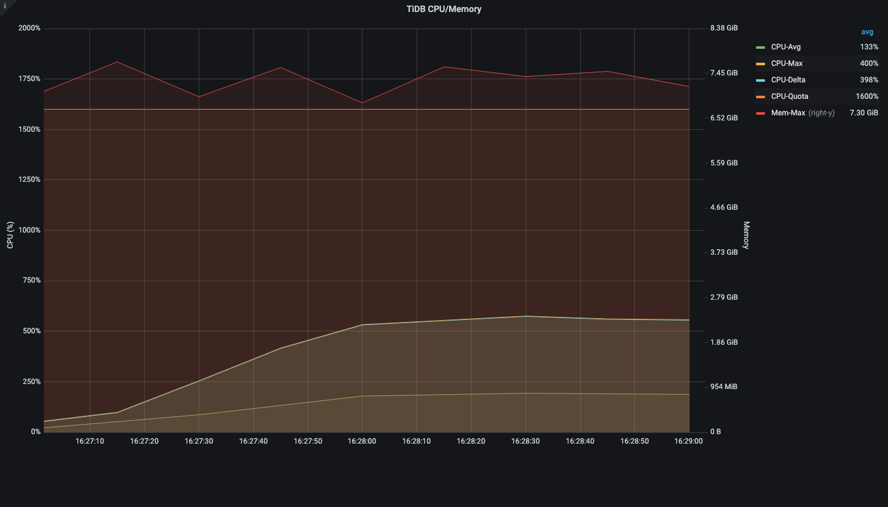
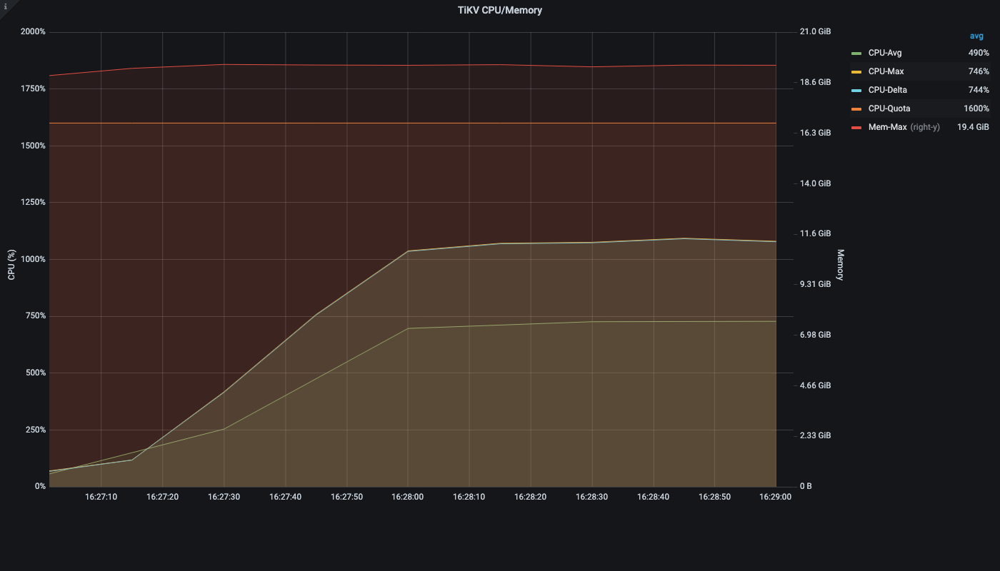
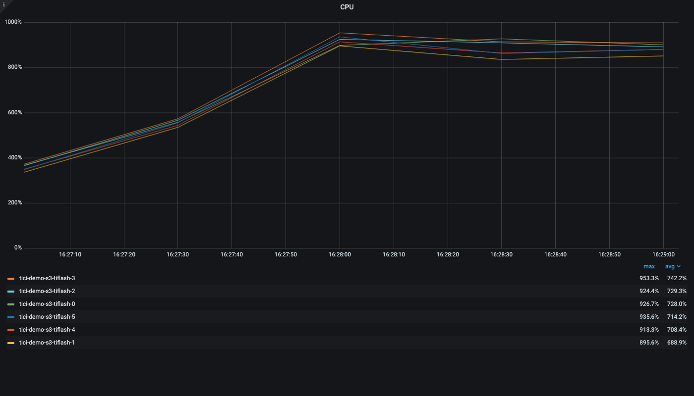
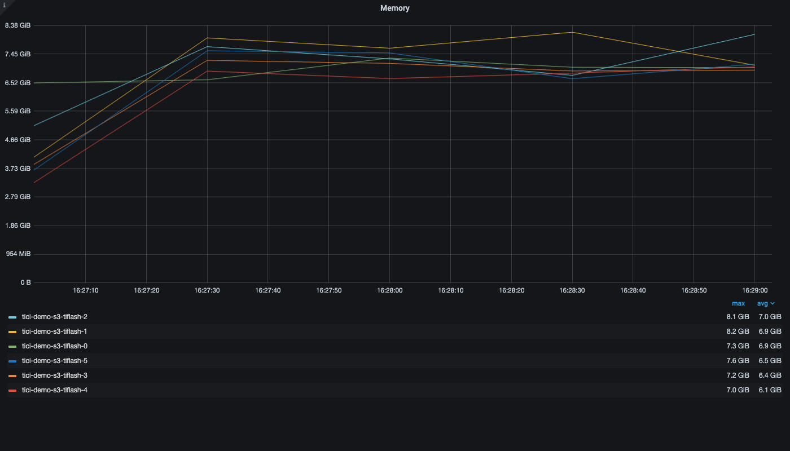
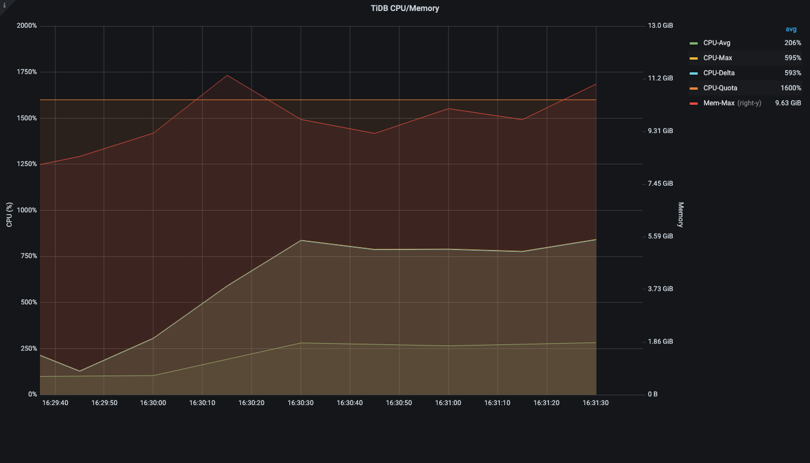
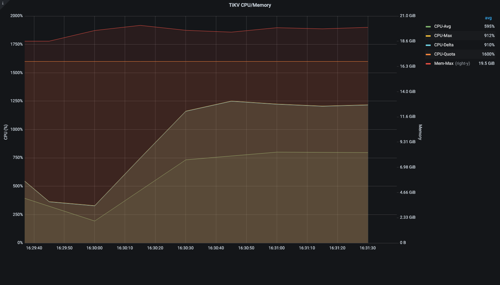
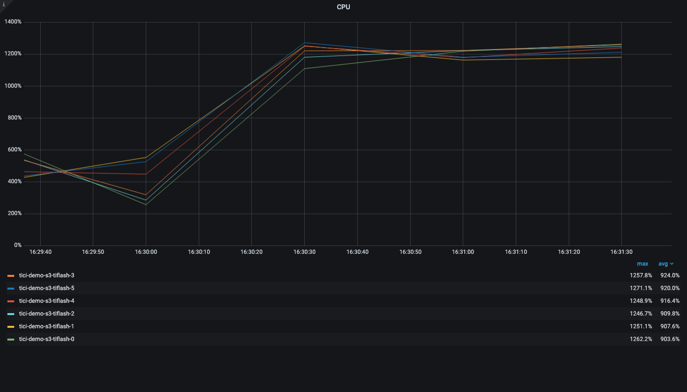
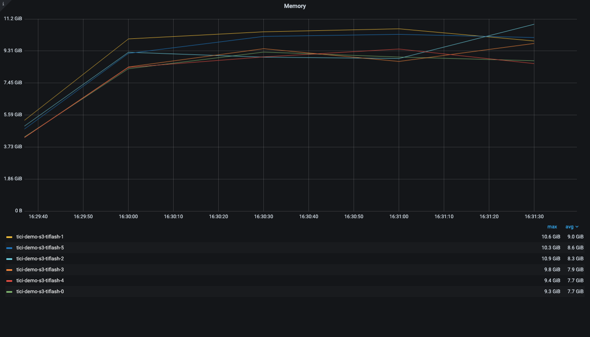

# jsm_assets4 Query Sample Run vs PingCAP Report

Run time: 2026-05-08T08:32:13.548172+00:00

Source report: `/Users/jin/Downloads/full_report_for_pingcap.md`.

Notes:
- The source report contains normalized SQL with placeholders, so this run materialized representative parameter sets from `jsm_assets4`.
- Each runnable query uses up to 10 sampled parameter sets. Rows are fetched to the client; latency is client-observed SQL execution plus fetch time.
- Wide object queries are represented as `SELECT o.*` / `SELECT obj.*`; predicate, ordering, and limit shape are preserved.
- Queries whose referenced tables are absent from `jsm_assets4` are marked skipped.
- Grafana: [http://a2e41aa49d08647d1b55ecd7b146bbf6-38f9eda417a300aa.elb.us-east-2.amazonaws.com:3000](http://a2e41aa49d08647d1b55ecd7b146bbf6-38f9eda417a300aa.elb.us-east-2.amazonaws.com:3000)

## Summary

| Query | Source avg | Source max | Samples | OK | Rows avg | jsm_assets4 avg | jsm_assets4 p50 | jsm_assets4 max | Comparison | Status |
|---:|---:|---:|---:|---:|---:|---:|---:|---:|---|---|
| 1 | 2.7ms | 518.3ms | 0 | 0 | None | None | None | None | n/a | skipped |
| 2 | 320.8ms | 14332.3ms | 10 | 10 | 600 | 341.1 | 327.0 | 421.8 | 1.06x source | ok |
| 3 | 36.3ms | 8652.6ms | 0 | 0 | None | None | None | None | n/a | skipped |
| 4 | 11882.9ms | 34102.7ms | 10 | 10 | 1000 | 433.3 | 457.9 | 546.0 | 27.42x faster | ok |
| 5 | 29101.7ms | 60034.6ms | 10 | 10 | 1000 | 549.2 | 487.7 | 875.9 | 52.99x faster | ok |
| 6 | 44.8ms | 927.9ms | 10 | 10 | 50 | 358.6 | 283.6 | 753.3 | 8.00x source | ok |
| 7 | 8.7ms | 487.0ms | 10 | 10 | 35 | 270.6 | 256.2 | 309.0 | 31.10x source | ok |
| 8 | 16983.6ms | 32291.9ms | 10 | 10 | 35.5 | 1675.0 | 1285.7 | 3959.4 | 10.14x faster | ok |
| 9 | 28.1ms | 10778.1ms | 10 | 10 | 24 | 262.2 | 256.0 | 309.3 | 9.33x source | ok |
| 10 | 41204.1ms | 51112.0ms | 10 | 10 | 1000 | 1028.3 | 894.4 | 2559.3 | 40.07x faster | ok |
| 11 | 17.0ms | 228.7ms | 10 | 10 | 1 | 275.8 | 261.1 | 306.6 | 16.22x source | ok |
| 12 | 10.2ms | 473.9ms | 0 | 0 | None | None | None | None | n/a | skipped |
| 13 | 29.8ms | 6157.8ms | 10 | 10 | 175 | 276.6 | 259.0 | 353.9 | 9.28x source | ok |
| 14 | 28809.4ms | 45421.2ms | 10 | 10 | 1000 | 325.8 | 325.9 | 341.3 | 88.43x faster | ok |
| 15 | 24650.8ms | 42060.9ms | 10 | 10 | 1000 | 330.5 | 332.6 | 351.7 | 74.59x faster | ok |
| 16 | 47800.9ms | 60019.8ms | 10 | 10 | 1000 | 1294.8 | 1255.3 | 1544.5 | 36.92x faster | ok |
| 17 | 29564.9ms | 37139.7ms | 10 | 10 | 1000 | 434.2 | 407.6 | 650.1 | 68.09x faster | ok |
| 18 | 3.7ms | 325.7ms | 10 | 10 | 5 | 248.4 | 244.9 | 265.6 | 67.14x source | ok |
| 19 | 39798.6ms | 60018.5ms | 10 | 10 | 1000 | 351.5 | 340.3 | 394.4 | 113.23x faster | ok |
| 20 | 17.8ms | 5900.3ms | 10 | 10 | 1 | 264.1 | 249.9 | 332.3 | 14.84x source | ok |
| 21 | 23577.6ms | 30859.8ms | 10 | 10 | 1000 | 650.5 | 493.1 | 1598.1 | 36.25x faster | ok |
| 22 | 25.9ms | 233.2ms | 10 | 10 | 20 | 300.9 | 275.5 | 525.3 | 11.62x source | ok |
| 23 | 33550.1ms | 35378.6ms | 10 | 10 | 1000 | 400.3 | 406.4 | 471.1 | 83.81x faster | ok |
| 24 | 60085.2ms | 60085.2ms | 10 | 10 | 1000 | 1724.5 | 1736.9 | 1907.7 | 34.84x faster | ok |
| 25 | 59691.1ms | 59691.1ms | 10 | 10 | 1000 | 1563.7 | 1423.7 | 2997.0 | 38.17x faster | ok |

## Skipped Queries

- Query #1: cdm_type_obj_type_attr is not present in jsm_assets4.
- Query #3: cdm_type_obj_type, cdm_type_obj_schema, and obj_schema_owner are not present in jsm_assets4.
- Query #12: cdm_type_ref_type, cdm_type_obj_schema, and obj_schema_owner are not present in jsm_assets4.

## Concurrent Runs

Worker assignment is per query class. For concurrency 22, each runnable query class gets one worker. For concurrency 69, workers are assigned round-robin across the 22 runnable query classes.

| Concurrency | Query classes | Duration s | Ops | OK | Errors | QPS | Avg ms | P95 ms | Max ms |
|---:|---:|---:|---:|---:|---:|---:|---:|---:|---:|
| 22 | 22 | 120 | 4207 | 4207 | 0 | 34.68 | 625.5 | 1589.4 | 5488.3 |
| 69 | 22 | 120 | 5103 | 5103 | 0 | 41.64 | 1622.7 | 4279.8 | 12496.4 |

### Grafana / Prometheus Resource Metrics

CPU and memory values below are pulled from the Grafana Prometheus datasource for each run window. CPU capacity percentage assumes the current scale: TiDB 3 x 16 cores, TiKV 4 x 16 cores, TiFlash 6 x 16 cores.

#### Concurrency 22

- Window: `2026-05-08T08:27:01.518918+00:00` to `2026-05-08T08:29:02.817925+00:00`
- Grafana time range: [http://a2e41aa49d08647d1b55ecd7b146bbf6-38f9eda417a300aa.elb.us-east-2.amazonaws.com:3000?from=1778228821519&to=1778228942817](http://a2e41aa49d08647d1b55ecd7b146bbf6-38f9eda417a300aa.elb.us-east-2.amazonaws.com:3000?from=1778228821519&to=1778228942817)

| Component | Replicas | CPU avg cores | CPU max cores | CPU max % capacity | Mem avg GiB | Mem max GiB | Note |
|---|---:|---:|---:|---:|---:|---:|---|
| tidb | 3 | 4.05 | 5.80 | 12.1% | 10.82 | 11.21 |  |
| tikv | 4 | 20.91 | 29.27 | 45.7% | 73.35 | 73.62 |  |
| tiflash | 6 | 44.01 | 55.71 | 58.0% | 40.40 | 44.31 | TiFlash proxy process CPU metric |

Grafana panel screenshots:









| Query | Workers | Ops | OK | Errors | Source avg | Source max | Run avg ms | vs source avg | P95 ms | Max ms | Avg rows |
|---:|---:|---:|---:|---:|---:|---:|---:|---|---:|---:|---:|
| 2 | 1 | 266 | 266 | 0 | 320.8ms | 14332.3ms | 447.6 | 1.40x source | 745.9 | 1172.4 | 600 |
| 4 | 1 | 134 | 134 | 0 | 11882.9ms | 34102.7ms | 895.4 | 13.27x faster | 1429.2 | 1879.3 | 1000 |
| 5 | 1 | 121 | 121 | 0 | 29101.7ms | 60034.6ms | 991.6 | 29.35x faster | 1471.0 | 1920.9 | 1000 |
| 6 | 1 | 268 | 268 | 0 | 44.8ms | 927.9ms | 444.3 | 9.92x source | 740.4 | 967.9 | 50 |
| 7 | 1 | 324 | 324 | 0 | 8.7ms | 487.0ms | 367.5 | 42.24x source | 669.8 | 949.3 | 35 |
| 8 | 1 | 44 | 44 | 0 | 16983.6ms | 32291.9ms | 2724.3 | 6.23x faster | 5270.5 | 5488.3 | 38.5 |
| 9 | 1 | 326 | 326 | 0 | 28.1ms | 10778.1ms | 366.0 | 13.02x source | 646.5 | 1058.7 | 24 |
| 10 | 1 | 118 | 118 | 0 | 41204.1ms | 51112.0ms | 1011.8 | 40.72x faster | 1389.9 | 1534.5 | 1000 |
| 11 | 1 | 284 | 284 | 0 | 17.0ms | 228.7ms | 419.1 | 24.65x source | 723.5 | 991.8 | 1 |
| 13 | 1 | 318 | 318 | 0 | 29.8ms | 6157.8ms | 375.3 | 12.59x source | 667.9 | 894.8 | 175 |
| 14 | 1 | 157 | 157 | 0 | 28809.4ms | 45421.2ms | 764.2 | 37.70x faster | 1254.8 | 1768.5 | 1000 |
| 15 | 1 | 156 | 156 | 0 | 24650.8ms | 42060.9ms | 769.1 | 32.05x faster | 1263.7 | 1690.2 | 1000 |
| 16 | 1 | 69 | 69 | 0 | 47800.9ms | 60019.8ms | 1737.3 | 27.51x faster | 2122.4 | 2296.6 | 1000 |
| 17 | 1 | 149 | 149 | 0 | 29564.9ms | 37139.7ms | 805.3 | 36.71x faster | 1207.2 | 1780.7 | 1000 |
| 18 | 1 | 332 | 332 | 0 | 3.7ms | 325.7ms | 358.6 | 96.92x source | 648.0 | 1066.7 | 5 |
| 19 | 1 | 157 | 157 | 0 | 39798.6ms | 60018.5ms | 764.2 | 52.08x faster | 1220.4 | 1366.7 | 1000 |
| 20 | 1 | 328 | 328 | 0 | 17.8ms | 5900.3ms | 363.0 | 20.39x source | 647.3 | 890.4 | 1 |
| 21 | 1 | 97 | 97 | 0 | 23577.6ms | 30859.8ms | 1237.0 | 19.06x faster | 1913.5 | 2226.1 | 1000 |
| 22 | 1 | 273 | 273 | 0 | 25.9ms | 233.2ms | 436.0 | 16.83x source | 757.6 | 966.5 | 20 |
| 23 | 1 | 148 | 148 | 0 | 33550.1ms | 35378.6ms | 810.7 | 41.38x faster | 1263.3 | 1788.3 | 1000 |
| 24 | 1 | 70 | 70 | 0 | 60085.2ms | 60085.2ms | 1718.7 | 34.96x faster | 2220.8 | 2493.1 | 1000 |
| 25 | 1 | 68 | 68 | 0 | 59691.1ms | 59691.1ms | 1764.0 | 33.84x faster | 2197.1 | 2565.4 | 1000 |

#### Concurrency 69

- Window: `2026-05-08T08:29:36.934331+00:00` to `2026-05-08T08:31:39.482223+00:00`
- Grafana time range: [http://a2e41aa49d08647d1b55ecd7b146bbf6-38f9eda417a300aa.elb.us-east-2.amazonaws.com:3000?from=1778228976934&to=1778229099482](http://a2e41aa49d08647d1b55ecd7b146bbf6-38f9eda417a300aa.elb.us-east-2.amazonaws.com:3000?from=1778228976934&to=1778229099482)

| Component | Replicas | CPU avg cores | CPU max cores | CPU max % capacity | Mem avg GiB | Mem max GiB | Note |
|---|---:|---:|---:|---:|---:|---:|---|
| tidb | 3 | 5.99 | 8.47 | 17.6% | 13.15 | 14.82 |  |
| tikv | 4 | 25.03 | 32.80 | 51.3% | 73.66 | 74.56 |  |
| tiflash | 6 | 56.35 | 76.71 | 79.9% | 49.45 | 57.42 | TiFlash proxy process CPU metric |

Grafana panel screenshots:









| Query | Workers | Ops | OK | Errors | Source avg | Source max | Run avg ms | vs source avg | P95 ms | Max ms | Avg rows |
|---:|---:|---:|---:|---:|---:|---:|---:|---|---:|---:|---:|
| 2 | 4 | 461 | 461 | 0 | 320.8ms | 14332.3ms | 1035.7 | 3.23x source | 1751.1 | 2473.3 | 600 |
| 4 | 4 | 161 | 161 | 0 | 11882.9ms | 34102.7ms | 2974.6 | 3.99x faster | 5348.3 | 6800.7 | 1000 |
| 5 | 4 | 144 | 144 | 0 | 29101.7ms | 60034.6ms | 3314.6 | 8.78x faster | 5150.1 | 5849.4 | 1000 |
| 6 | 3 | 352 | 352 | 0 | 44.8ms | 927.9ms | 1015.3 | 22.66x source | 1711.8 | 2085.5 | 50 |
| 7 | 3 | 415 | 415 | 0 | 8.7ms | 487.0ms | 864.0 | 99.31x source | 1528.9 | 1836.6 | 35 |
| 8 | 3 | 63 | 63 | 0 | 16983.6ms | 32291.9ms | 5776.8 | 2.94x faster | 10518.2 | 12496.4 | 35.5 |
| 9 | 3 | 407 | 407 | 0 | 28.1ms | 10778.1ms | 881.5 | 31.37x source | 1525.7 | 1826.9 | 24 |
| 10 | 3 | 137 | 137 | 0 | 41204.1ms | 51112.0ms | 2630.7 | 15.66x faster | 3442.1 | 3804.3 | 1000 |
| 11 | 3 | 374 | 374 | 0 | 17.0ms | 228.7ms | 957.2 | 56.31x source | 1611.3 | 2071.2 | 1 |
| 13 | 3 | 399 | 399 | 0 | 29.8ms | 6157.8ms | 899.6 | 30.19x source | 1688.0 | 2503.2 | 175 |
| 14 | 3 | 114 | 114 | 0 | 28809.4ms | 45421.2ms | 3189.2 | 9.03x faster | 5271.9 | 5958.1 | 1000 |
| 15 | 3 | 105 | 105 | 0 | 24650.8ms | 42060.9ms | 3429.4 | 7.19x faster | 7115.7 | 8412.1 | 1000 |
| 16 | 3 | 93 | 93 | 0 | 47800.9ms | 60019.8ms | 3846.5 | 12.43x faster | 5257.0 | 6067.2 | 1000 |
| 17 | 3 | 147 | 147 | 0 | 29564.9ms | 37139.7ms | 2467.9 | 11.98x faster | 3225.0 | 3503.5 | 1000 |
| 18 | 3 | 425 | 425 | 0 | 3.7ms | 325.7ms | 846.1 | 228.68x source | 1508.5 | 1831.6 | 5 |
| 19 | 3 | 126 | 126 | 0 | 39798.6ms | 60018.5ms | 2864.7 | 13.89x faster | 4718.5 | 6554.9 | 1000 |
| 20 | 3 | 420 | 420 | 0 | 17.8ms | 5900.3ms | 854.5 | 48.01x source | 1516.9 | 1830.2 | 1 |
| 21 | 3 | 66 | 66 | 0 | 23577.6ms | 30859.8ms | 5511.9 | 4.28x faster | 8901.5 | 9842.9 | 1000 |
| 22 | 3 | 360 | 360 | 0 | 25.9ms | 233.2ms | 995.6 | 38.44x source | 1677.2 | 2074.5 | 20 |
| 23 | 3 | 147 | 147 | 0 | 33550.1ms | 35378.6ms | 2448.7 | 13.70x faster | 3358.8 | 3662.9 | 1000 |
| 24 | 3 | 91 | 91 | 0 | 60085.2ms | 60085.2ms | 3992.6 | 15.05x faster | 5036.1 | 5127.6 | 1000 |
| 25 | 3 | 96 | 96 | 0 | 59691.1ms | 59691.1ms | 3771.3 | 15.83x faster | 5306.8 | 5928.0 | 1000 |


## Per-Query Details

### Query #1

- Source tables: `cdm_type_obj_type_attr`
- Source avg/max latency: `2.7ms` / `518.3ms`
- Source avg rows/cop tasks: `0` / `1`
- Status: `skipped`
- Reason: cdm_type_obj_type_attr is not present in jsm_assets4

### Query #2

- Source tables: `obj_relationship_new`
- Source avg/max latency: `320.8ms` / `14332.3ms`
- Source avg rows/cop tasks: `234` / `33`
- Status: `ok`

| Sample | Params | Rows | Latency ms | Status | Error |
|---|---|---:|---:|---|---|
| s1 | workspace=9963b35f-9397-48ec-9403-adab57aef265, object_ids=25 | 600 | 288.3 | ok |  |
| s2 | workspace=8a6526e6-cd57-4216-bac6-358a6177d221, object_ids=25 | 600 | 311.6 | ok |  |
| s3 | workspace=3b4c201d-8244-416e-925d-f9608e001a2b, object_ids=25 | 600 | 304.6 | ok |  |
| s4 | workspace=cafd5188-8a63-44e7-b4a9-e885c9664b9c, object_ids=25 | 600 | 359.4 | ok |  |
| s5 | workspace=134fa09e-62e8-4b23-be76-d1b2d01845cc, object_ids=25 | 600 | 317.1 | ok |  |
| s6 | workspace=183afe88-bcf4-48a6-a9ef-65420b7b819c, object_ids=25 | 600 | 314.9 | ok |  |
| s7 | workspace=718915aa-f8e9-4bbc-b1dc-ba720f1296e2, object_ids=25 | 600 | 340.3 | ok |  |
| s8 | workspace=23f639f1-fae8-48b0-8518-da3b7c80be57, object_ids=25 | 600 | 336.9 | ok |  |
| s9 | workspace=82e47cda-f6dc-4999-b9fa-dc813435ec51, object_ids=25 | 600 | 416.1 | ok |  |
| s10 | workspace=00eaf117-fdd6-4176-9926-45310e6b9f54, object_ids=25 | 600 | 421.8 | ok |  |

<details>
<summary>Representative SQL</summary>

```sql
SELECT obj_relationship.workspace_id, obj_relationship.partition_id, obj_relationship.id, obj_relationship.object_id, obj_relationship.referenced_object_id, obj_relationship.object_type_attribute_id, obj_relationship.object_type_id, obj_relationship.referenced_object_type_id FROM obj_relationship_new obj_relationship WHERE obj_relationship.object_id IN (0x5779bf118e9e45af85ffac6fd8a66ba0, 0x025095f5ca334fb5a8e23c5130096794, 0x12d3fc269787450db2ea7d31be651243, 0x172fdae3fba8423d94a5afbac76e0b89, 0x6c05c3878019479fa92aa972f4c4bf81, 0xbcf747e4d6d2495586383729190a0b60, 0xa072dd6f4250419abebb48de330d4a8d, 0xc5a636046c194885825e961ff4ec9736, 0xb289372d3ad24a05b7f12ac74bcca523, 0xcb402fbdf53249b888a3f76c18a4d161, 0xa349b98534aa4cbba24169ff153eb598, 0xeb56893462c749838ad268ac0c4c0e93, 0x6ed5b0b06b6c466eafd4b72e1992c83c, 0xc77a0fc5b3774d40b140c6f6d41644d8, 0x2446f69946644ee48e124aba704ab0b1, 0x8efcf2c3febf40e290b0895984473d01, 0x9a0a4be0944c4fa29bffdde57fcf217a, 0xd4436827f1e546f0b76600c808892b10, 0xd431693ce3c5413094c922ac204097f0, 0x0b95d04f18c2415781727201c349e488, 0xd072a9cd66ab44f8b4ed00f37b3d27c3, 0x7eb84ec125864f32994423ae9b853bc5, 0x843414e494004979a90f501f8fa54182, 0xe46bbcff0dfe4f828d076ec4b9dc9258, 0x7e5b9d54546d43b59acc88505a389231);
```

</details>

### Query #3

- Source tables: `obj_type,cdm_type_obj_type,icon,obj_schema,cdm_type_obj_schema,obj_schema_property,obj_schema_owner`
- Source avg/max latency: `36.3ms` / `8652.6ms`
- Source avg rows/cop tasks: `1` / `6`
- Status: `skipped`
- Reason: cdm_type_obj_type, cdm_type_obj_schema, and obj_schema_owner are not present in jsm_assets4

### Query #4

- Source tables: `obj_new`
- Source avg/max latency: `11882.9ms` / `34102.7ms`
- Source avg rows/cop tasks: `1000` / `518`
- Status: `ok`

| Sample | Params | Rows | Latency ms | Status | Error |
|---|---|---:|---:|---|---|
| s1 | workspace=9963b35f-9397-48ec-9403-adab57aef265, obj_types=5 | 1000 | 478.4 | ok |  |
| s2 | workspace=8a6526e6-cd57-4216-bac6-358a6177d221, obj_types=5 | 1000 | 546.0 | ok |  |
| s3 | workspace=3b4c201d-8244-416e-925d-f9608e001a2b, obj_types=5 | 1000 | 457.0 | ok |  |
| s4 | workspace=cafd5188-8a63-44e7-b4a9-e885c9664b9c, obj_types=5 | 1000 | 445.8 | ok |  |
| s5 | workspace=134fa09e-62e8-4b23-be76-d1b2d01845cc, obj_types=5 | 1000 | 458.9 | ok |  |
| s6 | workspace=183afe88-bcf4-48a6-a9ef-65420b7b819c, obj_types=5 | 1000 | 407.3 | ok |  |
| s7 | workspace=718915aa-f8e9-4bbc-b1dc-ba720f1296e2, obj_types=5 | 1000 | 461.5 | ok |  |
| s8 | workspace=23f639f1-fae8-48b0-8518-da3b7c80be57, obj_types=5 | 1000 | 463.4 | ok |  |
| s9 | workspace=82e47cda-f6dc-4999-b9fa-dc813435ec51, obj_types=5 | 1000 | 308.4 | ok |  |
| s10 | workspace=00eaf117-fdd6-4176-9926-45310e6b9f54, obj_types=5 | 1000 | 306.2 | ok |  |

<details>
<summary>Representative SQL</summary>

```sql
SELECT o.sequential_id, o.label FROM obj_new o WHERE o.workspace_id='9963b35f-9397-48ec-9403-adab57aef265' AND (o.obj_type_id IN (0xc803e991dc8d4c96a8180a05c3a7ee7b, 0xe9b4640efde64a4baba2d402fb8d3f93, 0xf1e422765cd348969fee51389a43a639, 0xcaa0b57b5bca42d780f67b3831e81978, 0x79d1215ce2a04ecaa29b257eec19bb8d) AND ((o.numeric_value_5 IS NOT NULL AND o.obj_type_id = 0xc803e991dc8d4c96a8180a05c3a7ee7b) OR (o.numeric_value_5 IS NOT NULL AND o.obj_type_id = 0xe9b4640efde64a4baba2d402fb8d3f93) OR (o.numeric_value_5 IS NOT NULL AND o.obj_type_id = 0xf1e422765cd348969fee51389a43a639) OR (o.numeric_value_5 IS NOT NULL AND o.obj_type_id = 0xcaa0b57b5bca42d780f67b3831e81978) OR (o.numeric_value_5 IS NOT NULL AND o.obj_type_id = 0x79d1215ce2a04ecaa29b257eec19bb8d))) ORDER BY o.label ASC LIMIT 1000 OFFSET 0;
```

</details>

### Query #5

- Source tables: `obj_new`
- Source avg/max latency: `29101.7ms` / `60034.6ms`
- Source avg rows/cop tasks: `65` / `1821`
- Status: `ok`

| Sample | Params | Rows | Latency ms | Status | Error |
|---|---|---:|---:|---|---|
| s1 | workspace=8a6526e6-cd57-4216-bac6-358a6177d221, obj_type_branches=5 | 1000 | 492.9 | ok |  |
| s2 | workspace=3b4c201d-8244-416e-925d-f9608e001a2b, obj_type_branches=5 | 1000 | 473.5 | ok |  |
| s3 | workspace=cafd5188-8a63-44e7-b4a9-e885c9664b9c, obj_type_branches=5 | 1000 | 424.0 | ok |  |
| s4 | workspace=134fa09e-62e8-4b23-be76-d1b2d01845cc, obj_type_branches=5 | 1000 | 483.0 | ok |  |
| s5 | workspace=183afe88-bcf4-48a6-a9ef-65420b7b819c, obj_type_branches=5 | 1000 | 492.4 | ok |  |
| s6 | workspace=718915aa-f8e9-4bbc-b1dc-ba720f1296e2, obj_type_branches=5 | 1000 | 477.3 | ok |  |
| s7 | workspace=23f639f1-fae8-48b0-8518-da3b7c80be57, obj_type_branches=5 | 1000 | 481.6 | ok |  |
| s8 | workspace=82e47cda-f6dc-4999-b9fa-dc813435ec51, obj_type_branches=5 | 1000 | 540.5 | ok |  |
| s9 | workspace=00eaf117-fdd6-4176-9926-45310e6b9f54, obj_type_branches=5 | 1000 | 751.2 | ok |  |
| s10 | workspace=8a6526e6-cd57-4216-bac6-358a6177d221, obj_type_branches=5 | 1000 | 875.9 | ok |  |

<details>
<summary>Representative SQL</summary>

```sql
SELECT o.sequential_id, o.label FROM obj_new o WHERE o.workspace_id='8a6526e6-cd57-4216-bac6-358a6177d221' AND (o.obj_type_id IN (0x81790b7da4ec44de85e1c94e50c497a7, 0x1bfa019ca2164e97b43331fe25d01325, 0xad3f4feadb96456da7bffc4cd63f05f4, 0x29ba27b2e1174ca3a0541b8e84c15d4e, 0x1d9d47a406e14befa85e456dcec5b67b) AND (((JSON_CONTAINS(o.other_values_indexed, JSON_SET(CAST('{}' AS JSON), '$."1eee37c0-0f68-41e4-abfa-9b166b9a0a18"', JSON_ARRAY('jira-group1'))) OR JSON_CONTAINS(o.other_values_indexed, JSON_SET(CAST('{}' AS JSON), '$."1eee37c0-0f68-41e4-abfa-9b166b9a0a18"', JSON_ARRAY('jira-group15'))) OR JSON_CONTAINS(o.other_values_indexed, JSON_SET(CAST('{}' AS JSON), '$."42cf7e7a-80c9-472a-b5da-429c41632661"', JSON_ARRAY('61b1c18ec15977006a4ad662'))) OR JSON_CONTAINS(o.other_values_indexed, JSON_SET(CAST('{}' AS JSON), '$."42cf7e7a-80c9-472a-b5da-429c41632661"', JSON_ARRAY('61b1c7a1c510bc006b67a317')))) AND o.obj_type_id=0x81790b7da4ec44de85e1c94e50c497a7) OR ((JSON_CONTAINS(o.other_values_indexed, JSON_SET(CAST('{}' AS JSON), '$."57bcd304-17ea-4e4b-9316-5d5193a72ba5"', JSON_ARRAY('61b192f0c15977006a48b4b6'))) OR JSON_CONTAINS(o.other_values_indexed, JSON_SET(CAST('{}' AS JSON), '$."bfa02459-ed27-4699-80be-74abd546f842"', JSON_ARRAY('jira-group2'))) OR JSON_CONTAINS(o.other_values_indexed, JSON_SET(CAST('{}' AS JSON), '$."57bcd304-17ea-4e4b-9316-5d5193a72ba5"', JSON_ARRAY('61b1b7c9744c4d0069892f45'))) OR JSON_CONTAINS(o.other_values_indexed, JSON_SET(CAST('{}' AS JSON), '$."bfa02459-ed27-4699-80be-74abd546f842"', JSON_ARRAY('jira-group12')))) AND o.obj_type_id=0x1bfa019ca2164e97b43331fe25d01325) OR ((JSON_CONTAINS(o.other_values_indexed, JSON_SET(CAST('{}' AS JSON), '$."cb46cc57-4418-4849-b604-c321ad0e3a35"', JSON_ARRAY('61b1b873977c5b00728adbf2'))) OR JSON_CONTAINS(o.other_values_indexed, JSON_SET(CAST('{}' AS JSON), '$."e2876f3e-fbd0-42cb-bd16-8c3b5f5ecdb9"', JSON_ARRAY('jira-group15'))) OR JSON_CONTAINS(o.other_values_indexed, JSON_SET(CAST('{}' AS JSON), '$."cb46cc57-4418-4849-b604-c321ad0e3a35"', JSON_ARRAY('61b1c272ebce470067f024c0'))) OR JSON_CONTAINS(o.other_values_indexed, JSON_SET(CAST('{}' AS JSON), '$."e2876f3e-fbd0-42cb-bd16-8c3b5f5ecdb9"', JSON_ARRAY('jira-group13')))) AND o.obj_type_id=0xad3f4feadb96456da7bffc4cd63f05f4) OR ((JSON_CONTAINS(o.other_values_indexed, JSON_SET(CAST('{}' AS JSON), '$."1ab70ec5-6043-4626-974e-2f1c9b2c1841"', JSON_ARRAY('61b193383618cd006f596d51'))) OR JSON_CONTAINS(o.other_values_indexed, JSON_SET(CAST('{}' AS JSON), '$."ca0f6d36-5cc2-4f2f-a9de-24e6601f9eb2"', JSON_ARRAY('jira-group8'))) OR JSON_CONTAINS(o.other_values_indexed, JSON_SET(CAST('{}' AS JSON), '$."1ab70ec5-6043-4626-974e-2f1c9b2c1841"', JSON_ARRAY('61b1bdaa657a05007060ed84'))) OR JSON_CONTAINS(o.other_values_indexed, JSON_SET(CAST('{}' AS JSON), '$."ca0f6d36-5cc2-4f2f-a9de-24e6601f9eb2"', JSON_ARRAY('jira-group9')))) AND o.obj_type_id=0x29ba27b2e1174ca3a0541b8e84c15d4e) OR ((JSON_CONTAINS(o.other_values_indexed, JSON_SET(CAST('{}' AS JSON), '$."2a594586-2aed-43f5-9545-f20a1ac1fca9"', JSON_ARRAY('61b1c42b744c4d006989d575'))) OR JSON_CONTAINS(o.other_values_indexed, JSON_SET(CAST('{}' AS JSON), '$."afce7106-823a-4e74-bca5-e89e98f3c06a"', JSON_ARRAY('jira-group1'))) OR JSON_CONTAINS(o.other_values_indexed, JSON_SET(CAST('{}' AS JSON), '$."afce7106-823a-4e74-bca5-e89e98f3c06a"', JSON_ARRAY('jira-group2'))) OR JSON_CONTAINS(o.other_values_indexed, JSON_SET(CAST('{}' AS JSON), '$."afce7106-823a-4e74-bca5-e89e98f3c06a"', JSON_ARRAY('jira-group10')))) AND o.obj_type_id=0x1d9d47a406e14befa85e456dcec5b67b))) ORDER BY o.label ASC LIMIT 1000 OFFSET 0;
```

</details>

### Query #6

- Source tables: `obj_new`
- Source avg/max latency: `44.8ms` / `927.9ms`
- Source avg rows/cop tasks: `168` / `0`
- Status: `ok`

| Sample | Params | Rows | Latency ms | Status | Error |
|---|---|---:|---:|---|---|
| s1 | workspace=9963b35f-9397-48ec-9403-adab57aef265, ids=50 | 50 | 753.3 | ok |  |
| s2 | workspace=8a6526e6-cd57-4216-bac6-358a6177d221, ids=50 | 50 | 504.4 | ok |  |
| s3 | workspace=3b4c201d-8244-416e-925d-f9608e001a2b, ids=50 | 50 | 302.6 | ok |  |
| s4 | workspace=cafd5188-8a63-44e7-b4a9-e885c9664b9c, ids=50 | 50 | 284.7 | ok |  |
| s5 | workspace=134fa09e-62e8-4b23-be76-d1b2d01845cc, ids=50 | 50 | 278.4 | ok |  |
| s6 | workspace=183afe88-bcf4-48a6-a9ef-65420b7b819c, ids=50 | 50 | 352.7 | ok |  |
| s7 | workspace=718915aa-f8e9-4bbc-b1dc-ba720f1296e2, ids=50 | 50 | 276.4 | ok |  |
| s8 | workspace=23f639f1-fae8-48b0-8518-da3b7c80be57, ids=50 | 50 | 274.7 | ok |  |
| s9 | workspace=82e47cda-f6dc-4999-b9fa-dc813435ec51, ids=50 | 50 | 276.0 | ok |  |
| s10 | workspace=00eaf117-fdd6-4176-9926-45310e6b9f54, ids=50 | 50 | 282.6 | ok |  |

<details>
<summary>Representative SQL</summary>

```sql
SELECT obj.* FROM obj_new obj WHERE obj.id IN (0x687c943e75034b308ad0a7200437bd6a, 0x012df2a994244650bf798c2a1dfd00a0, 0x76f30fd4a3da4761b6966c3dd8c11615, 0xac7713063b1840009ed93254816a3dc8, 0x457ec56e51b74accb4225426132e02c8, 0x800dfc7bd7bc44ff94fcfa37b8522d8f, 0x755b8f7c8a9749c2af9220a2163e4a7e, 0x088895fc8b4f4687a4d61ed86e0f496e, 0x4f118be964d04a1f9ebf1cd0a2eca8b9, 0x69c59817bcb64e6fb989af825320ee1e, 0x98ee7599b831458e9a305f53a701a834, 0x05021c826ad6499ea7b6c919c8481c65, 0x8d0693dfda2b483f89fbd2882d63e117, 0xb678b7d94f1647d398e20e849d9029bc, 0x82713fb7559142f185f4d6a0785380df, 0x92d38f8deffb4b58813348d82f127b0e, 0x41842febf7d2405ba3f0d455b4ec6ce3, 0x06c5c13c6f39475f917080670d6c3ef3, 0x311a751c91cd46ff9298918161962c88, 0xd14994a45abc4953a665c874abd2c0c8, 0xd21b6f92d1bd4df4bf309273e8e99857, 0xe561d36df58a4a4baee0bbfc198f2104, 0x48fceda44544436e91bc577c8c373661, 0x2739aa11500d4b2a9c68c41129cbee44, 0xa64186ddbef64fcca6c3e99bd1a3fa87, 0x6ca92bee65234caaa2783303beccf1ff, 0x456221cd83ce43cc972740f6b9cd1325, 0x515414589dd04f91970916ee73141391, 0x1392e5cc9e9544159b55418c1cbc1513, 0x2fe1bdb84f75411e8616f465eadc9a9b, 0x9eb65568a17b4b0da7b1d41a1e4bbc9d, 0xbdb193f9b49248349c1384cd70d65eda, 0xdeb03f0abd8c444e9d80b132974ca637, 0x0f13685937e6408390a141c33f3e07d5, 0x06c53d8d9283494ca15eda316681cd76, 0x34f957b108194d128a536340412b24ee, 0x6beea9ceffe6443888f00705b44a5f0b, 0x1c0f4b16447d4333bca72187c72874c1, 0x8eed871e1c884f72bb11ac0f947d7a3d, 0xdfca47df6c50416db3144e24cd3ae01a, 0x9af50714538a467a907fdabb37e52acc, 0x47a5982d1470446ab1a2076596cb4a57, 0x20da736aaaa546e6b29be7a684781c76, 0x235ae069332943b691155e78ada4fe11, 0xd900692d33f54e05b7c02a5a35f3c781, 0x06515de45e004a909d45a57c29a5e895, 0x5a840fe6ff8e48feac1beab11db9d4d1, 0xe2b77622524845e3930b3398a52c2250, 0x484549d7ad394bc1b19217c50b70d737, 0xc6abf937f80f415c812e1a27a7810ba6);
```

</details>

### Query #7

- Source tables: `obj_type_attr,obj_type`
- Source avg/max latency: `8.7ms` / `487.0ms`
- Source avg rows/cop tasks: `35` / `2`
- Status: `ok`

| Sample | Params | Rows | Latency ms | Status | Error |
|---|---|---:|---:|---|---|
| s1 | workspace=8a6526e6-cd57-4216-bac6-358a6177d221, obj_type=29ba27b2-e117-4ca3-a054-1b8e84c15d4e | 35 | 304.1 | ok |  |
| s2 | workspace=718915aa-f8e9-4bbc-b1dc-ba720f1296e2, obj_type=e7afe364-c8d5-413e-b80c-eb69477bba57 | 35 | 309.0 | ok |  |
| s3 | workspace=3b4c201d-8244-416e-925d-f9608e001a2b, obj_type=451aed8b-a883-4ee3-8d40-5f6881afa983 | 35 | 305.6 | ok |  |
| s4 | workspace=9963b35f-9397-48ec-9403-adab57aef265, obj_type=caa0b57b-5bca-42d7-80f6-7b3831e81978 | 35 | 247.9 | ok |  |
| s5 | workspace=00eaf117-fdd6-4176-9926-45310e6b9f54, obj_type=fa849938-5ed1-4c60-89b9-adb37223c21c | 35 | 250.0 | ok |  |
| s6 | workspace=9963b35f-9397-48ec-9403-adab57aef265, obj_type=e9b4640e-fde6-4a4b-aba2-d402fb8d3f93 | 35 | 249.2 | ok |  |
| s7 | workspace=cafd5188-8a63-44e7-b4a9-e885c9664b9c, obj_type=ca0a6a3f-120d-4e81-a73a-35dc434b9590 | 35 | 277.3 | ok |  |
| s8 | workspace=8a6526e6-cd57-4216-bac6-358a6177d221, obj_type=1bfa019c-a216-4e97-b433-31fe25d01325 | 35 | 261.9 | ok |  |
| s9 | workspace=cafd5188-8a63-44e7-b4a9-e885c9664b9c, obj_type=89a756f6-0201-4cda-bec2-e6496b1d0018 | 35 | 250.5 | ok |  |
| s10 | workspace=134fa09e-62e8-4b23-be76-d1b2d01845cc, obj_type=0a79f4d5-1527-4f18-b770-be668a5fb0ad | 35 | 250.2 | ok |  |

<details>
<summary>Representative SQL</summary>

```sql
SELECT otae1_0.id, otae1_0.additional_value, otae1_0.aql, otae1_0.created, otae1_0.default_type_id, otae1_0.deleted_at, otae1_0.description, otae1_0.external_id, otae1_0.group_id_type_value, otae1_0.hidden, otae1_0.include_child_object_types, otae1_0.is_deleted, otae1_0.label, otae1_0.maximum_cardinality, otae1_0.minimum_cardinality, otae1_0.name, otae1_0.object_type_id, otae1_0.ota_position, otae1_0.options, otae1_0.pending, otae1_0.reference_object_type_id, otae1_0.reference_type_id, otae1_0.regex_validation, otae1_0.removable, otae1_0.sequential_id, otae1_0.suffix, otae1_0.summable, otae1_0.type, otae1_0.type_value, otae1_0.unique_attribute, otae1_0.updated, otae1_0.workspace_id FROM obj_type_attr otae1_0 LEFT JOIN obj_type ot1_0 ON ot1_0.id = otae1_0.object_type_id AND ot1_0.workspace_id = '8a6526e6-cd57-4216-bac6-358a6177d221' AND ot1_0.is_deleted = 0 AND ot1_0.is_deleted = 0 WHERE otae1_0.workspace_id = '8a6526e6-cd57-4216-bac6-358a6177d221' AND otae1_0.is_deleted = 0 AND ot1_0.id IN (0x29ba27b2e1174ca3a0541b8e84c15d4e);
```

</details>

### Query #8

- Source tables: `obj_new`
- Source avg/max latency: `16983.6ms` / `32291.9ms`
- Source avg rows/cop tasks: `6` / `127`
- Status: `ok`

| Sample | Params | Rows | Latency ms | Status | Error |
|---|---|---:|---:|---|---|
| s1 | workspace=9963b35f-9397-48ec-9403-adab57aef265, obj_type=f1e42276-5cd3-4896-9fee-51389a43a639, text_value_22=⁣Operational⁣ | 35 | 2856.5 | ok |  |
| s2 | workspace=8a6526e6-cd57-4216-bac6-358a6177d221, obj_type=29ba27b2-e117-4ca3-a054-1b8e84c15d4e, text_value_22=⁣Operational⁣ | 200 | 3959.4 | ok |  |
| s3 | workspace=3b4c201d-8244-416e-925d-f9608e001a2b, obj_type=451aed8b-a883-4ee3-8d40-5f6881afa983, text_value_22=⁣Retired⁣ | 19 | 1805.7 | ok |  |
| s4 | workspace=cafd5188-8a63-44e7-b4a9-e885c9664b9c, obj_type=eefa73e0-11da-4486-8024-fddfc52baef8, text_value_22=⁣Retired⁣ | 22 | 2007.9 | ok |  |
| s5 | workspace=134fa09e-62e8-4b23-be76-d1b2d01845cc, obj_type=c30b5368-dba0-4929-bc3d-dff93d45b5c2, text_value_22=⁣Retired⁣ | 13 | 1322.6 | ok |  |
| s6 | workspace=183afe88-bcf4-48a6-a9ef-65420b7b819c, obj_type=eff9228f-d04b-4f0f-8812-29f29500c8f5, text_value_22=⁣Approved⁣ | 14 | 1248.7 | ok |  |
| s7 | workspace=718915aa-f8e9-4bbc-b1dc-ba720f1296e2, obj_type=28bb55ff-511b-4479-ab66-9f0707da95c1, text_value_22=⁣Retired⁣ | 9 | 1175.0 | ok |  |
| s8 | workspace=23f639f1-fae8-48b0-8518-da3b7c80be57, obj_type=a8439325-6f3b-4715-bdcb-9c132779da43, text_value_22=⁣Retired⁣ | 2 | 1033.8 | ok |  |
| s9 | workspace=82e47cda-f6dc-4999-b9fa-dc813435ec51, obj_type=3fb90e7e-add4-4003-b4cc-47d4b439a0c6, text_value_22=⁣Approved⁣ | 38 | 672.8 | ok |  |
| s10 | workspace=00eaf117-fdd6-4176-9926-45310e6b9f54, obj_type=dc814b70-4b9e-458d-94fe-350ddfc49d98, text_value_22=⁣Approved⁣ | 3 | 667.1 | ok |  |

<details>
<summary>Representative SQL</summary>

```sql
SELECT o.sequential_id, o.label FROM obj_new o WHERE o.workspace_id='9963b35f-9397-48ec-9403-adab57aef265' AND (o.obj_type_id IN (0xcaa0b57b5bca42d780f67b3831e81978, 0xe9b4640efde64a4baba2d402fb8d3f93, 0x79d1215ce2a04ecaa29b257eec19bb8d, 0xf1e422765cd348969fee51389a43a639, 0xc803e991dc8d4c96a8180a05c3a7ee7b) AND (o.obj_type_id = 0xf1e422765cd348969fee51389a43a639) AND (o.text_value_23 = '􏿿' AND MATCH(o.text_value_22) AGAINST ('"⁣Operational⁣"' IN BOOLEAN MODE) AND o.text_value_22 LIKE '%⁣Operational⁣%' AND o.text_value_22 != '' AND o.text_value_9 = 'Amana' AND (o.numeric_value_3 = 8.000000000000000000000000000000 OR o.numeric_value_1 = 312.000000000000000000000000000000))) ORDER BY o.label ASC LIMIT 1000 OFFSET 0;
```

</details>

### Query #9

- Source tables: `obj_relationship_new`
- Source avg/max latency: `28.1ms` / `10778.1ms`
- Source avg rows/cop tasks: `8` / `6`
- Status: `ok`

| Sample | Params | Rows | Latency ms | Status | Error |
|---|---|---:|---:|---|---|
| s1 | workspace=8a6526e6-cd57-4216-bac6-358a6177d221, object_id=ff118159-4364-48be-a450-4dd73ec2700f | 24 | 255.3 | ok |  |
| s2 | workspace=134fa09e-62e8-4b23-be76-d1b2d01845cc, object_id=bf7a3350-c58b-4f43-8604-571d1be16d0c | 24 | 260.6 | ok |  |
| s3 | workspace=183afe88-bcf4-48a6-a9ef-65420b7b819c, object_id=62254102-9427-4206-b6de-86b88773c7a2 | 24 | 253.4 | ok |  |
| s4 | workspace=cafd5188-8a63-44e7-b4a9-e885c9664b9c, object_id=dcd38928-db62-4fe9-81b1-5a8383620c10 | 24 | 256.7 | ok |  |
| s5 | workspace=8a6526e6-cd57-4216-bac6-358a6177d221, object_id=5acfd937-3988-428f-a186-6adc59e45952 | 24 | 253.0 | ok |  |
| s6 | workspace=cafd5188-8a63-44e7-b4a9-e885c9664b9c, object_id=3b012215-72ce-4b45-8f09-eb2734709841 | 24 | 249.7 | ok |  |
| s7 | workspace=9963b35f-9397-48ec-9403-adab57aef265, object_id=06c4e1ac-7174-4437-be57-bdf51ca88033 | 24 | 309.3 | ok |  |
| s8 | workspace=9963b35f-9397-48ec-9403-adab57aef265, object_id=7fa0d9a8-d639-43c6-a092-c167846c09e7 | 24 | 257.5 | ok |  |
| s9 | workspace=8a6526e6-cd57-4216-bac6-358a6177d221, object_id=855ab1d1-e006-42bf-87e7-90b7525665c2 | 24 | 249.9 | ok |  |
| s10 | workspace=23f639f1-fae8-48b0-8518-da3b7c80be57, object_id=0f51d2df-b5bd-4bb4-bf6f-c85cb5cbf797 | 24 | 277.1 | ok |  |

<details>
<summary>Representative SQL</summary>

```sql
SELECT obj_relationship.workspace_id, obj_relationship.partition_id, obj_relationship.id, obj_relationship.object_id, obj_relationship.referenced_object_id, obj_relationship.object_type_attribute_id, obj_relationship.object_type_id, obj_relationship.referenced_object_type_id FROM obj_relationship_new obj_relationship WHERE obj_relationship.object_id = 0xff118159436448bea4504dd73ec2700f;
```

</details>

### Query #10

- Source tables: `obj_new`
- Source avg/max latency: `41204.1ms` / `51112.0ms`
- Source avg rows/cop tasks: `136` / `4324`
- Status: `ok`

| Sample | Params | Rows | Latency ms | Status | Error |
|---|---|---:|---:|---|---|
| s1 | workspace=00eaf117-fdd6-4176-9926-45310e6b9f54, obj_type=266009e9-5e41-4baf-ab14-eef7ffe5f2e0, json_terms=4 | 1000 | 2559.3 | ok |  |
| s2 | workspace=00eaf117-fdd6-4176-9926-45310e6b9f54, obj_type=77744fc5-c48e-44e8-a7f1-1213703b7707, json_terms=4 | 1000 | 913.7 | ok |  |
| s3 | workspace=00eaf117-fdd6-4176-9926-45310e6b9f54, obj_type=7d9ffc8b-03a9-4ef6-9bbf-b2e5f939ba14, json_terms=4 | 1000 | 875.0 | ok |  |
| s4 | workspace=00eaf117-fdd6-4176-9926-45310e6b9f54, obj_type=dc814b70-4b9e-458d-94fe-350ddfc49d98, json_terms=4 | 1000 | 871.2 | ok |  |
| s5 | workspace=00eaf117-fdd6-4176-9926-45310e6b9f54, obj_type=fa849938-5ed1-4c60-89b9-adb37223c21c, json_terms=4 | 1000 | 696.2 | ok |  |
| s6 | workspace=134fa09e-62e8-4b23-be76-d1b2d01845cc, obj_type=05f273ff-2221-45a4-9742-dd58bb38be3e, json_terms=4 | 1000 | 835.5 | ok |  |
| s7 | workspace=134fa09e-62e8-4b23-be76-d1b2d01845cc, obj_type=0a79f4d5-1527-4f18-b770-be668a5fb0ad, json_terms=4 | 1000 | 942.0 | ok |  |
| s8 | workspace=134fa09e-62e8-4b23-be76-d1b2d01845cc, obj_type=33516f75-3dd9-43d6-b121-a8bf408c69be, json_terms=4 | 1000 | 934.0 | ok |  |
| s9 | workspace=134fa09e-62e8-4b23-be76-d1b2d01845cc, obj_type=c30b5368-dba0-4929-bc3d-dff93d45b5c2, json_terms=4 | 1000 | 716.5 | ok |  |
| s10 | workspace=134fa09e-62e8-4b23-be76-d1b2d01845cc, obj_type=d05f4480-7ba4-4f69-9764-9ee42ce5f6ef, json_terms=4 | 1000 | 939.7 | ok |  |

<details>
<summary>Representative SQL</summary>

```sql
SELECT o.* FROM obj_new o WHERE o.workspace_id='00eaf117-fdd6-4176-9926-45310e6b9f54' AND (o.obj_type_id=0x266009e95e414bafab14eef7ffe5f2e0 AND (JSON_CONTAINS(o.other_values_indexed, JSON_SET(CAST('{}' AS JSON), '$."305e045b-affd-4a0d-9c42-6198a29d9be1"', JSON_ARRAY('jira-group14'))) OR JSON_CONTAINS(o.other_values_indexed, JSON_SET(CAST('{}' AS JSON), '$."305e045b-affd-4a0d-9c42-6198a29d9be1"', JSON_ARRAY('jira-group18'))) OR JSON_CONTAINS(o.other_values_indexed, JSON_SET(CAST('{}' AS JSON), '$."93a28091-1d1d-4a99-956f-56655d771eb1"', JSON_ARRAY('61b1bb67ef18ca0071f4e3ce'))) OR JSON_CONTAINS(o.other_values_indexed, JSON_SET(CAST('{}' AS JSON), '$."305e045b-affd-4a0d-9c42-6198a29d9be1"', JSON_ARRAY('jira-group1')))) AND o.obj_type_id=0x266009e95e414bafab14eef7ffe5f2e0) ORDER BY o.label ASC LIMIT 1000 OFFSET 0;
```

</details>

### Query #11

- Source tables: `obj_new`
- Source avg/max latency: `17.0ms` / `228.7ms`
- Source avg rows/cop tasks: `1` / `0`
- Status: `ok`

| Sample | Params | Rows | Latency ms | Status | Error |
|---|---|---:|---:|---|---|
| s1 | workspace=00eaf117-fdd6-4176-9926-45310e6b9f54, sequential_id=1 | 1 | 303.6 | ok |  |
| s2 | workspace=00eaf117-fdd6-4176-9926-45310e6b9f54, sequential_id=2 | 1 | 306.6 | ok |  |
| s3 | workspace=00eaf117-fdd6-4176-9926-45310e6b9f54, sequential_id=3 | 1 | 305.5 | ok |  |
| s4 | workspace=00eaf117-fdd6-4176-9926-45310e6b9f54, sequential_id=4 | 1 | 261.4 | ok |  |
| s5 | workspace=00eaf117-fdd6-4176-9926-45310e6b9f54, sequential_id=5 | 1 | 259.3 | ok |  |
| s6 | workspace=00eaf117-fdd6-4176-9926-45310e6b9f54, sequential_id=6 | 1 | 257.7 | ok |  |
| s7 | workspace=00eaf117-fdd6-4176-9926-45310e6b9f54, sequential_id=7 | 1 | 260.9 | ok |  |
| s8 | workspace=00eaf117-fdd6-4176-9926-45310e6b9f54, sequential_id=8 | 1 | 257.6 | ok |  |
| s9 | workspace=00eaf117-fdd6-4176-9926-45310e6b9f54, sequential_id=9 | 1 | 257.8 | ok |  |
| s10 | workspace=00eaf117-fdd6-4176-9926-45310e6b9f54, sequential_id=10 | 1 | 288.0 | ok |  |

<details>
<summary>Representative SQL</summary>

```sql
SELECT obj.* FROM obj_new obj WHERE obj.workspace_id='00eaf117-fdd6-4176-9926-45310e6b9f54' AND obj.sequential_id = 1;
```

</details>

### Query #12

- Source tables: `ref_type,cdm_type_ref_type,obj_schema,cdm_type_obj_schema,obj_schema_property,obj_schema_owner`
- Source avg/max latency: `10.2ms` / `473.9ms`
- Source avg rows/cop tasks: `1` / `2`
- Status: `skipped`
- Reason: cdm_type_ref_type, cdm_type_obj_schema, and obj_schema_owner are not present in jsm_assets4

### Query #13

- Source tables: `obj_type_attr,obj_type`
- Source avg/max latency: `29.8ms` / `6157.8ms`
- Source avg rows/cop tasks: `175` / `2`
- Status: `ok`

| Sample | Params | Rows | Latency ms | Status | Error |
|---|---|---:|---:|---|---|
| s1 | workspace=9963b35f-9397-48ec-9403-adab57aef265, obj_types=5 | 175 | 306.9 | ok |  |
| s2 | workspace=8a6526e6-cd57-4216-bac6-358a6177d221, obj_types=5 | 175 | 258.6 | ok |  |
| s3 | workspace=3b4c201d-8244-416e-925d-f9608e001a2b, obj_types=5 | 175 | 259.4 | ok |  |
| s4 | workspace=cafd5188-8a63-44e7-b4a9-e885c9664b9c, obj_types=5 | 175 | 301.2 | ok |  |
| s5 | workspace=134fa09e-62e8-4b23-be76-d1b2d01845cc, obj_types=5 | 175 | 260.0 | ok |  |
| s6 | workspace=183afe88-bcf4-48a6-a9ef-65420b7b819c, obj_types=5 | 175 | 254.6 | ok |  |
| s7 | workspace=718915aa-f8e9-4bbc-b1dc-ba720f1296e2, obj_types=5 | 175 | 258.0 | ok |  |
| s8 | workspace=23f639f1-fae8-48b0-8518-da3b7c80be57, obj_types=5 | 175 | 256.4 | ok |  |
| s9 | workspace=82e47cda-f6dc-4999-b9fa-dc813435ec51, obj_types=5 | 175 | 256.6 | ok |  |
| s10 | workspace=00eaf117-fdd6-4176-9926-45310e6b9f54, obj_types=5 | 175 | 353.9 | ok |  |

<details>
<summary>Representative SQL</summary>

```sql
SELECT otae1_0.id, otae1_0.additional_value, otae1_0.aql, otae1_0.created, otae1_0.default_type_id, otae1_0.deleted_at, otae1_0.description, otae1_0.external_id, otae1_0.group_id_type_value, otae1_0.hidden, otae1_0.include_child_object_types, otae1_0.is_deleted, otae1_0.label, otae1_0.maximum_cardinality, otae1_0.minimum_cardinality, otae1_0.name, otae1_0.object_type_id, otae1_0.ota_position, otae1_0.options, otae1_0.pending, otae1_0.reference_object_type_id, otae1_0.reference_type_id, otae1_0.regex_validation, otae1_0.removable, otae1_0.sequential_id, otae1_0.suffix, otae1_0.summable, otae1_0.type, otae1_0.type_value, otae1_0.unique_attribute, otae1_0.updated, otae1_0.workspace_id FROM obj_type_attr otae1_0 LEFT JOIN obj_type ot1_0 ON ot1_0.id = otae1_0.object_type_id AND ot1_0.workspace_id = '9963b35f-9397-48ec-9403-adab57aef265' AND ot1_0.is_deleted = 0 AND ot1_0.is_deleted = 0 WHERE otae1_0.workspace_id = '9963b35f-9397-48ec-9403-adab57aef265' AND otae1_0.is_deleted = 0 AND ot1_0.id IN (0x79d1215ce2a04ecaa29b257eec19bb8d, 0xc803e991dc8d4c96a8180a05c3a7ee7b, 0xcaa0b57b5bca42d780f67b3831e81978, 0xe9b4640efde64a4baba2d402fb8d3f93, 0xf1e422765cd348969fee51389a43a639);
```

</details>

### Query #14

- Source tables: `obj_new`
- Source avg/max latency: `28809.4ms` / `45421.2ms`
- Source avg rows/cop tasks: `1000` / `1697`
- Status: `ok`

| Sample | Params | Rows | Latency ms | Status | Error |
|---|---|---:|---:|---|---|
| s1 | workspace=00eaf117-fdd6-4176-9926-45310e6b9f54, obj_type=266009e9-5e41-4baf-ab14-eef7ffe5f2e0, text_value_8=􏿿 | 1000 | 319.0 | ok |  |
| s2 | workspace=00eaf117-fdd6-4176-9926-45310e6b9f54, obj_type=dc814b70-4b9e-458d-94fe-350ddfc49d98, text_value_8=KitchenAid | 1000 | 334.5 | ok |  |
| s3 | workspace=00eaf117-fdd6-4176-9926-45310e6b9f54, obj_type=fa849938-5ed1-4c60-89b9-adb37223c21c, text_value_8=􏿿 | 1000 | 331.1 | ok |  |
| s4 | workspace=00eaf117-fdd6-4176-9926-45310e6b9f54, obj_type=77744fc5-c48e-44e8-a7f1-1213703b7707, text_value_8=􏿿 | 1000 | 341.3 | ok |  |
| s5 | workspace=00eaf117-fdd6-4176-9926-45310e6b9f54, obj_type=266009e9-5e41-4baf-ab14-eef7ffe5f2e0, text_value_8=􏿿 | 1000 | 322.2 | ok |  |
| s6 | workspace=00eaf117-fdd6-4176-9926-45310e6b9f54, obj_type=77744fc5-c48e-44e8-a7f1-1213703b7707, text_value_8=􏿿 | 1000 | 307.3 | ok |  |
| s7 | workspace=00eaf117-fdd6-4176-9926-45310e6b9f54, obj_type=266009e9-5e41-4baf-ab14-eef7ffe5f2e0, text_value_8=Admiral | 1000 | 324.8 | ok |  |
| s8 | workspace=00eaf117-fdd6-4176-9926-45310e6b9f54, obj_type=dc814b70-4b9e-458d-94fe-350ddfc49d98, text_value_8=􏿿 | 1000 | 327.0 | ok |  |
| s9 | workspace=00eaf117-fdd6-4176-9926-45310e6b9f54, obj_type=7d9ffc8b-03a9-4ef6-9bbf-b2e5f939ba14, text_value_8=􏿿 | 1000 | 321.3 | ok |  |
| s10 | workspace=00eaf117-fdd6-4176-9926-45310e6b9f54, obj_type=266009e9-5e41-4baf-ab14-eef7ffe5f2e0, text_value_8=Electrolux | 1000 | 329.2 | ok |  |

<details>
<summary>Representative SQL</summary>

```sql
SELECT o.sequential_id, o.text_value_8 FROM obj_new o WHERE o.workspace_id='00eaf117-fdd6-4176-9926-45310e6b9f54' AND (o.obj_type_id=0x266009e95e414bafab14eef7ffe5f2e0 AND ((NOT o.text_value_7_lower = '__not_franke__' OR LOWER(o.text_value_7) = '􏿿') AND o.text_value_7 IS NOT NULL AND o.obj_type_id=0x266009e95e414bafab14eef7ffe5f2e0)  AND (o.text_value_8='􏿿' AND o.obj_type_id=0x266009e95e414bafab14eef7ffe5f2e0)) ORDER BY o.text_value_8 ASC LIMIT 1000 OFFSET 0;
```

</details>

### Query #15

- Source tables: `obj_new`
- Source avg/max latency: `24650.8ms` / `42060.9ms`
- Source avg rows/cop tasks: `1000` / `1225`
- Status: `ok`

| Sample | Params | Rows | Latency ms | Status | Error |
|---|---|---:|---:|---|---|
| s1 | workspace=00eaf117-fdd6-4176-9926-45310e6b9f54, obj_type=266009e9-5e41-4baf-ab14-eef7ffe5f2e0, text_value_8=􏿿 | 1000 | 325.9 | ok |  |
| s2 | workspace=00eaf117-fdd6-4176-9926-45310e6b9f54, obj_type=dc814b70-4b9e-458d-94fe-350ddfc49d98, text_value_8=KitchenAid | 1000 | 334.0 | ok |  |
| s3 | workspace=00eaf117-fdd6-4176-9926-45310e6b9f54, obj_type=fa849938-5ed1-4c60-89b9-adb37223c21c, text_value_8=􏿿 | 1000 | 351.7 | ok |  |
| s4 | workspace=00eaf117-fdd6-4176-9926-45310e6b9f54, obj_type=77744fc5-c48e-44e8-a7f1-1213703b7707, text_value_8=􏿿 | 1000 | 331.2 | ok |  |
| s5 | workspace=00eaf117-fdd6-4176-9926-45310e6b9f54, obj_type=266009e9-5e41-4baf-ab14-eef7ffe5f2e0, text_value_8=􏿿 | 1000 | 300.3 | ok |  |
| s6 | workspace=00eaf117-fdd6-4176-9926-45310e6b9f54, obj_type=77744fc5-c48e-44e8-a7f1-1213703b7707, text_value_8=􏿿 | 1000 | 311.9 | ok |  |
| s7 | workspace=00eaf117-fdd6-4176-9926-45310e6b9f54, obj_type=266009e9-5e41-4baf-ab14-eef7ffe5f2e0, text_value_8=Admiral | 1000 | 339.4 | ok |  |
| s8 | workspace=00eaf117-fdd6-4176-9926-45310e6b9f54, obj_type=dc814b70-4b9e-458d-94fe-350ddfc49d98, text_value_8=􏿿 | 1000 | 327.7 | ok |  |
| s9 | workspace=00eaf117-fdd6-4176-9926-45310e6b9f54, obj_type=7d9ffc8b-03a9-4ef6-9bbf-b2e5f939ba14, text_value_8=􏿿 | 1000 | 334.3 | ok |  |
| s10 | workspace=00eaf117-fdd6-4176-9926-45310e6b9f54, obj_type=266009e9-5e41-4baf-ab14-eef7ffe5f2e0, text_value_8=Electrolux | 1000 | 348.6 | ok |  |

<details>
<summary>Representative SQL</summary>

```sql
SELECT o.sequential_id, o.text_value_1 FROM obj_new o WHERE o.workspace_id='00eaf117-fdd6-4176-9926-45310e6b9f54' AND (o.obj_type_id=0x266009e95e414bafab14eef7ffe5f2e0 AND ((NOT o.text_value_7_lower = '__not_franke__' OR LOWER(o.text_value_7) = '􏿿') AND o.text_value_7 IS NOT NULL AND o.obj_type_id=0x266009e95e414bafab14eef7ffe5f2e0)  AND (o.text_value_8='􏿿' AND o.obj_type_id=0x266009e95e414bafab14eef7ffe5f2e0)) ORDER BY o.text_value_1 ASC LIMIT 1000 OFFSET 0;
```

</details>

### Query #16

- Source tables: `obj_new`
- Source avg/max latency: `47800.9ms` / `60019.8ms`
- Source avg rows/cop tasks: `500` / `1738`
- Status: `ok`

| Sample | Params | Rows | Latency ms | Status | Error |
|---|---|---:|---:|---|---|
| s1 | workspace=00eaf117-fdd6-4176-9926-45310e6b9f54, obj_type=266009e9-5e41-4baf-ab14-eef7ffe5f2e0, text_value_16=Samsung | 1000 | 1275.9 | ok |  |
| s2 | workspace=00eaf117-fdd6-4176-9926-45310e6b9f54, obj_type=dc814b70-4b9e-458d-94fe-350ddfc49d98, text_value_16=Blue Star | 1000 | 1128.7 | ok |  |
| s3 | workspace=00eaf117-fdd6-4176-9926-45310e6b9f54, obj_type=fa849938-5ed1-4c60-89b9-adb37223c21c, text_value_16=LG | 1000 | 1231.8 | ok |  |
| s4 | workspace=00eaf117-fdd6-4176-9926-45310e6b9f54, obj_type=77744fc5-c48e-44e8-a7f1-1213703b7707, text_value_16=Samsung | 1000 | 1386.7 | ok |  |
| s5 | workspace=00eaf117-fdd6-4176-9926-45310e6b9f54, obj_type=266009e9-5e41-4baf-ab14-eef7ffe5f2e0, text_value_16=􏿿 | 1000 | 1544.5 | ok |  |
| s6 | workspace=00eaf117-fdd6-4176-9926-45310e6b9f54, obj_type=77744fc5-c48e-44e8-a7f1-1213703b7707, text_value_16=Fagor | 1000 | 1207.3 | ok |  |
| s7 | workspace=00eaf117-fdd6-4176-9926-45310e6b9f54, obj_type=266009e9-5e41-4baf-ab14-eef7ffe5f2e0, text_value_16=Amana | 1000 | 1285.3 | ok |  |
| s8 | workspace=00eaf117-fdd6-4176-9926-45310e6b9f54, obj_type=dc814b70-4b9e-458d-94fe-350ddfc49d98, text_value_16=􏿿 | 1000 | 1474.0 | ok |  |
| s9 | workspace=00eaf117-fdd6-4176-9926-45310e6b9f54, obj_type=7d9ffc8b-03a9-4ef6-9bbf-b2e5f939ba14, text_value_16=Franke | 1000 | 1179.4 | ok |  |
| s10 | workspace=00eaf117-fdd6-4176-9926-45310e6b9f54, obj_type=266009e9-5e41-4baf-ab14-eef7ffe5f2e0, text_value_16=Electrolux | 1000 | 1234.7 | ok |  |

<details>
<summary>Representative SQL</summary>

```sql
SELECT o.* FROM obj_new o WHERE o.workspace_id='00eaf117-fdd6-4176-9926-45310e6b9f54' AND (o.obj_type_id=0x266009e95e414bafab14eef7ffe5f2e0 AND ((NOT o.text_value_7_lower = '__not_franke__' OR LOWER(o.text_value_7) = '􏿿') AND o.text_value_7 IS NOT NULL AND o.obj_type_id=0x266009e95e414bafab14eef7ffe5f2e0)  AND (o.text_value_16='Samsung' AND o.obj_type_id=0x266009e95e414bafab14eef7ffe5f2e0)) ORDER BY o.numeric_value_4 ASC LIMIT 1000 OFFSET 0;
```

</details>

### Query #17

- Source tables: `obj_new`
- Source avg/max latency: `29564.9ms` / `37139.7ms`
- Source avg rows/cop tasks: `0` / `2578`
- Status: `ok`

| Sample | Params | Rows | Latency ms | Status | Error |
|---|---|---:|---:|---|---|
| s1 | workspace=00eaf117-fdd6-4176-9926-45310e6b9f54, obj_type=266009e9-5e41-4baf-ab14-eef7ffe5f2e0, json_terms=8 | 1000 | 356.4 | ok |  |
| s2 | workspace=00eaf117-fdd6-4176-9926-45310e6b9f54, obj_type=77744fc5-c48e-44e8-a7f1-1213703b7707, json_terms=8 | 1000 | 383.5 | ok |  |
| s3 | workspace=00eaf117-fdd6-4176-9926-45310e6b9f54, obj_type=7d9ffc8b-03a9-4ef6-9bbf-b2e5f939ba14, json_terms=8 | 1000 | 379.0 | ok |  |
| s4 | workspace=00eaf117-fdd6-4176-9926-45310e6b9f54, obj_type=dc814b70-4b9e-458d-94fe-350ddfc49d98, json_terms=8 | 1000 | 315.3 | ok |  |
| s5 | workspace=00eaf117-fdd6-4176-9926-45310e6b9f54, obj_type=fa849938-5ed1-4c60-89b9-adb37223c21c, json_terms=8 | 1000 | 323.5 | ok |  |
| s6 | workspace=134fa09e-62e8-4b23-be76-d1b2d01845cc, obj_type=05f273ff-2221-45a4-9742-dd58bb38be3e, json_terms=8 | 1000 | 476.8 | ok |  |
| s7 | workspace=134fa09e-62e8-4b23-be76-d1b2d01845cc, obj_type=0a79f4d5-1527-4f18-b770-be668a5fb0ad, json_terms=8 | 1000 | 431.8 | ok |  |
| s8 | workspace=134fa09e-62e8-4b23-be76-d1b2d01845cc, obj_type=33516f75-3dd9-43d6-b121-a8bf408c69be, json_terms=8 | 1000 | 592.5 | ok |  |
| s9 | workspace=134fa09e-62e8-4b23-be76-d1b2d01845cc, obj_type=c30b5368-dba0-4929-bc3d-dff93d45b5c2, json_terms=8 | 1000 | 433.6 | ok |  |
| s10 | workspace=134fa09e-62e8-4b23-be76-d1b2d01845cc, obj_type=d05f4480-7ba4-4f69-9764-9ee42ce5f6ef, json_terms=8 | 1000 | 650.1 | ok |  |

<details>
<summary>Representative SQL</summary>

```sql
SELECT o.sequential_id, o.label FROM obj_new o WHERE o.workspace_id='00eaf117-fdd6-4176-9926-45310e6b9f54' AND (o.obj_type_id=0x266009e95e414bafab14eef7ffe5f2e0 AND (JSON_CONTAINS(o.other_values_indexed, JSON_SET(CAST('{}' AS JSON), '$."305e045b-affd-4a0d-9c42-6198a29d9be1"', JSON_ARRAY('jira-group14'))) OR JSON_CONTAINS(o.other_values_indexed, JSON_SET(CAST('{}' AS JSON), '$."305e045b-affd-4a0d-9c42-6198a29d9be1"', JSON_ARRAY('jira-group18'))) OR JSON_CONTAINS(o.other_values_indexed, JSON_SET(CAST('{}' AS JSON), '$."93a28091-1d1d-4a99-956f-56655d771eb1"', JSON_ARRAY('61b1bb67ef18ca0071f4e3ce'))) OR JSON_CONTAINS(o.other_values_indexed, JSON_SET(CAST('{}' AS JSON), '$."305e045b-affd-4a0d-9c42-6198a29d9be1"', JSON_ARRAY('jira-group1'))) OR JSON_CONTAINS(o.other_values_indexed, JSON_SET(CAST('{}' AS JSON), '$."305e045b-affd-4a0d-9c42-6198a29d9be1"', JSON_ARRAY('jira-group9'))) OR JSON_CONTAINS(o.other_values_indexed, JSON_SET(CAST('{}' AS JSON), '$."93a28091-1d1d-4a99-956f-56655d771eb1"', JSON_ARRAY('61b192a0c15977006a48b222'))) OR JSON_CONTAINS(o.other_values_indexed, JSON_SET(CAST('{}' AS JSON), '$."93a28091-1d1d-4a99-956f-56655d771eb1"', JSON_ARRAY('61b1b8013618cd006f5b08ea'))) OR JSON_CONTAINS(o.other_values_indexed, JSON_SET(CAST('{}' AS JSON), '$."93a28091-1d1d-4a99-956f-56655d771eb1"', JSON_ARRAY('61b192f5d5986c006aa74cdb')))) AND o.obj_type_id=0x266009e95e414bafab14eef7ffe5f2e0) ORDER BY o.label ASC LIMIT 1000 OFFSET 0;
```

</details>

### Query #18

- Source tables: `obj_type`
- Source avg/max latency: `3.7ms` / `325.7ms`
- Source avg rows/cop tasks: `4` / `0`
- Status: `ok`

| Sample | Params | Rows | Latency ms | Status | Error |
|---|---|---:|---:|---|---|
| s1 | workspace=9963b35f-9397-48ec-9403-adab57aef265, obj_types=5 | 5 | 262.8 | ok |  |
| s2 | workspace=8a6526e6-cd57-4216-bac6-358a6177d221, obj_types=5 | 5 | 243.1 | ok |  |
| s3 | workspace=3b4c201d-8244-416e-925d-f9608e001a2b, obj_types=5 | 5 | 244.4 | ok |  |
| s4 | workspace=cafd5188-8a63-44e7-b4a9-e885c9664b9c, obj_types=5 | 5 | 244.6 | ok |  |
| s5 | workspace=134fa09e-62e8-4b23-be76-d1b2d01845cc, obj_types=5 | 5 | 241.9 | ok |  |
| s6 | workspace=183afe88-bcf4-48a6-a9ef-65420b7b819c, obj_types=5 | 5 | 246.4 | ok |  |
| s7 | workspace=718915aa-f8e9-4bbc-b1dc-ba720f1296e2, obj_types=5 | 5 | 245.2 | ok |  |
| s8 | workspace=23f639f1-fae8-48b0-8518-da3b7c80be57, obj_types=5 | 5 | 246.3 | ok |  |
| s9 | workspace=82e47cda-f6dc-4999-b9fa-dc813435ec51, obj_types=5 | 5 | 265.6 | ok |  |
| s10 | workspace=00eaf117-fdd6-4176-9926-45310e6b9f54, obj_types=5 | 5 | 243.6 | ok |  |

<details>
<summary>Representative SQL</summary>

```sql
SELECT ote1_0.* FROM obj_type ote1_0 WHERE ote1_0.workspace_id='9963b35f-9397-48ec-9403-adab57aef265' AND ote1_0.is_deleted = 0 AND ote1_0.id IN (0x79d1215ce2a04ecaa29b257eec19bb8d, 0xc803e991dc8d4c96a8180a05c3a7ee7b, 0xcaa0b57b5bca42d780f67b3831e81978, 0xe9b4640efde64a4baba2d402fb8d3f93, 0xf1e422765cd348969fee51389a43a639);
```

</details>

### Query #19

- Source tables: `obj_new`
- Source avg/max latency: `39798.6ms` / `60018.5ms`
- Source avg rows/cop tasks: `500` / `1758`
- Status: `ok`

| Sample | Params | Rows | Latency ms | Status | Error |
|---|---|---:|---:|---|---|
| s1 | workspace=00eaf117-fdd6-4176-9926-45310e6b9f54, obj_type=266009e9-5e41-4baf-ab14-eef7ffe5f2e0, text_value_16=Samsung | 1000 | 347.6 | ok |  |
| s2 | workspace=00eaf117-fdd6-4176-9926-45310e6b9f54, obj_type=dc814b70-4b9e-458d-94fe-350ddfc49d98, text_value_16=Blue Star | 1000 | 334.8 | ok |  |
| s3 | workspace=00eaf117-fdd6-4176-9926-45310e6b9f54, obj_type=fa849938-5ed1-4c60-89b9-adb37223c21c, text_value_16=LG | 1000 | 333.7 | ok |  |
| s4 | workspace=00eaf117-fdd6-4176-9926-45310e6b9f54, obj_type=77744fc5-c48e-44e8-a7f1-1213703b7707, text_value_16=Samsung | 1000 | 390.9 | ok |  |
| s5 | workspace=00eaf117-fdd6-4176-9926-45310e6b9f54, obj_type=266009e9-5e41-4baf-ab14-eef7ffe5f2e0, text_value_16=􏿿 | 1000 | 328.4 | ok |  |
| s6 | workspace=00eaf117-fdd6-4176-9926-45310e6b9f54, obj_type=77744fc5-c48e-44e8-a7f1-1213703b7707, text_value_16=Fagor | 1000 | 370.4 | ok |  |
| s7 | workspace=00eaf117-fdd6-4176-9926-45310e6b9f54, obj_type=266009e9-5e41-4baf-ab14-eef7ffe5f2e0, text_value_16=Amana | 1000 | 336.7 | ok |  |
| s8 | workspace=00eaf117-fdd6-4176-9926-45310e6b9f54, obj_type=dc814b70-4b9e-458d-94fe-350ddfc49d98, text_value_16=􏿿 | 1000 | 334.5 | ok |  |
| s9 | workspace=00eaf117-fdd6-4176-9926-45310e6b9f54, obj_type=7d9ffc8b-03a9-4ef6-9bbf-b2e5f939ba14, text_value_16=Franke | 1000 | 394.4 | ok |  |
| s10 | workspace=00eaf117-fdd6-4176-9926-45310e6b9f54, obj_type=266009e9-5e41-4baf-ab14-eef7ffe5f2e0, text_value_16=Electrolux | 1000 | 343.9 | ok |  |

<details>
<summary>Representative SQL</summary>

```sql
SELECT o.sequential_id, o.numeric_value_4 FROM obj_new o WHERE o.workspace_id='00eaf117-fdd6-4176-9926-45310e6b9f54' AND (o.obj_type_id=0x266009e95e414bafab14eef7ffe5f2e0 AND ((NOT o.text_value_7_lower = '__not_franke__' OR LOWER(o.text_value_7) = '􏿿') AND o.text_value_7 IS NOT NULL AND o.obj_type_id=0x266009e95e414bafab14eef7ffe5f2e0)  AND (o.text_value_16='Samsung' AND o.obj_type_id=0x266009e95e414bafab14eef7ffe5f2e0)) ORDER BY o.numeric_value_4 ASC LIMIT 1000 OFFSET 0;
```

</details>

### Query #20

- Source tables: `obj_type_attr`
- Source avg/max latency: `17.8ms` / `5900.3ms`
- Source avg rows/cop tasks: `1` / `2`
- Status: `ok`

| Sample | Params | Rows | Latency ms | Status | Error |
|---|---|---:|---:|---|---|
| s1 | workspace=00eaf117-fdd6-4176-9926-45310e6b9f54, sequential_id=1 | 1 | 247.8 | ok |  |
| s2 | workspace=00eaf117-fdd6-4176-9926-45310e6b9f54, sequential_id=2 | 1 | 297.8 | ok |  |
| s3 | workspace=00eaf117-fdd6-4176-9926-45310e6b9f54, sequential_id=3 | 1 | 245.8 | ok |  |
| s4 | workspace=00eaf117-fdd6-4176-9926-45310e6b9f54, sequential_id=4 | 1 | 244.6 | ok |  |
| s5 | workspace=00eaf117-fdd6-4176-9926-45310e6b9f54, sequential_id=5 | 1 | 245.6 | ok |  |
| s6 | workspace=00eaf117-fdd6-4176-9926-45310e6b9f54, sequential_id=6 | 1 | 262.6 | ok |  |
| s7 | workspace=00eaf117-fdd6-4176-9926-45310e6b9f54, sequential_id=7 | 1 | 332.3 | ok |  |
| s8 | workspace=00eaf117-fdd6-4176-9926-45310e6b9f54, sequential_id=8 | 1 | 244.2 | ok |  |
| s9 | workspace=00eaf117-fdd6-4176-9926-45310e6b9f54, sequential_id=9 | 1 | 268.2 | ok |  |
| s10 | workspace=00eaf117-fdd6-4176-9926-45310e6b9f54, sequential_id=10 | 1 | 252.0 | ok |  |

<details>
<summary>Representative SQL</summary>

```sql
SELECT otae1_0.id, otae1_0.additional_value, otae1_0.aql, otae1_0.created, otae1_0.default_type_id, otae1_0.deleted_at, otae1_0.description, otae1_0.external_id, otae1_0.group_id_type_value, otae1_0.hidden, otae1_0.include_child_object_types, otae1_0.is_deleted, otae1_0.label, otae1_0.maximum_cardinality, otae1_0.minimum_cardinality, otae1_0.name, otae1_0.object_type_id, otae1_0.ota_position, otae1_0.options, otae1_0.pending, otae1_0.reference_object_type_id, otae1_0.reference_type_id, otae1_0.regex_validation, otae1_0.removable, otae1_0.sequential_id, otae1_0.suffix, otae1_0.summable, otae1_0.type, otae1_0.type_value, otae1_0.unique_attribute, otae1_0.updated, otae1_0.workspace_id FROM obj_type_attr otae1_0 WHERE otae1_0.workspace_id = '00eaf117-fdd6-4176-9926-45310e6b9f54' AND otae1_0.is_deleted = 0 AND otae1_0.sequential_id = 1;
```

</details>

### Query #21

- Source tables: `obj_new,obj_relationship_new`
- Source avg/max latency: `23577.6ms` / `30859.8ms`
- Source avg rows/cop tasks: `1000` / `2971`
- Status: `ok`

| Sample | Params | Rows | Latency ms | Status | Error |
|---|---|---:|---:|---|---|
| s1 | workspace=00eaf117-fdd6-4176-9926-45310e6b9f54, text_value_24=Bosch, sub_text_value_8=􏿿 | 1000 | 1598.1 | ok |  |
| s2 | workspace=00eaf117-fdd6-4176-9926-45310e6b9f54, text_value_24=Bosch, sub_text_value_8=􏿿 | 1000 | 479.1 | ok |  |
| s3 | workspace=00eaf117-fdd6-4176-9926-45310e6b9f54, text_value_24=KitchenAid, sub_text_value_8=􏿿 | 1000 | 493.2 | ok |  |
| s4 | workspace=00eaf117-fdd6-4176-9926-45310e6b9f54, text_value_24=􏿿, sub_text_value_8=􏿿 | 1000 | 493.1 | ok |  |
| s5 | workspace=00eaf117-fdd6-4176-9926-45310e6b9f54, text_value_24=􏿿, sub_text_value_8=􏿿 | 1000 | 546.2 | ok |  |
| s6 | workspace=00eaf117-fdd6-4176-9926-45310e6b9f54, text_value_24=􏿿, sub_text_value_8=􏿿 | 1000 | 485.6 | ok |  |
| s7 | workspace=00eaf117-fdd6-4176-9926-45310e6b9f54, text_value_24=Franke, sub_text_value_8=􏿿 | 1000 | 473.2 | ok |  |
| s8 | workspace=00eaf117-fdd6-4176-9926-45310e6b9f54, text_value_24=Electrolux, sub_text_value_8=􏿿 | 1000 | 725.2 | ok |  |
| s9 | workspace=00eaf117-fdd6-4176-9926-45310e6b9f54, text_value_24=􏿿, sub_text_value_8=􏿿 | 1000 | 729.7 | ok |  |
| s10 | workspace=00eaf117-fdd6-4176-9926-45310e6b9f54, text_value_24=IKEA, sub_text_value_8=􏿿 | 1000 | 481.6 | ok |  |

<details>
<summary>Representative SQL</summary>

```sql
SELECT o.sequential_id, o.label FROM obj_new o WHERE o.workspace_id='00eaf117-fdd6-4176-9926-45310e6b9f54' AND (o.obj_type_id IN (0xdc814b704b9e458d94fe350ddfc49d98, 0x77744fc5c48e44e8a7f11213703b7707, 0x266009e95e414bafab14eef7ffe5f2e0, 0xfa8499385ed14c6089b9adb37223c21c, 0x7d9ffc8b03a94ef69bbfb2e5f939ba14) AND (o.text_value_24='Bosch' AND o.obj_type_id IN (0xdc814b704b9e458d94fe350ddfc49d98, 0x77744fc5c48e44e8a7f11213703b7707, 0x266009e95e414bafab14eef7ffe5f2e0, 0xfa8499385ed14c6089b9adb37223c21c, 0x7d9ffc8b03a94ef69bbfb2e5f939ba14)) AND EXISTS (SELECT 1 FROM obj_relationship_new subr INNER JOIN obj_new subo1 ON subr.object_id=subo1.id AND subo1.obj_type_id IN (0xdc814b704b9e458d94fe350ddfc49d98, 0x77744fc5c48e44e8a7f11213703b7707, 0x266009e95e414bafab14eef7ffe5f2e0, 0xfa8499385ed14c6089b9adb37223c21c, 0x7d9ffc8b03a94ef69bbfb2e5f939ba14) WHERE o.id=subr.referenced_object_id AND subo1.workspace_id='00eaf117-fdd6-4176-9926-45310e6b9f54' AND subo1.text_value_8='􏿿')) ORDER BY o.label ASC LIMIT 1000 OFFSET 0;
```

</details>

### Query #22

- Source tables: `obj_new`
- Source avg/max latency: `25.9ms` / `233.2ms`
- Source avg rows/cop tasks: `20` / `0`
- Status: `ok`

| Sample | Params | Rows | Latency ms | Status | Error |
|---|---|---:|---:|---|---|
| s1 | workspace=9963b35f-9397-48ec-9403-adab57aef265, partition_id=1, sequential_ids=20 | 20 | 525.3 | ok |  |
| s2 | workspace=8a6526e6-cd57-4216-bac6-358a6177d221, partition_id=1, sequential_ids=20 | 20 | 273.8 | ok |  |
| s3 | workspace=3b4c201d-8244-416e-925d-f9608e001a2b, partition_id=1, sequential_ids=20 | 20 | 280.7 | ok |  |
| s4 | workspace=cafd5188-8a63-44e7-b4a9-e885c9664b9c, partition_id=1, sequential_ids=20 | 20 | 275.3 | ok |  |
| s5 | workspace=134fa09e-62e8-4b23-be76-d1b2d01845cc, partition_id=1, sequential_ids=20 | 20 | 275.7 | ok |  |
| s6 | workspace=183afe88-bcf4-48a6-a9ef-65420b7b819c, partition_id=1, sequential_ids=20 | 20 | 287.0 | ok |  |
| s7 | workspace=718915aa-f8e9-4bbc-b1dc-ba720f1296e2, partition_id=1, sequential_ids=20 | 20 | 286.1 | ok |  |
| s8 | workspace=23f639f1-fae8-48b0-8518-da3b7c80be57, partition_id=1, sequential_ids=20 | 20 | 270.0 | ok |  |
| s9 | workspace=82e47cda-f6dc-4999-b9fa-dc813435ec51, partition_id=1, sequential_ids=20 | 20 | 266.8 | ok |  |
| s10 | workspace=00eaf117-fdd6-4176-9926-45310e6b9f54, partition_id=1, sequential_ids=20 | 20 | 268.4 | ok |  |

<details>
<summary>Representative SQL</summary>

```sql
SELECT obj.* FROM obj_new obj WHERE obj.workspace_id='9963b35f-9397-48ec-9403-adab57aef265' AND obj.partition_id=1 AND obj.sequential_id IN (1, 2, 3, 4, 5, 6, 7, 8, 9, 10, 11, 12, 13, 14, 15, 16, 17, 18, 19, 20);
```

</details>

### Query #23

- Source tables: `obj_new`
- Source avg/max latency: `33550.1ms` / `35378.6ms`
- Source avg rows/cop tasks: `0` / `928`
- Status: `ok`

| Sample | Params | Rows | Latency ms | Status | Error |
|---|---|---:|---:|---|---|
| s1 | workspace=00eaf117-fdd6-4176-9926-45310e6b9f54, obj_type=266009e9-5e41-4baf-ab14-eef7ffe5f2e0, json_terms=4 | 1000 | 307.7 | ok |  |
| s2 | workspace=00eaf117-fdd6-4176-9926-45310e6b9f54, obj_type=77744fc5-c48e-44e8-a7f1-1213703b7707, json_terms=4 | 1000 | 366.0 | ok |  |
| s3 | workspace=00eaf117-fdd6-4176-9926-45310e6b9f54, obj_type=7d9ffc8b-03a9-4ef6-9bbf-b2e5f939ba14, json_terms=4 | 1000 | 353.9 | ok |  |
| s4 | workspace=00eaf117-fdd6-4176-9926-45310e6b9f54, obj_type=dc814b70-4b9e-458d-94fe-350ddfc49d98, json_terms=4 | 1000 | 357.4 | ok |  |
| s5 | workspace=00eaf117-fdd6-4176-9926-45310e6b9f54, obj_type=fa849938-5ed1-4c60-89b9-adb37223c21c, json_terms=4 | 1000 | 306.2 | ok |  |
| s6 | workspace=134fa09e-62e8-4b23-be76-d1b2d01845cc, obj_type=05f273ff-2221-45a4-9742-dd58bb38be3e, json_terms=4 | 1000 | 460.9 | ok |  |
| s7 | workspace=134fa09e-62e8-4b23-be76-d1b2d01845cc, obj_type=0a79f4d5-1527-4f18-b770-be668a5fb0ad, json_terms=4 | 1000 | 463.3 | ok |  |
| s8 | workspace=134fa09e-62e8-4b23-be76-d1b2d01845cc, obj_type=33516f75-3dd9-43d6-b121-a8bf408c69be, json_terms=4 | 1000 | 446.7 | ok |  |
| s9 | workspace=134fa09e-62e8-4b23-be76-d1b2d01845cc, obj_type=c30b5368-dba0-4929-bc3d-dff93d45b5c2, json_terms=4 | 1000 | 471.1 | ok |  |
| s10 | workspace=134fa09e-62e8-4b23-be76-d1b2d01845cc, obj_type=d05f4480-7ba4-4f69-9764-9ee42ce5f6ef, json_terms=4 | 1000 | 469.8 | ok |  |

<details>
<summary>Representative SQL</summary>

```sql
SELECT o.sequential_id, o.label FROM obj_new o WHERE o.workspace_id='00eaf117-fdd6-4176-9926-45310e6b9f54' AND (o.obj_type_id=0x266009e95e414bafab14eef7ffe5f2e0 AND (JSON_CONTAINS(o.other_values_indexed, JSON_SET(CAST('{}' AS JSON), '$."305e045b-affd-4a0d-9c42-6198a29d9be1"', JSON_ARRAY('jira-group14'))) OR JSON_CONTAINS(o.other_values_indexed, JSON_SET(CAST('{}' AS JSON), '$."305e045b-affd-4a0d-9c42-6198a29d9be1"', JSON_ARRAY('jira-group18'))) OR JSON_CONTAINS(o.other_values_indexed, JSON_SET(CAST('{}' AS JSON), '$."93a28091-1d1d-4a99-956f-56655d771eb1"', JSON_ARRAY('61b1bb67ef18ca0071f4e3ce'))) OR JSON_CONTAINS(o.other_values_indexed, JSON_SET(CAST('{}' AS JSON), '$."305e045b-affd-4a0d-9c42-6198a29d9be1"', JSON_ARRAY('jira-group1')))) AND o.obj_type_id=0x266009e95e414bafab14eef7ffe5f2e0) ORDER BY o.label ASC LIMIT 1000 OFFSET 0;
```

</details>

### Query #24

- Source tables: `obj_new,obj_relationship_new`
- Source avg/max latency: `60085.2ms` / `60085.2ms`
- Source avg rows/cop tasks: `0` / `3147`
- Status: `ok`

| Sample | Params | Rows | Latency ms | Status | Error |
|---|---|---:|---:|---|---|
| s1 | workspace=8a6526e6-cd57-4216-bac6-358a6177d221, depth3_label=LG-52576 | 1000 | 1442.2 | ok |  |
| s2 | workspace=8a6526e6-cd57-4216-bac6-358a6177d221, depth3_label=Samsung-514085 | 1000 | 1824.3 | ok |  |
| s3 | workspace=8a6526e6-cd57-4216-bac6-358a6177d221, depth3_label=Admiral-16098 | 1000 | 1775.4 | ok |  |
| s4 | workspace=8a6526e6-cd57-4216-bac6-358a6177d221, depth3_label=Admiral-282336 | 1000 | 1757.1 | ok |  |
| s5 | workspace=8a6526e6-cd57-4216-bac6-358a6177d221, depth3_label=LG-360191 | 1000 | 1708.1 | ok |  |
| s6 | workspace=8a6526e6-cd57-4216-bac6-358a6177d221, depth3_label=Blue Star-562402 | 1000 | 1645.0 | ok |  |
| s7 | workspace=8a6526e6-cd57-4216-bac6-358a6177d221, depth3_label=Whirlpool-509861 | 1000 | 1907.7 | ok |  |
| s8 | workspace=8a6526e6-cd57-4216-bac6-358a6177d221, depth3_label=LG-52576 | 1000 | 1718.9 | ok |  |
| s9 | workspace=8a6526e6-cd57-4216-bac6-358a6177d221, depth3_label=Samsung-514085 | 1000 | 1711.4 | ok |  |
| s10 | workspace=8a6526e6-cd57-4216-bac6-358a6177d221, depth3_label=Admiral-16098 | 1000 | 1754.9 | ok |  |

<details>
<summary>Representative SQL</summary>

```sql
SELECT o.sequential_id, o.label FROM obj_new o WHERE o.workspace_id='8a6526e6-cd57-4216-bac6-358a6177d221' AND (o.obj_type_id IN (0x81790b7da4ec44de85e1c94e50c497a7, 0x1d9d47a406e14befa85e456dcec5b67b, 0x1bfa019ca2164e97b43331fe25d01325, 0x29ba27b2e1174ca3a0541b8e84c15d4e, 0xad3f4feadb96456da7bffc4cd63f05f4) AND EXISTS (SELECT 1 FROM obj_relationship_new subr INNER JOIN obj_new subo1 ON subr.referenced_object_id=subo1.id WHERE o.id=subr.object_id AND subo1.workspace_id='8a6526e6-cd57-4216-bac6-358a6177d221' AND EXISTS (SELECT 1 FROM obj_relationship_new subr1 INNER JOIN obj_new subo2 ON subr1.referenced_object_id=subo2.id WHERE subo1.id=subr1.object_id AND subo2.workspace_id='8a6526e6-cd57-4216-bac6-358a6177d221' AND EXISTS (SELECT 1 FROM obj_relationship_new subr2 INNER JOIN obj_new subo3 ON subr2.referenced_object_id=subo3.id WHERE subo2.id=subr2.object_id AND subo3.workspace_id='8a6526e6-cd57-4216-bac6-358a6177d221' AND subo3.label='LG-52576')))) ORDER BY o.label ASC LIMIT 1000 OFFSET 0;
```

</details>

### Query #25

- Source tables: `obj_new`
- Source avg/max latency: `59691.1ms` / `59691.1ms`
- Source avg rows/cop tasks: `1000` / `3162`
- Status: `ok`

| Sample | Params | Rows | Latency ms | Status | Error |
|---|---|---:|---:|---|---|
| s1 | workspace=00eaf117-fdd6-4176-9926-45310e6b9f54, obj_type=266009e9-5e41-4baf-ab14-eef7ffe5f2e0, text_value_8=􏿿 | 1000 | 2997.0 | ok |  |
| s2 | workspace=00eaf117-fdd6-4176-9926-45310e6b9f54, obj_type=dc814b70-4b9e-458d-94fe-350ddfc49d98, text_value_8=KitchenAid | 1000 | 1436.0 | ok |  |
| s3 | workspace=00eaf117-fdd6-4176-9926-45310e6b9f54, obj_type=fa849938-5ed1-4c60-89b9-adb37223c21c, text_value_8=􏿿 | 1000 | 1470.1 | ok |  |
| s4 | workspace=00eaf117-fdd6-4176-9926-45310e6b9f54, obj_type=77744fc5-c48e-44e8-a7f1-1213703b7707, text_value_8=􏿿 | 1000 | 1514.9 | ok |  |
| s5 | workspace=00eaf117-fdd6-4176-9926-45310e6b9f54, obj_type=266009e9-5e41-4baf-ab14-eef7ffe5f2e0, text_value_8=􏿿 | 1000 | 1265.7 | ok |  |
| s6 | workspace=00eaf117-fdd6-4176-9926-45310e6b9f54, obj_type=77744fc5-c48e-44e8-a7f1-1213703b7707, text_value_8=􏿿 | 1000 | 1308.7 | ok |  |
| s7 | workspace=00eaf117-fdd6-4176-9926-45310e6b9f54, obj_type=266009e9-5e41-4baf-ab14-eef7ffe5f2e0, text_value_8=Admiral | 1000 | 1373.9 | ok |  |
| s8 | workspace=00eaf117-fdd6-4176-9926-45310e6b9f54, obj_type=dc814b70-4b9e-458d-94fe-350ddfc49d98, text_value_8=􏿿 | 1000 | 1459.0 | ok |  |
| s9 | workspace=00eaf117-fdd6-4176-9926-45310e6b9f54, obj_type=7d9ffc8b-03a9-4ef6-9bbf-b2e5f939ba14, text_value_8=􏿿 | 1000 | 1400.8 | ok |  |
| s10 | workspace=00eaf117-fdd6-4176-9926-45310e6b9f54, obj_type=266009e9-5e41-4baf-ab14-eef7ffe5f2e0, text_value_8=Electrolux | 1000 | 1411.3 | ok |  |

<details>
<summary>Representative SQL</summary>

```sql
SELECT o.* FROM obj_new o WHERE o.workspace_id='00eaf117-fdd6-4176-9926-45310e6b9f54' AND (o.obj_type_id=0x266009e95e414bafab14eef7ffe5f2e0 AND ((NOT o.text_value_7_lower = '__not_franke__' OR LOWER(o.text_value_7) = '􏿿') AND o.text_value_7 IS NOT NULL AND o.obj_type_id=0x266009e95e414bafab14eef7ffe5f2e0)  AND (o.text_value_8='􏿿' AND o.obj_type_id=0x266009e95e414bafab14eef7ffe5f2e0)) ORDER BY o.text_value_1 ASC LIMIT 1000 OFFSET 0;
```

</details>

